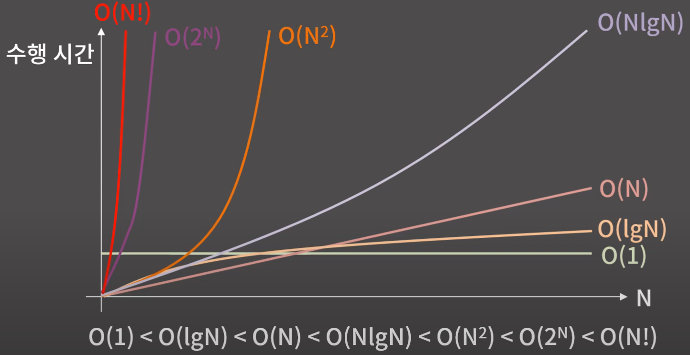
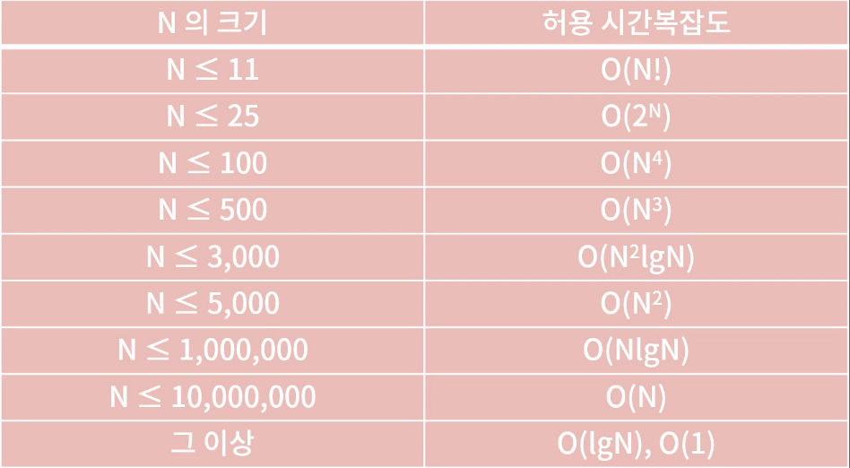
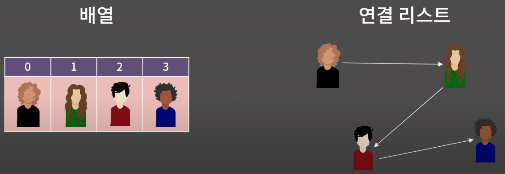
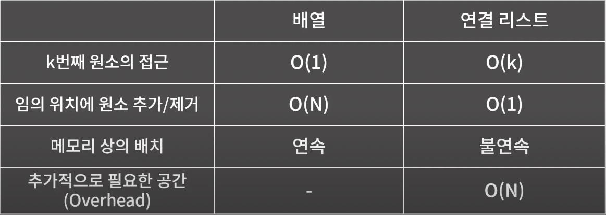
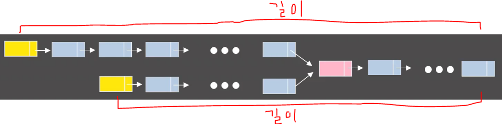
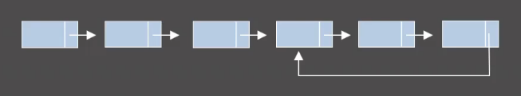

<p align="center" style="font-size:50px">
    <a href="https://github.com/lsw6684/ComputerScience">HOME</a>
</p>

***

<br />

# ALGORITHM (Including Data Structure)
- [CPP 입출력 속도 향상](#cpp-입출력-속도-향상)
- [시간복잡도 & 공간복잡도](#시간복잡도--공간복잡도)
- [배열](#배열)
- [벡터](#벡터)
- [연결 리스트](#연결-리스트)
- [스택, 큐, 덱](#스택-큐-덱)
- [BFS](#bfs)

<br />

## CPP 입출력 속도 향상
- std::endl → **"\n"** : endl은 버퍼를 비우고 출력을 진행하기 때문에 상당한 시간을 요구합니다. \n을 사용하는 것이 **월등히 빠르다**고 할 수 있습니다.

    `#define endl "\n"`을 상단에 정의하면 \n을 endl로도 표현할 수 있습니다. (전역변수 std 사용 시 주의❗)
- ios::sync_with_stdio(0), cin.tie(0) - 메인함수 안에 선언
    - ios::sync_with_stdio(0) : cin과 cout은 stream상에서 분리되어 있기 때문에 동기화할 시간이 필요합니다. 그렇기 때문에 앞에서 언급된 문장을 선언함으로써 동기화를 끊어야 합니다. (해당 방법을 사용할 시 scanf/printf를 사용하면 안 됩니다❗)
    - cin.tie(0) : cin은 endl과 같은 개념으로 버퍼를 사용하기 때문에 속도가 느립니다. 이러한 과정을 생략하기 위해 사용됩니다.
- using namespace std - 전역 : 많은 사람들이 전역변수를 사용하는 것은 프로그래밍 관점으로 봤을 때 충돌을 야기할 수 있으며 지양해야 하는 부분이라고 말합니다. 저 또한 그렇게 생각합니다. 하지만, 코딩 테스트를 위한 코딩은, 남에게 보여주거나 유지보수를 고려해야 하는 클린 코딩이 중요한 것이 아니라 **속도와 순간의 편리성을 우선**으로 해야 한다고 생각합니다.

<br />

## 시간복잡도 & 공간복잡도
- **시간복잡도(Time Complexity) :** 입력의 크기와 문제를 해결하는데 걸리는 시간의 상관관계
  - 빅오표기법 (Big-O Notation) : 주어진 식을 값이 가장 큰 대표항만 남겨서 나타내는 방법
    - O(N) : 5N + 3, 2N + 10lgN, 10N
    - O(N²) : N² + 2N + 4, 6N² + 20N, 10lgN
    - O(NlgN) : NlgN + 30N + 10, 5NlgN + 6
    - O(1) : 5, 16, 36
<p align="center"></p>

<p align="center"></p>

**ex 1) O(N)**
```cpp
int func(int arr[], int n) {
    int cnt = 0;                    // cnt 1번
    for(int i = 0; i < n; i++)      // for( 1번; n번; n번 )
        if(arr[i] % 5 == 0) cnt++;  // if(1번, 1번) 1번
    }
    return cnt;                     // 1 + 1 + n(2 + 2 + 1) + 1 = 5n + 3                                   
}   
```
n이 100만이면 약 500만의 연산이 필요하여 1초 안에 **가능**.

n이 10억이면 약 50억번의 연사이 필요하여 1초 안에 **불가능**.

※ **5n+3 → n에 비례** 한다고 표현합니다.

<br />

**ex 2) O($\sqrt{N}$)**

```cpp
int func(int N) {
    for(int i = 1; i * i <= N; i++) {
        if(i*i == N) return 1;
    }
    return 0;
}
```

</br>

**ex 3) O(lgN) - N이 2<sup>k</sup> 이상 2<sup>k+1</sup> 미만일 때 O(k)**

```cpp
int func(int N) {
    int val = 1;
    while(2*val <= N) val *=2;
    return val;
}
```

</br>

**ex 4) Confusing❗**
```cpp
// O(N) 벡터도 메인함수에서 복사본을 보내는 것입니다. 
// N개의 복사본을 보내기 때문에 O(N). 원본도 변하지 않습니다.
bool cmp1 (vector<int> v1, vector<int> v2, int idx) 
    return v1[idx] > v2[idx];

// O(1) 참조자를 사용하여 참조 대상의 주소 정보만 넘어가기 때문에 O(1).
// 원본도 바뀝니다.
bool cmp2 (vector<int>& v1, vector<int>& v2, int idx)
    return v1[idx] > v2[idx];
```

<br />

- **공간복잡도(Time Complexity) :** 입력의 크기와 문제를 해결하는데 필요한 공간의 상관관계
    - 메모리 제한이 `512MB`인 경우 `1.2억개의 int` 선언 가능 

<br />

## 배열
- 메모리 상에 원소를 **연속**하게 배치한 자료구조입니다.
- 배열의 끝에 원소를 추가/제거/확인/변경 하는 경우 **O(1)**. k번째 원소를 확인, 변경 가능.
- 임의의 위치에 원소를 추가/제거 하는 경우 **O(N)**.
- 추가적으로 소모되는 메모리의 양(**=overhead**)가 거의 없습니다.
- [**Cache hit rate**](#cache-hit-ratio)가 높습니다.
- 메모리 상에 연속한 구간을 잡아야 해서 할당에 제약이 걸립니다.
- 선형 자료구조입니다.
    - ### **Cache hit ratio**
    ```
    Cache Hit : User process가 요구하는 데이터기 있을 경우
    Cache Miss : User Process가 요구하는 데이터가 없을 경우
    Chache hit ratio는 Buffer Cache에서 바로 읽혀진 비율로 캐쉬의 적중률이라고 할 수 있습니다.
    ```
- fill함수 활용 권장
    ```cpp
    int a[21];
    fill(a, a+3, 0);                   // a의 0번째부터 세 번째 까지 0으로 채웁니다.
    ```
- 🎁 O(N<sup>2</sup>)이 아닌 O(N) 비교
    - Q) 임의의 자연수 N개로 이루어진 배열에서 합이 100인 서로 다른 위치의 두 원소가 존재하면 1, 그렇지 않으면 0을 반환하는 함수.
        ```cpp
        이중 for문(O(N<sup>2</sup>))으로 비교하는 것이 아닌 한 개의 for문(O(N))으로도 가능합니다.
        int func(int arr[], int N) {
            int occur[101] = {};
            for(int i = 0 ; i < N; i++) {
                if(occur[100-arr[i]])           // 값이 1(합 100)이면 참
                    return 1;
                occur[arr[i]] = 1;
            }
            return 0;
        }
        ```

<br />

## 벡터
- 원소가 메모리에 연속하여 저장되어 있기 때문에 O(1)에 인덱스로 접근 가능.
- loop comparison
    ```cpp
    vector<int> v1 = {1, 2, 3, 4, 5, 6};

    // 1. range-based for loop (since c++11)
    for(int e : v1)
        cout << e << ' ';               // e를 수정하면 원본 v1도 바뀝니다.
    
    // 2. usual
    for(int i = 0; i < v1.size(); i++)
        cout << v1[i] << ' ';

    size는 정수가 아닌 unsigned int를 반환합니다.
    // 3. ***wrong***
    for(int i = 0 ; i <= v1.size() - 1; i++)
        cout << v[i] << ' ';
    ```

<br />

## 연결 리스트
- 원소를 저장할 때 그 다음 원소가 있는 위치를 포함시키는 방식으로 저장하는 자료구조입니다.
- 선형 자료구조입니다.
<p align="center"></p>

　　　　　　**특정 원소릴 알면 후의 원소들도 알 수 있습니다.**
- k 번째 원소를 확인/변경하기 위해 **O(k)** 가 필요합니다.
- 임의의 위치에 원소를 추가/제거 하기 위해 **O(1)** 이 필요합니다.(*단, 위치를 알고 있는 경우*)
- 원소들이 메모리 상에 연속해있지 않아 [**Cache hit rate**](#cache-hit-ratio)가 낮지만 할당이 다소 쉽습니다.
    - 단일 연결 리스트(Singly Linked List) : 각 원소가 자신의 다음 원소의 주소를 포함합니다.
    - 이중 연결 리스트(Doubly Linked List) : 이전 원소와 다음 원소의 주소를 포함합니다. 원소를 하나 더 가지기 때문에 메모리를 더 사용합니다.
    - 원형 연결 리스트(Circular Linked Likst) : 단일 혹은 이중 연결 리스트 상태에서 끝이 처음과 연결되어있습니다.
- 임의의 원소에 대한 작업이 필요한 경우 용이합니다.
- 🎁 배열 vs 연결리스트

<p align="center"></p>

- 야매 연결 리스트 (실무❌, STL 사용 불가한 코딩 테스트⭕)
    ```cpp
    const int MX = 1000005;         
    int dat[MX], pre[MX], nxt[MX];                      // dat - i번째 원소의 값
    int unused = 1;                                     // pre - 이전, nxt - 다음 원소의 값
    // 0은 시작점을 나타내기 위한 dummy node.   unused부터 새로운 원소가 들어갈 수 있고 1씩 증가.
    fill(pre, pre+MX, -1);                              // -1 : 이전(pre) 혹은 다음(nxt) 원소가 존재하지 않음.
    fill(nxt, nxt+MX, -1);                  
    ```
-   ```cpp
    #include<iostream>
    #include<list>
    #define endl "\n"
    using namespace std;

    int main() {
        ios::sync_with_stdio(0), cin.tie(0);
        list<int> L = { 1,2 };	                    // 1 2
        list<int>::iterator t = L.begin();	            // c++11 이상부터 auto t = L.begin() 가능
        L.push_front(10);		                    // 10 1 2
        cout << *t << endl;		                    // t가 가리키는 값 = 1 출력
        L.push_back(5);			            // 10 1 2 5
        L.insert(t, 6);			            // t가 가리키는 곳 앞에 6을 삽입, 10 6 1 2 5
        t++;					    // t를 1칸 앞으로 전진? t가 가리키는 값은 2.
        t = L.erase(t);			            // t가 가리키는 값 제거. 10 6 1 5, 이제 t는 5를 가리킴

        cout << *t << endl;	                            // 5
        
        for (auto i : L) cout << i << ' ';	// c++11 이상부터 가능. 불가능 하면 아래 방법.
        cout << endl;
        for (list<int>::iterator it = L.begin(); it != L.end(); it++)
            cout << *it << ' ';
    }
    ```
- 🎁 원형 연결 리스트 내의 임의의 노드 하나가 주어졌을 때 해당 List의 길이를 효율적으로 구하는 방법은?
    ```cpp
     시작점을 저장하고 동일한 노드가 나올 때 까지 다음 노드로 이동하면 됩니다.
    공간복잡도 O(1), 시간복잡도 O(N)의 효율을 갖습니다.
    ```
- 🎁 중간에서 만나는 두 연결 리스트의 시작점들이 주어졌을 때 만나는 지점을 구하는 방법은?

<p align="center"></p>
 
```cpp
1. 두 시작점 각각에 대해 끝까지 진행시키고 각각의 길이를 구합니다.
2. 그 후 다시 시작점으로 돌아와서 더 긴쪽을 둘의 차이만큼 앞으로 먼저 이동시킵니다.
3. 두 점을 동시에 한 칸씩 전진시키다 보면 동일한 점에서 만납니다.
   🙂 공간복잡도 O(1), 시간복잡도 O(A+B)로 구할 수 있습니다.
```
- 🎁 주어진 연결 리스트 안에 사이클이 있는지 판단하라.

<p align="center"></p>

```cpp
Floyd's cycle-finding algorithm을 이용하여, 공간복잡도 O(1), 시간복잡도 O(N)으로 구할 수 있습니다.
한 칸씩 가는 커서와 두 칸씩 가는 커서를 동일 시점에서 출발 시키면, 사이클이 있을 경우 두 커서는 만나게 됩니다.
반대로 사이클이 존재하지 않다면, 만나지 못하고 연결 리스트의 끝에 도달하게 됩니다.
```

<br />

## 스택, 큐, 덱
상위 세 가지 자료구조는 원소를 삽입하고 제거하는 위치가 정해져 있어서 **Restricted Structured**로 불리기도 합니다.
- 스택
    - FILO - First In Last Out
    - 한쪽 끝에서만 원소를 넣고 뺄 수 있습니다.
    - 원소의 추가, 제거, 그리고 상단의 원소 확인이 O(1)입니다.
    - 최상단의 원소를 제외한 원소는 확인/변경이 **원칙적으로는 불가능**합니다.
- 큐
    - FIFO - First In First Out
    - 한쪽 끝에서 원소를 넣고 반대쪽 끝에서 원소를 뺄 수 있는 자료구조입니다.
    - 원소의 추가, 제거, 그리고 앞/뒤 원소들의 확인이 O(1)입니다.
    - 맨 앞/뒤가 아닌 나머지 원소들의 확인/변경이 **원칙적으로는 불가능**합니다.
    -큐가 비어있을 때 호출하면 런타임에러가 발생할 수 있습니다.
- 덱
    - deque, Double Ended Queue로 양쪽 끝에서 삽입, 삭제가 가능합니다.
    - 원소의 추가, 제거, 그리고 앞/뒤의 원소들의 확인이 O(1)입니다.
    - 맨 앞/뒤가 아닌 나머지 원소들의 확인/변경이 **원칙적으로는 불가능**합니다. ***STL deque에서는 인덱스로 접근 가능***합니다.

<br />

## BFS
- Breadth First Search, 다차원 배열에서 각 칸을 방문할 때 너비를 우선으로 방문하는 알고리즘입니다.
- 자료구조에서 정점과 간선으로 이루어진 그래프에서 모든 노드를 방문하기 위한 알고리즘입니다.
- 노드가 N개일 때 O(N). **행이 R이고 열이 C이면 O(RC)**
1. 시작 점을 Queue에 push하고 방문했다는 표시를 남깁니다.
2. Queue의 원소를 꺼내어 상하좌우 인접한 칸에 대해 3번을 진행합니다.
3. 방문하지 않은 인접 공간에 방문했다는 표시를 남기고 Queue에 push합니다.
4. Queue가 empty상태가 될 때까지 2번을 반복합니다.

- pair 활용 : 두 자료형을 묶어서 사용할 수 있습니다.
    ```cpp
    #include<iostream>
    using namespace std;
    int main() {
        pair<int, int> t1 = make_pair(10, 13);	                    // pair 생성
        pair<int, int> t2 = { 4, 6 };	                            // since c++11
        cout << t2.first << ' ' << t2.second << '\n';	            // 원소 접근
        if (t2 < t1) cout << "t2 < t1";                                 // first 비교하고 second 비교
    }    
    4 6
    t2 < t1
    ```
- BFS 구현
    ```cpp
    #include <iostream>
    #include <queue>
    using namespace std;
    #define endl '\n'
    #define X first
    #define Y second				                    // pair에서 first, second 줄여 쓰기 위함.
    int board[502][502] =
    {
        {1,1,1,0,1,0,0,0,0,0},
        {1,0,0,0,1,0,0,0,0,0},
        {1,1,1,0,1,0,0,0,0,0},
        {1,1,0,0,1,0,0,0,0,0},
        {0,1,0,0,0,0,0,0,0,0},
        {0,0,0,0,0,0,0,0,0,0},
        {0,0,0,0,0,0,0,0,0,0}
    };						                    // 1 == 방, 0 == 벽
    bool vis[502][502];						    // 해당 칸을 방문했는지 여부 저장
    int n = 7, m = 10;					            // 행, 열의 수
    int dx[4] = { 1, 0, -1, 0 };
    int dy[4] = { 0, 1, 0, -1 };				            // 상하좌우 네 방향 의미
    int main()
    {
        ios::sync_with_stdio, cin.tie(0);
        queue<pair<int, int>> Q;
        vis[0][0] = 1;					            // (0, 0) 시작, 방문
        Q.push({ 0,0 });						    // Q에 방문한 곳 push
        while (!Q.empty()) {                                            // Q가 empty가 될 때까지
            pair<int, int> cur = Q.front();
            Q.pop();
            cout << '(' << cur.X << ',' << cur.Y << ") -> ";
            for (int dir = 0; dir < 4; dir++) {	                    // 상하좌우 살피기
                int nx = cur.X + dx[dir];
                int ny = cur.Y + dy[dir];		                    // nx, ny에 dir에서 정한 방향의 인접한 칸의 좌표
                if (nx < 0 || nx >= n || ny < 0 || ny >= m) continue;   // 범위 밖 제외
                if (vis[nx][ny] || board[nx][ny] != 1) continue;	    // 이미 방문한 칸, 벽 제외
                vis[nx][ny] = 1;				            // (nx, ny) 방문
                Q.push({ nx,ny });
            }
        }
    }
    (0,0) -> (1,0) -> (0,1) -> (2,0) -> (0,2) -> (3,0) -> (2,1) -> (3,1) -> (2,2) -> (4,1) ->
    ```
