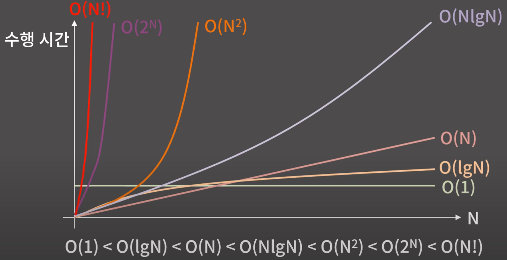

# ALGORITHM (Including Data Structure)
- [ALGORITHM (Including Data Structure)](#algorithm-including-data-structure)
  - [시간복잡도 & 공간복잡도](#시간복잡도--공간복잡도)


</br>

## 시간복잡도 & 공간복잡도
- **시간복잡도(Time Complexity) :** 입력의 크기와 문제를 해결하는데 걸리는 시간의 상관관계
  - 빅오표기법 (Big-O Notation) : 주어진 식을 값이 가장 큰 대표항만 남겨서 나타내는 방법
    - O(N) : 5N + 3, 2N + 10lgN, 10N
    - O(N²) : N² + 2N + 4, 6N² + 20N, 10lgN
    - O(NlgN) : NlgN + 30N + 10, 5NlgN + 6
    - O(1) : 5, 16, 36
<p align="center"></p>

```cpp
int func(int arr[], int n) {
    int cnt = 0;                    // cnt 1번
    for(int i = 0; i < n; i++)      // for( 1번; n번; n번 )
        if(arr[i] % 5 == 0) cnt++;  // if(1번, 1번) 1번
    }
    return cnt;                     // 1 + 1 + n(2 + 2 + 1) + 1 = 5n + 3                                   
}   
```
n이 100만이면 약 500만의 연산이 필요하여 1초 안에 **가능**.

n이 10억이면 약 50억번의 연사이 필요하여 1초 안에 **불가능**.

※ **5n+3 → n에 비례** 한다고 표현합니다.

```cpp
int func(int N) {
    for(int i = 1; i * i <= N; i++) {
        if(i*i == N) return 1;
    }
    return 0;
}
```

$\sqrt{N}$