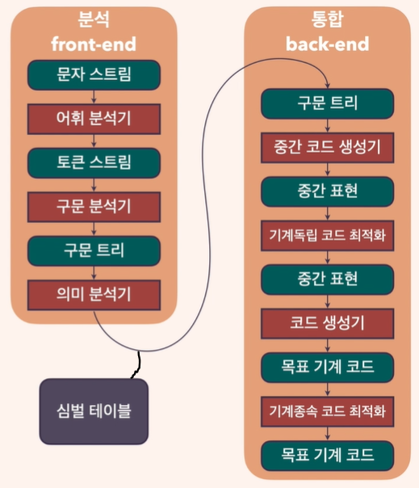
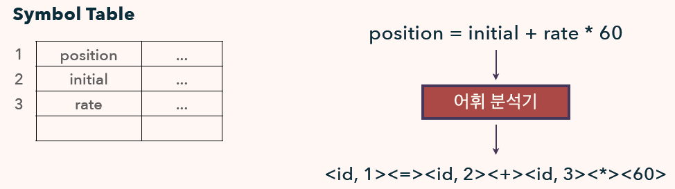
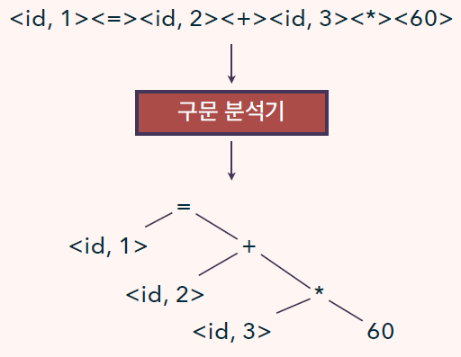
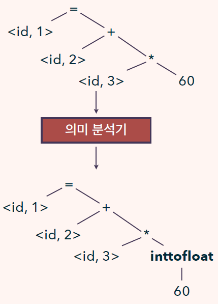
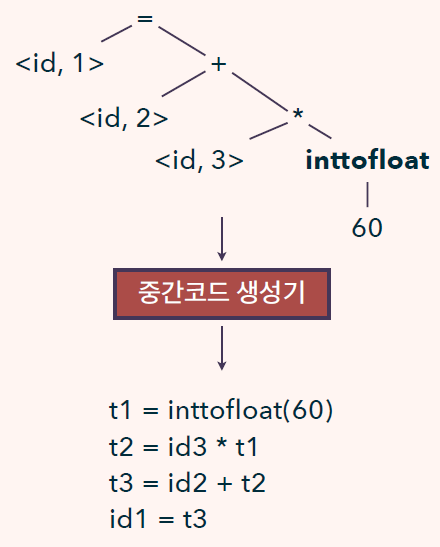
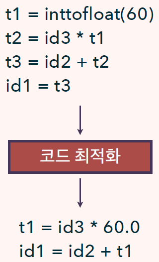
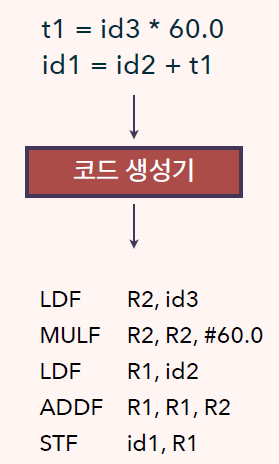

  <a href="https://github.com/lsw6684/ComputerScience">HOME</a>

***

 

# Compiler Construction
- [Compiler](#Compiler)

 

## Compiler
원시 언어(source language)를 목표 언어(target language)로 번역합니다.

### Compiler VS Interpreter ★
- 컴파일러는 원시 프로그램을 입력 받아 목표 프로그램으로 변환하며, 프로그램의 실행은 목표 프로그램이 입력을 받아 출력을 내놓는 것입니다.
- 인터프리터는 원시 프로그램 자체와 입력을 모두 받습니다. 이를 내부적으로 번역(interpret)하여 실행하고 출력합니다. 즉, 목표 프로그램을 생성하는 과정이 없습니다.
- 일반적으로 컴파일러가 생성한 목표 프로그램의 실행 속도가 인터프리터에 비해 빠르다는 장점이 있으며, 인터프리터는 코드를 한 줄씩 실행하는 형태이므로 오류가 발생한 경우 보다 자세한 오류 메시지를 표시할 수 있는 장점이 있습니다.

### 혼합형 컴파일러
- 자바의 경우 원시 언어로 작성된 코드를 바이트코드로 우선 변환 - *컴파일러*
- 해당 바이트코드를 JVM에서 읽고 실행 - *인터프리터*
- JVM이 인터프리터가 되어 바이트코드를 처리하므로 어떤 기계에서도 동일한 바이트코드를 실행합니다.
- 위와 같은 이유로 실행속도가 상대적으로 느립니다. 이러한 사항을 해소하기 위해 **JIT(Just In Time) 컴파일러**가 등장합니다.
    - 바이트코드를 실행하기 직전 기계어로 컴파일하여 입력을 처리합니다. 즉, 실질적으로 컴파일러와 동일한 형태로 진행되어 속도가 상대적으로 빠릅니다.

### 컴파일러의 구조
소스코드는 문자 스트림 형태로 컴파일러에 전달합니다. 다양한 단계를 통해 구문 트리 (syntax tree) 및 중간 표현 (Intermediate Representation, IR)을 거쳐 최종적으로 목표 기계 코드를 생성합니다. 이 과정에서 기계독립적(Machine independent) 코드 최적화와 기계종속적 코드 최적화를 수행합니다. 전체 과정에서 얻은 소스코드에 대한 정보를 저장하기 위해 Symbol Table이 사용됩니다.
- 분석 - 통합 구조
    - 분석(Analysis) 부분은 소스코드를 구성 요소로 분리하고, 문법적 구조를 부과합니다.
        - 이를 토대로 중간 표현(IR, 토큰 스트림 or 구문 트리)을 생성합니다.
        - 수집된 정보들은 Symbol Table에 저장됩니다.
    - 통합(Synthesis) 부분은 중간 표현과 심벌 테이블의 정보를 이용하여 목표 기계 코드를 생성합니다.

- 단계를 패스(PASS)로 통합
    - 실질적인 구현에서는 여러 단계의 동작들이 입력 파일을 읽고 출력 파일을 작성하는 패스로 통합됩니다.
    - 어휘, 구문, 의미 분석과 중간 코드 단계는 하느의 패스로 통합될 수 있습니다.
    - 이후의 최적화 부분은 선택적 패스입니다.
    - 중간표현을 매개체로 소스코드를 다양한 기계에 맞게 목적 코드로 변환하는 컴파일러를 만들 수 있습니다.
        - 기계독립적으로 변환하는 전단부 + 각 기계에 맞는 목적코드를 생성하는 후단부의 결합
- Symbol Table
    - 컴파일러의 중요한 기능은 소스코드에서 사용되는 이름을 저장하고 각 이름의 여러 가지 속성에 관한 정보를 수집하는 것입니다. 이러한 속성에는 **이름에 할당되는 기억장소, 이름의 타입, 이름의 영역(scope), 프로시저. 그리고 함수인 경우, 매개변수의 개수, 타입, 전달 방법과 반환 값에 대한 정보**등이 포함됩니다.
    - 하나의 이름에 대해 하나의 레코드를 갖는 데이터 구조입니다.
        - 컴파일러가 각 이름에 대한 레코드를 효율적으로 저장하고 추출하는 것이 가능하도록 설계되어야 합니다.

### 어휘 분석
Lexical Analysis, 컴파일러의 첫 단계로 스캐닝(Scanning)로도 불립니다. 소스코드에 해당하는 문자 스트림을 읽어 어휘항목(Lexeme)이라 불리는 의미있는 문자의 나열로 묶으며 각 어휘항목에 대해 어휘 분석기는 **토큰**을 출력합니다.
- `token = <토큰이름 token-name, 속성 값 attribute-value>`

### 구문 분석
두 번째 단계로 구문 분석(Syntax Analysis) 또는 파싱(parsing)이라고 합니다. 파서는 토큰 스트림의 문법 구조를 서술하는 구문 트리(Syntax tree)를 만들고 노드(=연산)와 노드의 자식(피 연산자)으로 구성됩니다. 구문 트리에선 연산이 수행되는 순서 또한 볼 수 있습니다.

### 의미 분석
Semantic Analysis, 구문 트리와 Symbol Table에 있는 정보를 이용하여 프로그램이 언어 정의에 의미적으로 일치하는지 검사합니다. 중간 코드 생성에 이용하기 위해 타입 정보를 수집하여 구문 트리나 Symbol Table에 저장합니다. 
- 타입 검사(Type checking)
    - 컴파일러가 각 연산자와 피연산자 끼리 부합 되는지 검사합니다.
    - e.g) 배열의 인덱스가 정수인가?
- 강제 변환(coercion) : 언어 명세가 허용하는 경우 값을 적절한 타입으로 변환합니다.

### 중간코드 생성
구문 및 의미 분석 이후, 저수준의 중간 표현(IR)을 생성합니다. IR은 생산하기 쉬워야 하며, 목표 기계어로 번역하기도 쉬운 특성을 가져야 합니다. 추상 기계에 대한 프로그램으로 생각할 수 있습니다.
- 3주소 코드(Three-address code) ★
    - 각 명령어마다 3개의 피연산자를 갖는 어셈블리어와 같은 형태이며 각 피연산자는 레지스터로 동작할 수 있습니다.

우변에는 1개 이하의 연산자가 오고 값 저장을 위한 임시 이름이 사용됩니다. 명령어에 따라 3개 이하의 피연산자를 가질 수 있습니다.

### 코드 최적화
보다 좋은 목표 코드를 생성하도록 중간에 코드를 개선합니다. '보다 좋은'의 의미는 상황에 따라 달라질 수 있으나, 일반적으로 '빠른'을 의미합니다.
- 단순 작업으로 빠르게 중간 코드 생성 >> 최적화를 통해 코드 개선.

정수를 부동소수점으로 바꿈으로써 inttofloat연산을 제거 했으며 변수를 줄여 더욱 짧고 간결한 코드로 변경합니다.

### 코드 생성
원시 프로그램의 중간 표현을 입력으로 사용하여 이를 목표언어로 나타냅니다. 목표언어가 기계어 코드인 경우 레지스터 또는 메모리 장소가 프로그램에서 사용되는 각 변수에 선택되며 얼마나 적절한 레지스터를 선택하느냐고 중요합니다.

명령어가 F로 끝나는 것은 부동소수점 취급을, # 60.0은 60.0을 살수로 취급함을 의미합니다.
