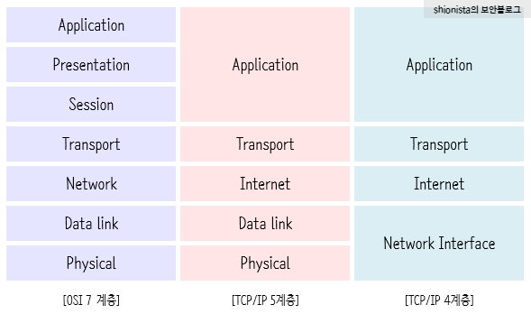

  <a href="https://github.com/lsw6684/ComputerScience">HOME</a>

***

 

# Computer Network
- OSI 7 Layers(#osi-7-layers)

 

## OSI 7 Layers
 - **1계층 - 물리 계층, Physical Layer**
    - 전송에 필요한 두 장치 간의 실제 접속과 절단 등에 필요한 전송 매체의 기계적, 전기적, 기능적, 절차적 특성에 대한 규칙 정의.
    - 0과 1을 전압의 고저나 빛의 점멸로 변환.
    - 커넥터, 케이블 모양을 규정.
    - 프로토콜 : Ethernet.RS-232C
    - 장비 : 허브, 리피터
    - 전송 단위 : 비트

- **2계층 - 데이터 링크 계층, Data Link Layer**
    - 인접한 개방 시스템들 간에 신뢰성 있고 효율적인 정보 전송을 할 수 있도록 함.
    - 상대방과 물리적인 통신을 위한 통신로 확립 및 통신로를 통과하는 동안에 오류 검사 실시
    - 직접 연결된 기기 간의 데이터 프레임 식별 및 전송.
    - 흐름제어, 프레임 동기화, 오류 검사, 순서 제어.
    - 프로토콜 : MAC, HDLC, LAPB, PPP, LLC
    - 장비 : 브리지, 스위치
    - 전송 단위 : 프레임

- **3계층 - 네트워크 계층, Network Layer**
    - 개방 시스템들 간의 네트워크 연결 관리(네트워크 연결 설정/해제)
    - 주소 관리, 경로 선택, 트래픽 제어, 패킷 정보 전송
    - 프로토콜 : X.25, IP, ICMP, IGMP, IPSec, ARP
    - 장비 : 라우터
    - 전송 단위 : 패킷

- **4계층 - 전송 계층, Transport Layer**
    - 데이터가 능률적으로 확실하게 도착하는 지를 담당.
    - 종단 시스템(End to End) 간에 투명한 데이터 전송을 가능하게 함.
    - 전송 연결 설정, 데이터 전송, 연결 해제, 주소 설정, 다중화, 오류제어, 흐름제어
    - 장비 : 게이트웨이
    - 프로토콜 : TCP, UDP, ARP
    - 전송 단위 : 세그먼트

- **5계층 - 세션 계층, Session Layer**
    - 데이터가 흐를 수 있는 가상 경로의 확립 및 해제
    - 송수신측 간의 관련성 유지
    - 대화 제어/구성/동기 제어, 데이터 교환 관리, 통신 관리, 연결 확립/끊기, 4계층 이하의 층관리
    - 프로토콜 : SSH, TLS
    - 전송 단위 : 메시지

- **6계층 - 표현 계층, Presentation Layer**
    - 응용 계층에서 받은 데이터를 세션 계층에 맞게, 세션 계층에서 받은 데이터를 응용 계층에 맞게 변환.
    - 코드 변환, 데이터 암호화, 데이터 압축, 구문 검색, 정보 형식 변환, 문맥 관리, 전송 형식에 관한 책임
    - 프로토콜 : JPEG, MPEG, SMB, AFP
    - 전송 단위 : 메시지

- **7계층 - 응용 계층, Application Layer**
    - 사용자가 OSI환경에 접근할 수 있도록 서비스를 제공.
    - 특정 애플리케이션에 특화된 프로토콜(메일용 프로토콜, 로그인용 프로토콜..)
    - 프로토콜 : DHCP, DNS, HTTP, SMTP, FTP
    - 전송 단위 : 메시지
- **TCP/IP 4계층/5계층**
    - OSI 7 Layer가 나오기 전에 설계된 모델입니다.
    - 호환성, 장비 개발 측면에서 OSI모델이 더 많이 사용되지만, 실질적인 통신에는 TCP/IP모델이 사용됩니다. 
 

