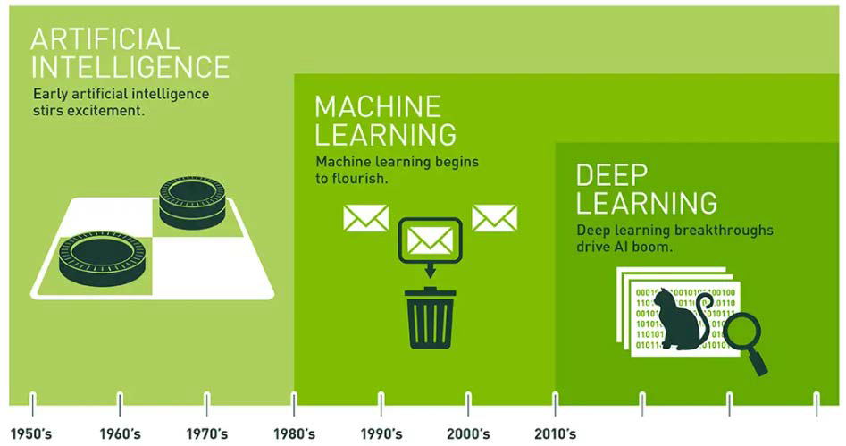

<p align="center" style="font-size:50px">
    <a href="https://github.com/lsw6684/ComputerScience">HOME</a>
</p>

***

<br />

# Data Analysis
- [통계적 학습 이론 Statistical Learning](#통계적-학습-이론-statistical-learning)

<br />

## 통계적 학습 이론 Statistical Learning
- **추론 Inference** vs **예측 Prediction**
    ```
    추론 Inference : 논리적으로 결과를 도출하는 것. 해석적인 측면.
    - Data mining(대략)
    예측 Prediction : 과거의 데이터를 기반으로 미래에 대한 설명, 계획, 예정
    - Machine Learning(대략)
    ```
- 데이터 분석
    - 데이터 분석은 AI, ML, DL을 Tool로써 사용합니다.
        - 인공지능 Artificial Intelligence
            ```
            인간처럼 행동하고 일하는 지능적 기계의 창조를 강조합니다.
            ```
        - 기계 학습 Machine Learning
            ```
            컴퓨터를 학습시켜서 인간처럼 행동하게끔 만들어내는 것을 의미합니다.
            ```
        - 심층 학습 Deep Learing
            ```
            머신러닝의 인공신경망의 일종으로 데이터의 추상적 개념을 모델화 하기 위해 사용되는 알고리즘의 집합입니다.
            ```
<p align="center"></p>

- **통계적 학습 이론 SL-Statistical Learning** VS **기계 학습 ML-Machine Learning**
    ```
    SL은 통계학의 Subfiled, ML은 인공지능의 Subfiled입니다. 상호 보완적으로 작용하고 있습니다.

     SL과 ML은 지도 학습(Superviesed Learning)과 비지도 학습(Unsupervised Learning)으로 분류됩니다.
    여기서 지도 학습은 일종의 주입식 교육이고 주로 Prediction에 사용됩니다.
    비지도 학습은 창의적인 결과를 도출하는 것으로 볼 수 있습니다.

    지도 학습 - Regression → 특정 함수를 찾아가는 과정 {y = f(x) + ε}, Classification
    비지도 학습 - Clustering
    ```
<p align="center"></p>

- Python Programming for SL
    - 파이썬 Data structures and syntax
        - List : 배열의 확장판으로 서로 다른 데이터끼리 묶고 수정할 수 있습니다.
        - Tuple : 수정이 불가능한 List
        - Dictionary : Index로 정수를 포함하여 문자도 사용할 수 있는 배열이라 할 수 있으며 중복을 허용합니다. (js의 객체?)
        - Set : 중복을 허용하지 않는 Dictionary라 할 수 있습니다.
    - NumPy : 다차원 벡터, 행렬을 쉽게 처리할 수 있는 빠른 속도의 라이브러리
    - Pandas : 엑셀의 Spreadsheet라 할 수 있으며 데이터 조작 및 분석을 위한 파이썬 라이브러리입니다.
    - Scikit-learn : 파이썬을 위한 기계 학습 라이브러리입니다.
- Good f(x)
    - 잘 설계된 f란, 트레이닝을 통하여 만든 f에 새로운 x를 대입했을 때 그 값이 실제의 값과 가까울 여지가 있는 경우의 f를 좋은 f라고 합니다.
    - Ideal f(x) : [MSE](#mse)를 최소화할 수 있는 f(x).
- Good fit : overfit도 아니고 under-fit도 아니어야 합니다.
    - over-fit : 에러구분없이 모든 데이터를 쫓아가는 형태
    - under-fit : 억지로 1차 모델링을 하는 형태.
- Prediction accuracy와 interpretability 사이에는 trade-off가 존재합니다.
- Notation
    - 선형 회귀 Linear Regression : 선형 회귀는 종속 변수 y와 한 개 이상의 독립변수 X와의 선형 상관 관계를 모델링 하는 방법으로 데이터의 밀집된 구간에 나타나는 대각선을 칭합니다. 상대적으로 해석에 용이합니다.
    - X축은 독립(independent)변수, Y축은 종속(dependent)변수이며 Data Analysis에선 **Predictor와 Response**를 주로 사용합니다.
        ```
        X 축 - input, Y 축 - output 
        X 축 - predictor, Y 축 - response
        X 축 - feature, Y 축 target or label
        ```
    - ε(앱실론) : 여러 개의 불확실한 요소들의 측정값을 정규분포로 규정합니다.
    - ### MSE
        `Mean-Squared prediction Error : 제곱한 형태의 평균 제곱 오차`
        - MSE는 Reducible Error와 Irreducible Error로 분리가 됩니다. Irreducible Error는 줄일 수 없는 에러이며, Reducible Error는 input이 영향을 끼치기 때문에 줄일 수 있습니다. 
    <p align="center"></p>
    
    - 차원의 저주 Curse of dimensionality : predict의 종류가 많아지게 되어 prediction이 어려워지고 그 정도가 엄청난 속도로 증가합니다.  
