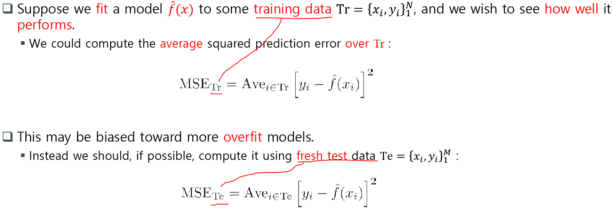

<p align="center" style="font-size:50px">
    <a href="https://github.com/lsw6684/ComputerScience">HOME</a>
</p>

***

<br />

# Data Analysis
- [통계적 학습 이론 Statistical Learning](#통계적-학습-이론-statistical-learning)
- [Probability & Statistics](#probability--statistics)

<br />

## 통계적 학습 이론 Statistical Learning
- **추론 Inference** vs **예측 Prediction**
    ```
    추론 Inference : 논리적으로 결과를 도출하는 것. 해석적인 측면.
    - Data mining(대략)
    예측 Prediction : 과거의 데이터를 기반으로 미래에 대한 설명, 계획, 예정
    - Machine Learning(대략)
    ```
- **데이터 분석**
    - 데이터 분석은 AI, ML, DL을 Tool로써 사용합니다.
        - 인공지능 Artificial Intelligence
            ```
            인간처럼 행동하고 일하는 지능적 기계의 창조를 강조합니다.
            ```
        - 기계 학습 Machine Learning
            ```
            컴퓨터를 학습시켜서 인간처럼 행동하게끔 만들어내는 것을 의미합니다.
            ```
        - 심층 학습 Deep Learing
            ```
            머신러닝의 인공신경망의 일종으로 데이터의 추상적 개념을 모델화 하기 위해 사용되는 알고리즘의 집합입니다.
            ```
<p align="center"></p>

- **통계적 학습 이론 SL-Statistical Learning** VS **기계 학습 ML-Machine Learning**
    ```
    SL은 통계학의 Subfiled, ML은 인공지능의 Subfiled입니다. 상호 보완적으로 작용하고 있습니다.

     SL과 ML은 지도 학습(Superviesed Learning)과 비지도 학습(Unsupervised Learning)으로 분류됩니다.
    여기서 지도 학습은 일종의 주입식 교육이고 주로 Prediction에 사용됩니다.
    비지도 학습은 창의적인 결과를 도출하는 것으로 볼 수 있습니다.

    지도 학습 - Regression → 특정 함수를 찾아가는 과정 {y = f(x) + ε}, Classification → 종양의 크기와 암 판정의 상관관계(일정 크기 이상이 대체로 암)
    비지도 학습 - Clustering으로 창의적 결과물 도출.
    ```
<p align="center"></p>

- **Python Programming for SL**
    - 파이썬 Data structures and syntax
        - List - []: 배열의 확장판으로 서로 다른 데이터끼리 묶고 수정할 수 있습니다.
        ```python
        a_list = {2, 3, 7, None}
        b_list = list(tuple)        # 튜플을 리스트로 바꿉니다.
        --------------------------------------
        gen = range(10)             # 0부터 10개, 0 ~ 9
        ```
        - Tuple - {}: 수정이 불가능한 List
        ```python
        tuple = ([4, 0, 2, 'string'])
        => (4, 0, 2)
        --------------------------------------
        (4, None, 'foo') + (1, 2) + ('bar',)
        => (4, None, 'foo', 1, 2, 'bar')

        ```
        - Dictionary - {}: Index로 정수를 포함하여 문자도 사용할 수 있는 배열이라 할 수 있으며 중복을 허용합니다. key와 value로 매핑합니다. (js의 객체?)
        ```python
        di = {'a' : 'some value', 'b' : [1, 2, 3, 4]}
        di 'b'
        => [1, 2, 3, 4]
        ```
        - Set : 중복을 허용하지 않는 Dictionary라 할 수 있습니다.
        ```python
        set([2, 2, 3, 3, 1, 3])
        => {1, 2, 3}
        ```
    - **NumPy** : 다차원 벡터, 행렬을 쉽게 처리할 수 있는 빠른 속도의 라이브러리입니다. array형태의 데이터를 효율적으로(속도↑ 메모리↓) 처리합니다.
        - 리스트와 유사한 **ndarray**라는 데이터 타입을 가집니다.
        - for문을 사용하지 않아서 추가적인 오버헤드를 발생시키지 않습니다.
        - 메모리를 연속적으로 할당하여 계산 효율을 향상시킵니다.
        - 기존의 List보다 100배 이상 빠르며 메모리를 적게 소모합니다.
        - 랜덤변수 생성 가능. `random.normal(loc=0.0, scale=1.0, size=None)`
    - **Pandas** : 엑셀의 Spreadsheet라 할 수 있으며 데이터 조작 및 분석을 위한 파이썬 라이브러리입니다.
        - **DataFrame**로 tabular, row와 column을 가집니다.(sql같은 형태)
        - **Series**, 1차원 데이터 객체를 가집니다.
        ```python
        obj = pd.Series([4, 7, -5, 3], index=['d', 'b', 'a', 'c'])
        obj
        >>> d   4
            b   7
            a  -5
            c   3
        dtype: int64
        -----------------------------------------------------------
        data = {'a' : [1,2,3,4,5,6,7], 'b':[11,22,33,44,55,66,77]}
        frame = pd.DataFrame(data)
        frame
        >>> SQL처럼 표로 출력
        ```
        - **Categorical data**를 이용하여 문자열 변수를 카테고리형 변수로 변환하면 메모리가 절약된다.
    - **matplotlib** : 2차원 그래프를 그려주기 위함입니다. 3차원도 지원 하지만, 별로...
    - **SciPy** : scientific computing으로 적분이나 통계학과 관련된 연산을 지원합니다.
    - **Scikit-learn** : 텐서플로우와 양대산맥으로 파이썬을 위한 기계 학습 라이브러리입니다.
    - **statsmodels** : 통계학에 관련된 기능들을 포함합니다.
    - **seaborn** : matplotlib을 개선시킨 것으로 좀 더 상세한 그래프 표현이 가능합니다.

<br />

- **Good f(x)**
    - 잘 설계된 f란, 트레이닝을 통하여 만든 f에 새로운 x를 대입했을 때 그 값이 실제의 값과 가까울 여지가 있는 경우의 f를 좋은 f라고 합니다.
    - Ideal f(x) : [MSE](#mse)를 최소화할 수 있는 f(x).
    - Neighborhood of x : 값이 하나, 또는 없을 때 "평균"은 의미가 없으니 그 주변 범위를 활용하여 Response로 결과 도출.

<br />

- **Good fit** : overfit도 아니고 under-fit도 아니어야 합니다.
    - over-fit : 에러구분없이 모든 데이터를 쫓아가는 형태
    - under-fit : 억지로 1차 모델링을 하는 형태.

<br />

- **Prediction accuracy**와 **interpretability** 사이에는 **trade-off**가 존재합니다.

<br />

- **Notation**
    - 선형 회귀 Linear Regression : 선형 회귀는 종속 변수 y와 한 개 이상의 독립변수 X와의 선형 상관 관계를 모델링 하는 방법으로 데이터의 밀집된 구간에 나타나는 대각선을 칭합니다. 상대적으로 해석에 용이합니다.
    - X축은 독립(independent)변수, Y축은 종속(dependent)변수이며 Data Analysis에선 **Predictor와 Response**를 주로 사용합니다.
        ```
        X 축 - input, Y 축 - output 
        X 축 - predictor, Y 축 - response
        X 축 - feature, Y 축 target or label
        X 축 - Independent variable, Y 축 Dependent variable
        ```
    - ε(앱실론) : Noise, 여러 개의 불확실한 요소들의 측정값을 정규분포로 규정합니다.
    - ### MSE
        `Mean-Squared prediction Error : 제곱한 형태의 평균 제곱 오차`
        - MSE는 Reducible Error와 Irreducible Error로 분리가 됩니다. Irreducible Error는 줄일 수 없는 에러이며, Reducible Error는 input이 영향을 끼치기 때문에 줄일 수 있습니다.
        - MSE : **Reducible** error + **Irreducible** error 
    <p align="center"></p>
    
    - 차원의 저주 Curse of dimensionality : predict의 종류가 많아지게 되어 prediction이 어려워지고 그 정도가 엄청난 속도로 증가합니다.

<br />

- **Model Accuracy 평가**
    - 데이터 분석에서 Learning을 한다는 것은 Training data에다 학습시키려는 model을 fitting 하는 것인데 이것이 얼마 잘 동작하는지 평가하는 것입니다.
    
    - 과한 트레이닝 데이터 fitting은 Error까지 fitting 하여 **overfit** 즉, 정확성이 떨어질 수 있습니다. `Overfitting - (에러가 과하게 포함된)특화된 데이터 때문에 새로운 데이터가 적응을 하지 못합니다.`
    
    - fresh test(새로운 데이터를 이용)를 해야합니다.
    - test error를 최소화시켜줄 수 있는 것이 가장 좋은 학습 방법이라 할 수 있습니다.
    - 손실함수, MSE : Mean Squared Error
    <p align="center"></p>
    이미 알고 있는 response에 새로 평가한 값의 차를 구한 다음 그 제곱을 하여 모두 더하고 트레이딩 데이터 개수로 나누어 평균을 구합니다.
<br />

- **Bias-Variance Trade-off**
    - 전형적으로 flexibility가 증가하면 Variance도 증가하지만 Bias는 감소합니다.
    - Bias-Variance Trade-off를 적절하게 하려면 MSE 값을 최소화 시킬 수 있는 구간에서 flexibility 값을 찾아야 합니다.
        - bias, 편향 : original function을 얼마나 잘 쫓아갈 수 있는지에 대한 역량으로 학습 알고리즘에서 잘못된 가정을 했을 때 발생하는 오차입니다.
        - variance, 분산 : 트레이닝 셋에 내재된 작은 변동때문에 발생하는 오차입니다.
- **Classification Problem**
    - e.g, email is one of C=(spam, ham) (ham = good email)
    - Bayes optimal classifier : conditional class probabilities를 최대화 할 수 있는 값을 선택합니다(smallest error, 이론적으로 ideal classifier). 항상 정확한 답을 내는 것은 아닙니다.
    - Support-vector machines : Linear classifier의 일종입니다. 값이 섞여있어서 linear classifier로 분리가 불가능한 경우 차원을 올려서 분류합니다. (2차원 -> 3차원)
    - KNN, K-nearest Neighbors : Bayes classifier를 실제 환경에 맞춰둔 것입니다. (실질적으로 사용될 수 있는 classifier) 새로운 데이터를 입력 받았을 때 특정 범위 내에 가장 많은 것이 무엇이냐를 중심으로 새로운 데이터의 종류를 정해주는 알고리즘입니다.
<p align="center"></p>

## Probability & Statistics
```
Summarizing data set : 결론에 도달하기 위해 data set을 의미있게 표현합니다.
ex) 평균, 분산, 확률 분포

Probability
- Mean : 평균 || Expectation : 기댓값 
- Variance : 분산
- Covariance : 공분산
- Covariance matrix : 공분산 행렬
```