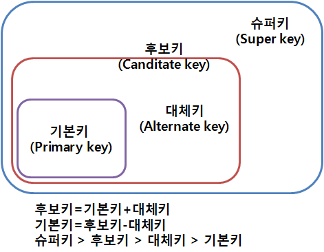
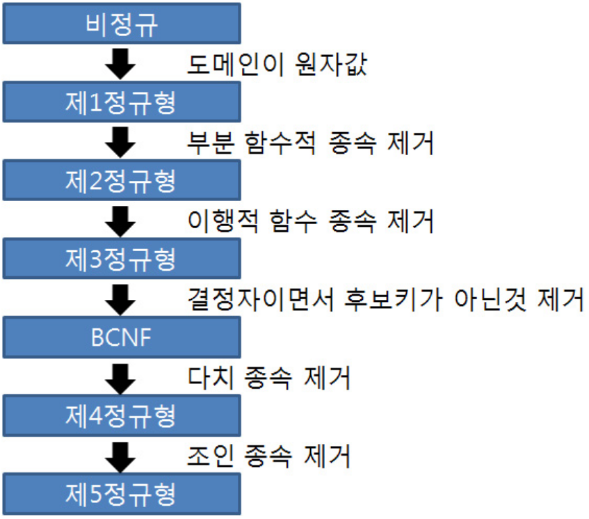
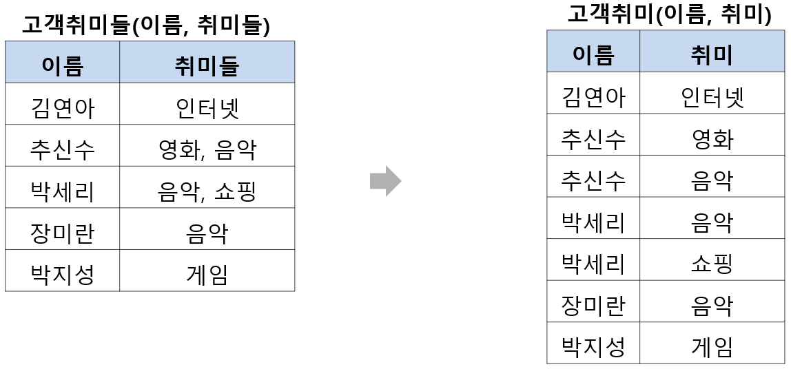
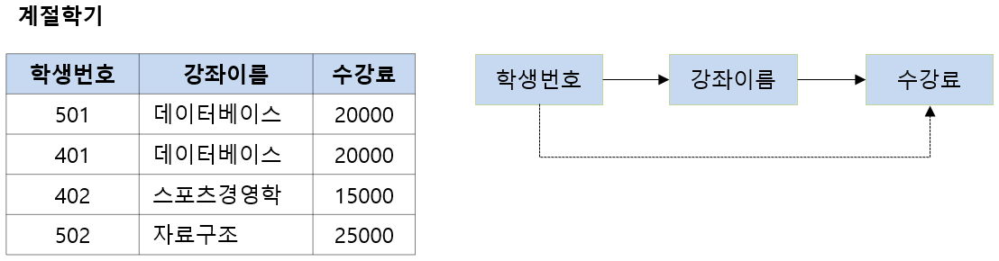
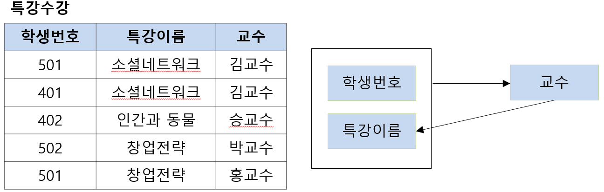
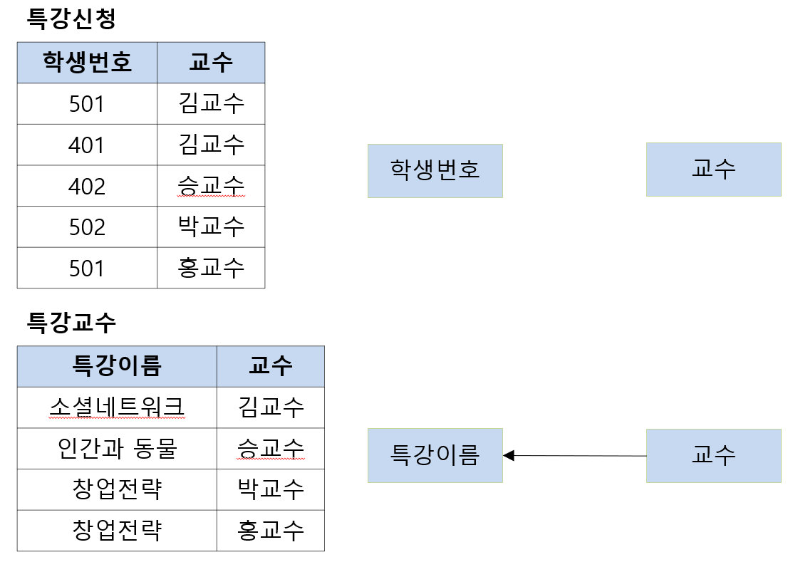
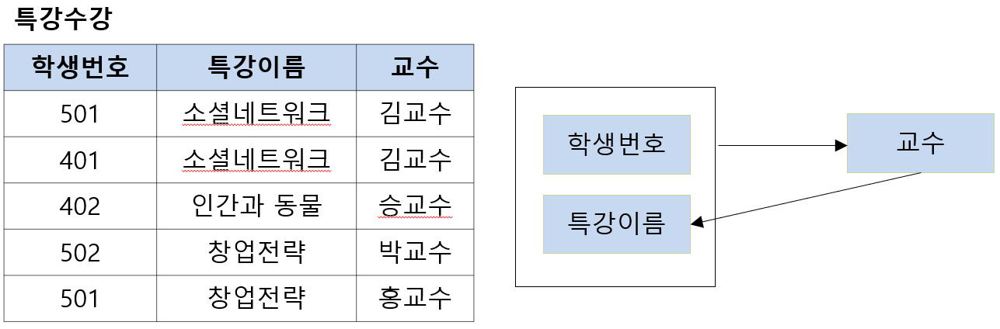
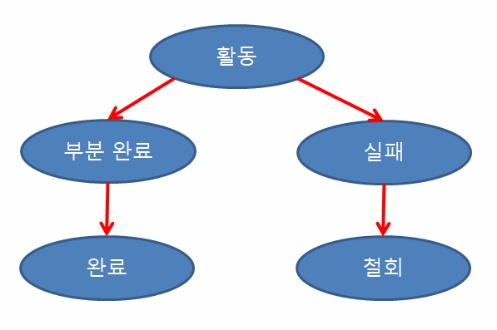

<p align="center" style="font-size:50px">
    <a href="https://github.com/lsw6684/ComputerScience">HOME</a>
</p>

***

<br />

# Database
- [무결성](#무결성)
- [Key](#key)
- [SQL](#sql)
- [정규화](#정규화)
- [트랜잭션](#트랜잭션)

<br />

## 무결성
- **데이터의 무결성**<br />
    정확성, 일관성, 유효성이 유지되는 것을 말합니다. 데이터의 무결성을 유지하는 것은 데이터베이스 관리 시스템(DBMS)의 중요한 기능이며, 주로 데이터에 적용되는 연산에 제한을 두어 데이터의 무결성을 유지합니다.
    - **개체 무결성 Entity integrity**<br />
        모든 테이블이 기본 키로 선택된 필드(column)를 가져야 합니다. 즉, 고유한 값을 가져야 하며, NULL 값을 허용하지 않습니다.
    - **참조 무결성 Referential integrity**<br />
        참조 관계에 있는 테이블 끼리 항상 일관된 값을 가져야 합니다. 외래 키 값은 NULL이거나 참조 릴레이션의 기본 키 값과 동일해야 합니다.
    - **도메인 무결성 Domain integrity**<br />
        테이블에 존재하는 필드의 무결성을 보장하기 위한 것으로 필드의 타입, NULL값의 허용 등에 대한 사항을 정의하고, 올바른 입력인지 확인합니다.

<br />

## Key
데이터베이스에서 조건에 만족하는 튜플을 찾거나 정렬할 때, 기준이 되는 속성을 말합니다.
- **슈퍼 키 Super Key** 
    - 특정 튜플을 고유하게 식별할 수 있는 속성, 또는 속성들의 집합으로 구성됩니다. 
    - **유일성은 만족** 하지만, **최소성은 만족하지 못합니다.**
- ### 후보 키 Candidate Key
    - 튜플을 유일하게 식별하는 속성들의 부분집합입니다.
    - **유일성과 최소성을 모두 만족합** 니다.
- **기본 키 Primary Key**
    - **후보 키 중에서 선정**된 키로 중복된 값을 가질 수 없습니다.
    - **후보 키의 성질**을 가집니다. 즉, **유일성과 최소성**을 만족합니다.
    - 속성에 **NULL 값이 있으면 안됩니다.**
- **대체 키 Alternate Key**
    - **기본 키를 제외한 나머지 후보키**들을 말합니다.
- **외래 키 Foreign Key**
    - 다른 릴레이션의 기본 키를 참조하는 속성, 또는 속성들의 집합입니다.
    - 참조 릴레이션의 기본 키와 동일한 키 속성을 가집니다.
- **복합 키 Comosite Key**
    - 각 튜플을 식별할 수 있는 두 개 이상의 속성들로 구성된 후보 키입니다.
<p align="center">

<br />

## SQL
- **SQL의 종류**
    - DDL : Data Definition Language ***[CREATE](#create), [DROP](#drop), [ALTER](#alter), [TRUNCATE](#truncate)***
        - 데이터 정의 언어
        - 데이터베이스, 테이블, 뷰, 인덱스 등의 데이터베이스 개체 생성/삭제/변경
        - DDL은 트랜잭션을 발생시키지 않습니다.
        - ROLLBACK, COMMIT 사용 불가능
    - DML : Data Manipulation Language ***[SELECT](#select), [INSERT](#insert), [UPDATE](#update), [DELETE](#delete)***
        - 데이터 조작 언어
        - 데이터를 조작(선택, 삽입, 수정, 삭제)
        - DML 구문이 사용되는 대상은 테이블의 행
        - 사용 전에 테이블이 정의되어 있어야 합니다.
        - 트랜잭션이 발생하는 SQL도 DML에 속합니다.
        - ❗데이터를 변경(입력/수정/삭제)할 때 실제 테이블에 완전히 적용하지 않고, 임시로 적용시키는 것
        - ❗취소 가능.
    - DCL : Data Control Language ***[GRANT](#grant), [REVOKE](#revoke)***
        - 데이터 제어 언어
        - 사용자에게  권한을 부여하거나 빼앗을 때 사용.

<br />

❗**↓↓↓ SQL 명령어는 단순 개념 정리가 아닌 예시 위주의 복습 정리입니다.**

❗**↓↓↓ 질의의 마지막은 세미콜론(;)을 사용하며 하위 설명에선 편의상 생략될 수 있습니다.**
- **SQL 명령어**
    - ### SELECT
        - 요구하는 데이터를 가져옵니다. 
            ```sql
            SELECT  coulumn_name                        -- SELECT DISTINCT는 중복 제거 출력
            FROM    table_references        
            WHERE   height > 150 AND Conuntry = 'KOREA'
               AND  price BETWEEN 1000 and 2000
               AND  Pet IN ('cat', 'dog')
            GROUP BY country_code                       -- 데이터를 묶어줍니다. 상세내용 아래 기타.
            HAVING
            ORDER BY - city_population DESC             -- ASC 오름 차순(default), DESC 내림 차순
            LIMIT 10;                                   -- 결과에 대한 상위 10개만 출력
                                                        
            ```
    - JOIN
        - 여러 테이블에서 가져온 레코드를 조합하여 하나의 테이블이나 결과 집합으로 출력합니다.
            ```sql
            SELECT *
            FROM city
            
            -- city와 country, country_language테이블을 ON 뒤의 조건에 맞게 합칩니다.
            JOIN country ON city.CountryCode = country.Code 
            JOIN country_language ON city.CountryCode = country_language.Code;
            ```
    
    - ### CREATE
        - 테이블 생성
            ```sql
            CREATE TABLE city2 AS SELECT * FROM city;   -- city의 데이터를 모두 복사하여 city2를 생성합니다.

            CREATE TABLE test (
                id      INT NOT NULL PRIMARY KEY,       -- 정수, null 금지, 기본 키
                col1    INT NULL,                       -- 정수, null 허용
                col2    FLOAT NULL,                     -- 실수, null 허용
                col3    VARCHAR(45) NULL                -- 가변길이 최대 45, null 허용
                전공과목 CHAR(15) CHECK (전공과목 in ('수학', '영어'))  -- 전공과목은 수학과 영어 중에 선택 가능.
            );
            ```
        - 데이터베이스 생성
            ```sql
            CREATE DATABASE SeungWon;
            ```
        - 인덱스 생성 - 테이블에서 원하는 데이터를 빠르게 찾기 위해 사용
            ```sql
            INDEX
            - 검색과 질의를 할 때 테이블 전체를 읽지 않기 때문에 빠릅니다.
            - 검색 시 테이블을 순서대로 검색하기 때문에 데이터가 많을 수록 검색하는 시간이 늘어납니다.
            - 설정된 컬럼 값을 포함한 데이터의 삽입, 삭제 수정 작업이 이루어지면, 인덱스도 함께 수정되어야 합니다.
            - 인덱스가 존재하는 테이블은 처리 속도가 느려질 수 있으므로 수정보다는 검색이 자주 사용되는 테이블에서 사용하는 것이 좋습니다.

            CREATE INDEX CollIdx                        -- CollIdx라는 이름의 인덱스 생성.
            ON test (col1);                             -- test테이블의 col1에 대하여
            SHOW INDEX FROM text;                       -- test테이블에 있는 인덱스를 조회합니다.
            CREATE UNIQUE INDEX Col2Idx;                -- 중복값이 허용되지 않는 인덱스 생성                                                      
            ```
            [인덱스 수정](#인덱스-수정)

        - 뷰 생성
            ```sql
            VIEW
            - 데이터베이스에 존재하는 가상 테이블.
            - 실제 테이블처럼 행과 열을 가지지 않고 데이터를 저장하지도 않습니다.
            - 여러 테이블이나 뷰를 하나의 테이블처럼 볼 수 있습니다.
            
            ❗뷰의 장점
            1. 특정 사용자에게 필요한 부분만 보여줄 수 있습니다.
            2. 복잡한 쿼리를 단순화하여 사용하며 쿼리를 재사용할 수 있습니다.
            3. 실제 데이터에 접근하는 것이 아니며 특정 부분만 보여주기 때문에 보안성이 있습니다.
            
            ❗뷰의 단점
            1. 한 번 정의된 뷰는 변경할 수 없습니다.
            2. 삽입, 삭제, 갱신 작업에 많은 제한 사항을 가집니다.
            3. 자신만의 인덱스를 가질 수 없습니다.
            CREATE VIEW testView AS                         
            SELECT Col1, Co2
            FROM test;
            ```
            [뷰 수정](#뷰-수정), [뷰 삭제](#뷰-삭제)

    - ### DROP
        - DROP은 ALTER로 자동 변환될 수 있습니다.
        - 테이블 삭제
            ```sql
            DROP TABLE test;
            ```
        - 컬럼 삭제
            ```sql
            DROP col4;                                  -- 해당 컬럼 삭제
            ```
        - 인덱스 삭제
            ```sql
            DROP INDEX col4 ON test;                    -- 인덱스 명 ON 테이블 명
            ```
        - ### 뷰 삭제
            ```sql
            DROP VIEW testView;
            ```
        - 데이터베이스 삭제
            ```sql
            DROP DATABASE test;
            ```

    - ### ALTER
        - 테이블 변경 - add를 함께 사용하면, 테이블에 컬럼을 추가할 수 있습니다.
            ```sql
            ALTER TABLE test
            ADD col4 INT NULL;                          -- 컬럼 한 줄 추가.
            
            ALTER TABLE test
            MODIFY col4 VARCHAR(20) NULL;               -- col4 자료형 변경.
            ```
        - 인덱스 삭제 - 테이블에 추가된 인덱스 삭제
            ```sql
            ALTER TABlE test
            DROP INDEX;                                 
            ```
        - ### 뷰 수정
            ```sql
            ALTER VIEW testView AS
            SELECT Col1, Co2, Col3
            FROM test;
            ```
    - ### INSERT
        - 데이터 삽입
            ```sql
            INSERT INTO test
            VALUE(1, 123, 1.1, "test");                 -- 컬럼 수에 주의
            ```
        - INSERT INTO SELECT
            ```sql
            INSERT INTO test2 SELECT * FROM test;       -- test에 있는 모든 데이터를 test2에 삽입합니다.
            ```
    - ### UPDATE
        - 기존에 입력되어 있는 값을 변경합니다.
        - WHERE절을 생략하면 테이블의 전체 행에 적용됩니다.
            ```sql
            UPDATE test
            SET col1=1, co2=1.0, col3='TT'
            WHERE id = 1;
            ```
    - ### DELETE
        - 행 단위로 데이터를 삭제합니다.
        - 데이터는 지워지지만 테이블 용량은 줄어들지 않습니다.
        - 원하는 데이터만 지울 수 있으며 ***삭제 후 되돌릴 수 있습니다.***
        - WHERE절을 생략하면 테이블의 전체 행에 적용됩니다.
            ```sql
            DELETE FROM test
            WHERE id = 1;
            ```
    - ### GRANT
        - 다른 사용자에게 권한을 할당합니다.
            ```sql
            GRANT SELECT ON emp to scott            -- emp 테이블의 SELECT 권한을 scott에게 부여합니다.
            WITH GRANT OPTION;                      -- 받은 권한을 다른 곳에 부여할 수 있는 권한도 포함합니다.
            ```
    - ### REVOKE
        - 권한을 회수합니다.
            ```sql
            -- USER01이 MEMBERS테이블에 대해 가지는 모든 권한과
            -- USER01이 다른 사람에게 부여한 권한까지 취소하시오.
            REVOKE ALL ON MEMBERS USER01 CASCADE;
            ```
    - ### TRUNCATE
        - 용량이 줄어 들며 인덱스 등도 모두 삭제됩니다.
        - 테이블은 삭제하지 않고 데이터만 삭제됩니다.
        - 한 번에 모두 지워지며 ***삭제 후 되돌릴 수 없습니다.***
            ```sql
            TRUNCATE TABLE test;
            ```
    - 기타
        - \* : 모든 데이터 
        - LIKE : 데이터의 부분 일치
            ```sql
            SELECT *
            WHERE CountryCode LIKE 'KO_'                -- 언더바"_" 개수만큼 글자 수 지정.
            ----------------------------                         "%" 글자 수 제한 없음.
            LIKE 'TEL%'                                 -- TEL로 시작하는 모든 데이터
            LIKE '%TEL'                                 -- TEL로 끝나는 모든 데이터 
            LIKE '%TEL%'                                -- TEL이 들어가는 모든 데이터
            ```
        - Sub Query
            ```sql
            SELECT *
            FROM city
            WHERE CountryCode = (   SELECT CountryCode  -- 동일하게 매핑
                                    FROM city
                                    WHERE city_name = 'Seoul'    )
            -- 하위 질의의 결과가 KOR 이라고 가정하면
            -- CountryCode가 KOR인 city의 데이터를 모두 보여줍니다.
            ---------------------------------------------------------------
            WHERE CountryCode > ANY ( Sub Query ) 
            -- 서브 쿼리에 해당하는 것에 1개라도 해당하면 출력합니다.
            -- ANY는 SOME과 같습니다.
            -- ALL은 서브 쿼리 출력의 모든 것(최대값)을 포함하는 데이터를 출력합니다.
            ```
        - GROUP BY
            ```sql
            AS를 사용하여 별칭 부여가 가능합니다. 효율적인 데이터 그룹화가 가능합니다.
            
            ❗집계 함수와 같이 사용. 
            AVG() - 평균, MIN() - 최소, MAX() - 최대, 
            COUNT() - 행의 개수, COUNT(DISTINCT) - 중복 제외된 행의 개수,
            STDEV() - 표준 편차, VARIANCE() - 분산
            
            SELECT CountryCode, MAX(city_population) AS 'Population'
            FROM city
            GROUP BY CountryCode                        -- HAVING으로 상세 조건 가능.
            HAVING MAX(city_population) > 1000;         -- 반드시 GROUP BY 다음에 나와야 합니다.

            SELECT CountryCode, city_name, SUM(city_population)
            FROM city
            GROUP BY CountryCode, city_name WITH ROLLUP; 
            -- WITH ROLLUP으로 중간 합계를 보여주는 행(들)을 추가합니다.

            GROUP BY ROLLUP(CountryCode, city_name) 개수
            >>> GROUP BY CountryCode, city_name + GROUP BY city_name + 총 합계
            즉, (CountryCode별 행 개수 + 합계 1줄) + (city_name별 행 개수 + 합계 1줄) + 총 합계 1줄
            ```
        - LENGTH - 문자열의 길이 반환
            ```sql
            SELECT LENGTH('Hello')                      -- 5 반환
            ```
        - CONCAT - 문자열 결합
            ```sql
            SELECT CONCAT('He', 'llo'),                 -- Hello 반환
                   CONCAT('H', NULL, 'ello')            -- 하나라도 NULL이면 NULL 반환
            ```
        - LOCATE - 문자열이 처음 등장하는 위치 반환, 인덱스는 1부터, 존재하지 않으면 0 반환.
            ```sql
            SELECT LOCATE('abc', 'aaabc'),              -- 3 반환
                   LOCATE('abc', 'abab')                -- 0 반환
            ```
        - LEFT, RIGHT - 한 방향에서 지정된 개수만큼의 문자 반환
            ```sql
            SELECT LEFT('abcdefg', 2),                  -- ab 반환
                   RIGHT('abcdefg', 2)                  -- fg 반환
            ```
        - UPPER(), LOWER() - 대, 소문자로 변환
            ```sql
            SELECT UPPER('aBc'),                        -- ABC 반환
                   LOWER('aBc')                         -- abc 반환
            ```
        - REPLACE - 문자 대체
            ```sql
            SELECT REPLACE('MSSQL', 'MS', 'My');        -- MySQL 반환
            ```
        - TRIM - 특정 문자 제거
            ```sql
            SELECT TRIM('  a  '),                       -- a 반환
                   TRIM(LEADING '#' FROM '###My###'),   -- My### 반환, 앞의 문자 제거
                   TRIM(TRAILING '#' FROM '###My###');  -- ###My 반환, 뒤의 문자 제거
            ```
        - FORMAT - 숫자 타입의 데이터를 세 자리마다 쉼표로 구분. '#,###,###.##' 형식으로 변환
            ```sql
            문자열로 반환되며, 두 번째 인수는 반올림할 소수 자릿수
            SELECT FORMAT(123123123.123123, 3),         -- 123,123,123.123 반환
                   FORMAT(123123123.123123, 6);         -- 123,123,123.123123 반환
            ```
        - FLOOR, CEIL, ROUND - 내림, 올림, 반올림
            ```sql
            SELECT FLOOR(10.6),                         -- 10
                   CEIL(10.6),                          -- 11
                   ROUND(10.6, 0);                      -- 11, 0번째 자리에서 반올림
            ```
        - SQRT, POW, EXP, LOG - 양의 제곱근, (a, b)에서 a<sup>b</sup>, e의 거듭제곱, 자연로그 값 계산
            ```sql
            SELECT SQRT(4),                             -- 2 
                   POW(2, 3),                           -- 8
                   EXP(3),                              -- 20.085536...
                   LOG(3);                              -- 1.09861...
            ```
        - SIN, COS, TAN - 사인값, 코사인값, 탄젠트값 반환
            ```sql
            PI() - 파이값
            SELECT SIN(PI()/2),                         -- 1
                   COS(PI()),                           -- -1
                   TAN(PI()/4);                         -- 0.99999999...
            ```
        - ABS, RAND - 절댓값 반환, 0.0 초과 1.0 미만의 실수 무작위 생성
            ```sql
            SELECT ABS(-3),                             -- 3
                   RAND(),                              -- 0.4923..
                   ROUND(RAND()*100, 0);                -- 58
            ```
        - NOW - 현재 날짜와 시간 반환('YYYY-MM-DD HH:MM:SS' or YYYYMMDDHHMMSS)
        - CURDATE - 현재 날짜 반환('YYYY-MM-DD' or YYYYMMDD)
        - CURTIME - 현재 시각 반환('HH:MM:SS' or HHMMSS)
            ```sql
            SELECT NOW(),                               -- 2021-02-28 20:17:08
                   CURDATE(),                           -- 2021-02-28
                   CURTIME();                           -- 20:17:08
            ```
        - DATE, MONTH, DAY, HOUR, MINUTE, SECOND 
        - MONTHNAME, DAYNAME, DAYOFWEEK, DAYOFMONTH, DAYOFYEAR
            ```sql
            SELECT 
            NOW(),                                      -- 2021-02-28 20:22:03
            DATE(NOW()),                                -- 2021-02-28
            MONTH(NOW()),                               -- 2
            DAY(NOW()),                                 -- 28
            HOUR(NOW()),                                -- 20
            MINUTE(NOW()),                              -- 22
            SECOND(NOW()),                              -- 3
            MONTHNAME(NOW()),                           -- February
            DAYNAME(NOW()),                             -- Sunday
            DAYOFWEEK(NOW()),                           -- 28
            DAYOFMONTH(NOW()),                          -- 1, "일" 월 화 수 목 금 토 순
            DAYOFYEAR(NOW());                           -- 59
            ```
        - DATE_FORMAT() - 특정 형식에 맞춰 날짜와 시간 정보를 문자열로 변환
            
            [Date and Time Function 공식 문서](https://dev.mysql.com/doc/refman/8.0/en/date-and-time-functions.html)
            ```sql
            SELECT
            DATE_FORMAT(NOW(), '%D %y %a %d %m %j');    -- 28th 21 Sun 28 11 59
            ```

<br />

## 정규화
이상 현상이 발생하는 릴레이션을 분해하여, **이상 현상을 없애는 과정**입니다. 함수 종속성의 유형에 따라 등급을 구분하고 **정규형이 높을수록 이상 현상이 줄어듭니다.** 
- **이상 현상 Anomaly**
    - **삭제 이상 deletion anomaly** : 튜플 삭제 시 같이 저장된 다른 정보까지 연쇄적으로 삭제되는 현상입니다. - 연쇄삭제(triggered deletion) 문제
    - **삽입 이상 insertion anomaly** : 튜플 삽입 시 특정 속성에 해당하는 값이 없어 NULL값을 입력해야 하는 현상입니다. - NULL 값 문제 발생
    - **갱신 이상 update anomaly** : 데이터 갱신 시 일관성 유지가 안되는 현상입니다.
- **함수적 종속성 FD, Functional Dependency** <br />
    **릴레이션 R**과 **R에 속하는 속성의 집합 X, Y**가 있을 때, X 각각의 값이 Y의 값 한 개와 대응이 될 때 `X는 Y를 함수적으로 결정한다`라고 하고 X → Y로 표기합니다. 이때 X를 **결정자 determinant**라고 하고, Y를 **종속 속성 dependent attribute**이라고 합니다. 함수 종속성은 보통 릴레이션 설계 단계에서 속성의 의미로부터 정해집니다.
    - **완전 함수적 종속 Full Functional Dependency** <br />
        종속자가 기본 키에만 종속되며, 기본 키가 여러 속성으로 구성되어 있을경우, 기본키 속성이 포함된  부분집합에 종속된 경우입니다.<br />
        `ex) 기본 키 1개 혹은 2개 모두 알아야 식별 가능합니다.`
    - **부분 함수적 종속 Partial Functional Dependency** <br />
        기본 키가 아닌 다른 속성에 종속되거나, 기본 키가 여러 속성으로 구성되어 있을 경우, 기본 키를 구성하는 속성 중 일부만 종속되는 경우입니다.<br />
        `ex) 기본 키가 2개지만, 그 중 1개만 알아도 식별 가능합니다.`
    - **이행적 함수 종속 Transitive Functional Dependency** <br/>
        X, Y, Z라는 3개의 속성이 있을 때, **X → Y, Y → Z 란 종속 관계**가 있으며, **X → Z가 성립**합니다. 즉, X를 알면 Y를 알고, 이 것을 통해 Z까지 알 수 있는 경우를 말합니다.
    - **무손실 분해 Lossless Decomposition**
        - 분해된 두 릴레이션을 조인하면 원래의 릴레이션에 들어 있는 정보를 완전하게 얻을 수 있습니다.
        - 여기서 손실이란 정보의 손실을 뜻하며, 정보의 손실은 정보의 양이 원래의 것보다 많고, 적고 **(기존과 정보의 양이 다름)**를 모두 포함하의 칭합니다.
- **정규형 : 도부이결다조**
<p align="center"></p>

- **제 1정규형**
    - 릴레이션 R의 모든 속성 값이 원자(쪼갤 수 없는) 값을 가집니다.
    - 모든 속성은 한 개의 값을 가집니다.
<p align="center"></p>

- **제 2정규형**
    - 제 1정규형을 만족한 상태에서 부분 함수 종속을 제거합니다.
<p align="center"> </p>

- **제 3정규형**
    - 이행적 함수 종속을 제거합니다.
<p align="center"> </p>

- **BCNF**
    - 릴레이션의 모든 결정자가 후보 키인 릴레이션입니다.
    - [후보 키](#후보-키-candidate-key)가 아닌 속성이 결정자로 사용되면 안된다는 뜻입니다.
 <p align="center"></p>
 <p align="center"></p>
 <p align="center"></p>

- **제 4정규형**
    - 다치종속(MVD)을 제거합니다.
    - 다치종속이란, A가 {B1, B2 ..} 를 결정하고, {C2, C5..}도 결정. 즉, 하나의 값이 집합 값들을 가리키는 것을 말합니다.
- **제 5정규형**
    - 조인종속을 이용하여 원래의 릴레이션과 차이가 있는지(무손실 분해의 원칙에 어긋나지 않는지), 확인하고 올바른 분해를 합니다.
- **반 정규화**
    - 시스템 성능 향상과 개발 및 운영의 단순화를 위해 데이터 모델을 통합하는 데이터베이스 성능향상 기법입니다.
        - 데이터를 조회할 때 디스크I/O량이 많아 성능이 저하되는 경우
        - 경로가 너무 멀어 조인으로 인한 성능저하가 예상되는 경우
        - 컬럼을 계산하여 읽을 때, 성능 저하기 예상되는 경우

<br />

## 트랜잭션
DB의 상태를 변환시키는, 하나의 논리적 기능을 수행하기 위한 작업의 단위 또는 한 번에 수행되어야 할 일련의 연산들을 말합니다. Commit, Rollback이 가능합니다.

- **트랜잭션의 성질 ACID**
    - **원자성 Atomicity**
        - 트랜잭션의 작업이 부분적으로 실행되거나 중단되지 않는 것을 보장합니다.
        - 작업 단위의 일부분만을 실행하지 않습니다.
    - **일관성 Consistency**
        - 트랜잭션이 성공적으로 완료되면 일관적인 DB 상태를 유지합니다.
        - 데이터의 형태가 변하지 않습니다. `int -> string (x)`
    - **독립성 Isolation**
        - 둘 이상의 트랜잭션이 동시에 실행되는 경우 서로의 연산에 영향을 끼치지 않습니다.
        - 수행 중인 트랜잭션은 완전히 완료될 때까지 다른 트랜잭션에서 그 결과를 참조할 수 없습니다.
    - **영속성 Durability**
        - 성공적으로 완료된 트랜잭션의 결과는 시스템이 고장 나더라도 영구적으로 반영됩니다.
- **트랜잭션의 상태**
    - **활동 Active** : 트랜잭션이 실행 중인 상태
    - **실패 Failed** : 트랜잭션 실행에 오류가 발생하여 중단된 상태
    - **철회 Aborted** : 트랜잭션이 비정상적으로 종료되어 Rollback 연산을 수행한 상태
    - **부분 완료 Partially Committed** : 트랜잭션의 마지막 연산까지 실행했지만, Commit 연산이 실행되기 직전의 상태
    - **완료 Committed** : 트랜잭션이 성공적으로 종료되어 Commit 연산을 실행한 후의 상태
<p align="center">


                                                        
