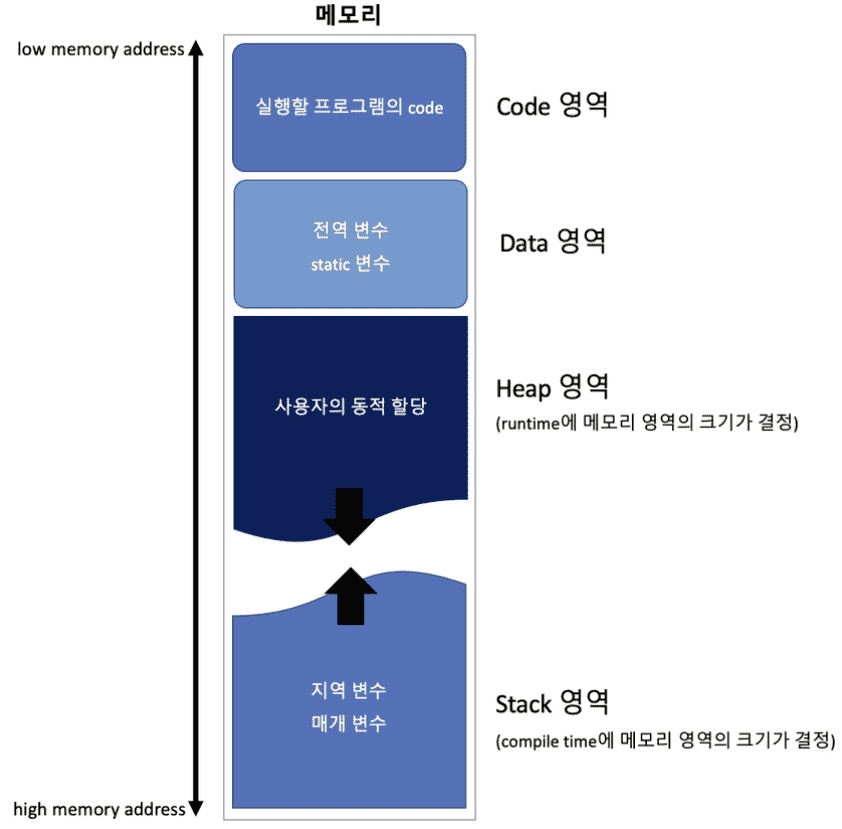
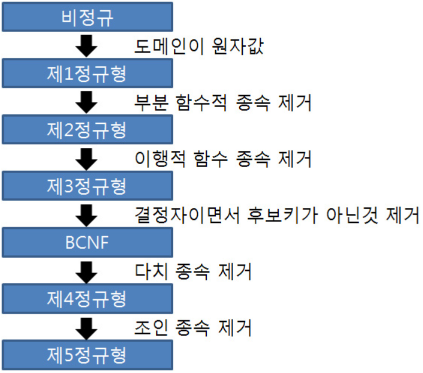
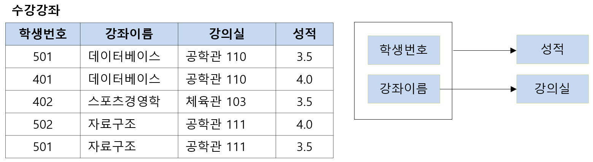
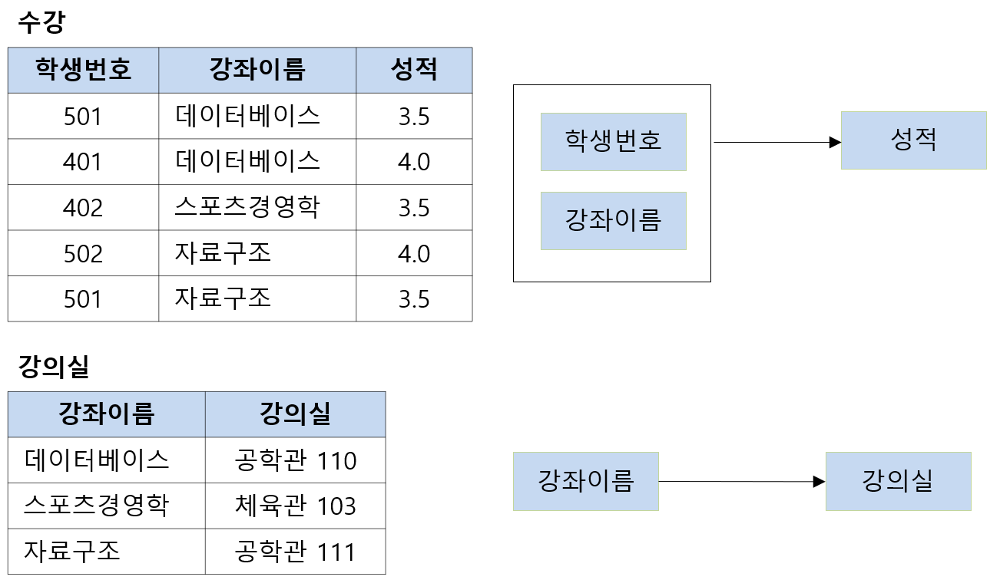
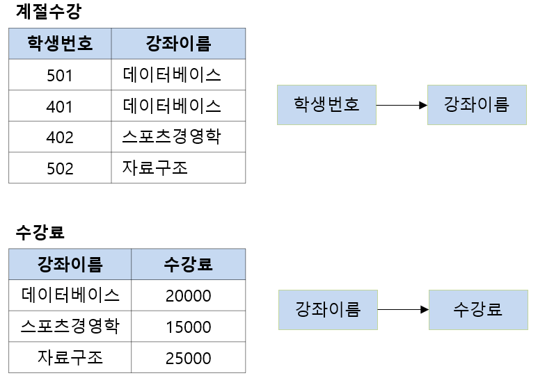
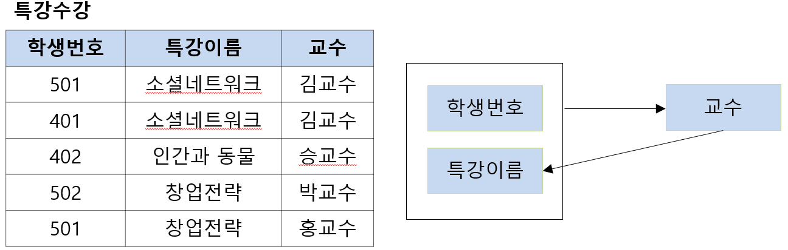
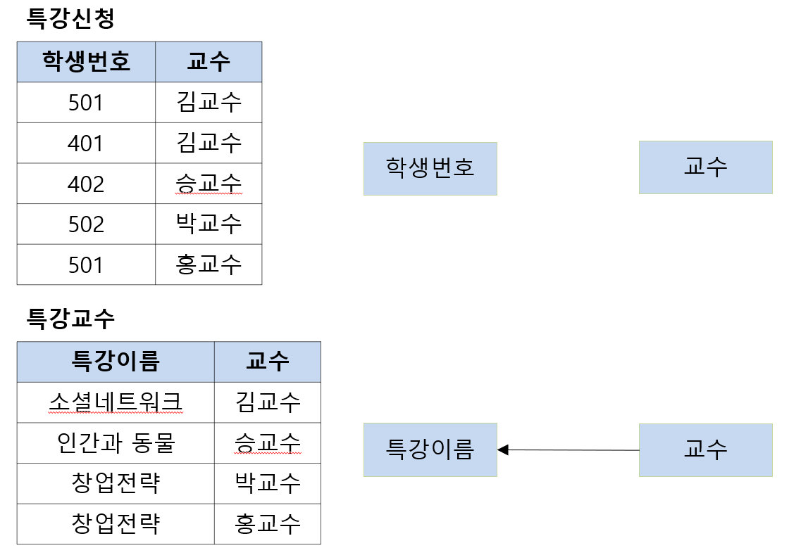
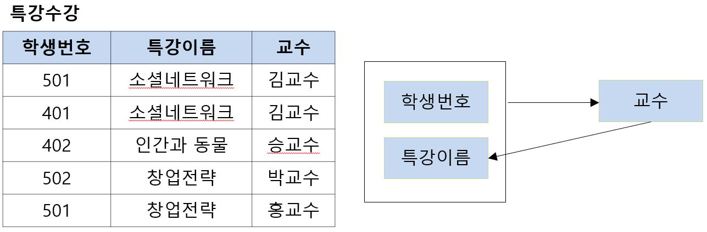
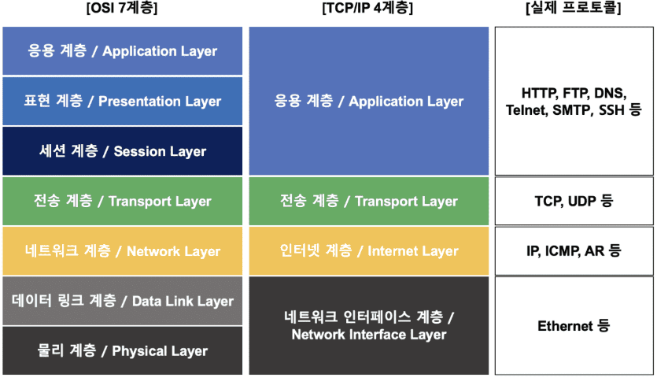

<p align="center" style="font-size:50px">
    <a href="https://github.com/lsw6684/ComputerScience">HOME</a>
</p>

___

<br />

# Interview
- [Data Structure](#data-structure)
- [Operating System](#operating-system)
- [DataBase](#database)
- [Network](#network)
- [Java](#java)
- [Spring](#spring)
- [Web](#web)

---
## Data Structure
### Array는 어떤 자료구조인가요?
Array는 연관된 data를 메모리상에 연속적이며 순차적으로, 미리 할당된 크기만큼 저장하는 자료구조입니다.

<br />

#### Array의 특징은 어떤 것들이 있나요?
대표적으로 **고정된 저장 공간**과 **순차적 데이터 저장**이 있습니다. 

Array의 **장점**은 lookup과 append가 빠르다는 것입니다. 따라서 조회를 자주 해야되는 작업에서 사용됩니다.

**단점**으로는, fixed-size 특성상 선언 시에 크기를 미리 지정해야 된다는 것입니다. 이는 메모리 낭비나 Overhead가 발생할 수 있습니다.

<br />

#### 시간 복잡도

|Array||
|:---|:---|
|access|O(1)|
|append|O(1)|
|마지막 원소 delete|O(1)|
|insertion|O(n)|
|deletion|O(n)|
|search|O(n)|

<br />

#### 미리 예상한 것보다 더 많은 수의 data를 저장하느라 Array의 size를 넘어서게 됐습니다. 이 때, 어떻게 해결할 수 있을까요?
기존 size보다 더 큰 Array를 선언하여, 데이터를 옮기고 기존 Array를 삭제합니다. 이와 같이 동적으로 배열의 크기를 조절하는 자료구조를 Dynamic array라고 합니다. 

size를 예측하기 쉽지 않다면, Array 대신 Linked List를 사용함으로써, 데이터가 추가될 때마다 메모리 공간을 할당받는 방식을 사용합니다.

<br />

#### Array와 ArrayList의 차이점이 무엇인가요?
Array는 크기가 고정적이며, ArrayList는 가변적이라고 할 수 있습니다. Array는 초기화 시, 메모리에 할당 되는 이유로, ArrayList보다 속도가 빠르고, ArrayList는 데이터를 추가하거나 삭제할 때 메모리를 재할당 하기 때문에 Array보다 느립니다.

***

### Dynamic Array는 어떤 자료구조인가요?
Array의 경우 size가 고정되었기 때문에 선언 시에 설정한 size보다 많은 갯수의 data를 저장할 수 없습니다. 하지만, Dynamic Array는 저장 공간이 가득 차면, **resize**를 통해 유동적으로 size를 조절하여 데이터를 저장하는 자료구조입니다.

<br />

#### Dynamic Array의 resize를 설명해 보세요.
resizing을 하는 방법은 여러 가지가 있는데, 대표적으로 기존 Array size의 2배 를 할당하는 **doubling**이 있습니다. 데이터 append 시 O(1)의 시간복잡도를 가지다가, doubling이 발생하면, 데이터를 일일이 옮겨야 하므로 O(n)의 시간복잡도를 가집니다. 

- 분할상환 시간복잡도 Amortized time complexity
    ```
    append 시 O(1)로 진행 되다가 doubling이 발생할 때만 O(n)이 됩니다. 이러한 경우 시간 복잡도를 O(1)로 규정하며, 더욱 정확히 표현하면 amortized O(1)이라고 칭합니다.
    ```

<br />

#### Dynamic Array를 Linked List와 비교하여 장단점을 설명해 주세요
**Linked List와 비교했을 때, Dynamic Array의 장점**은
- 데이터 접근과 할당이 O(1)로 굉장히 빠른 속도를 자랑합니다. Random access의 index 접근 방법이 배열 첫 data의 주소값에 offset을 더하는 산술 연산으로 이루어져 있기 때문입니다. 
- Dynamic Array의 맨 뒤에 데이터를 추가하거나 삭제하는 것이 O(1)의 시간 복잡도이며 상대적으로 빠릅니다.

**Linked List와 비교했을 때, Dynamic Array의 단점**은
- Dynamic Array의 맨 끝이 아닌 곳에 data를 insert하거나 remove할 때, O(n)의 시간복잡도로 느린 편입니다. 메모리상에서 data들이 연속적으로 저장되어 있으므로, 이후의 data들을 모두 한 칸씩 shift 해야하기 때문입니다.
- resize를 해야할 때, 현저히 낮은 performance가 발생합니다.
- resize 시 필요 이상의 메모리 공간을 할당받기 때문에, 낭비되는 메모리 공간이 발생합니다.

***

### Linked List에 관해서 설명해 주세요.
Node라는 구조체로 이루어져 있는데, Node는 데이터 값과 다음 Node의 address로 구성됩니다. Linked List는 **물리적인 메모리상에서는 비연속적으로 저장** 되지만, 각각의 Node가 다음 Node의 address를 가리킴으로써 **논리적인 연속성을 가진 자료구조**입니다.

메모리 할당이 데이터 추가 시 이루어지기 때문에, 메모리를 좀 더 효율적으로 사용할 수 있으며 물리적 연속성을 유지하지 않아도 되는 이유로 메모리 사용이 자유로운 대신, Next address를 추가적으로 저장해야 하기 때문에 데이터 하나당 차지하는 메모리가 더 커지게 됩니다.

<br />

#### 시간 복잡도

|Linked List||
|:---|:---|
|access|O(n)|
|search|O(n)|
|insertion|O(1)|
|deletion|O(1)|

<br />

#### Linked List를 Array와 비교하여 설명해 주세요.
Array와 다르게 Linked List는 물리적 메모리상으로 연속적이지 않지만, 메모리 주소값을 저장함으로써 논리적 연속성을 띕니다. 저장할 데이터의 크기를 모르는 상태에서 Array보다 좋은 performance를 발휘하며 삽입, 삭제가 빈번한 상황에서 권장됩니다.

***

### Queue는 어떤 자료구조인가요?
선입선출 FIFO(First In First Out)의 자료구조입니다. 시간복잡도는 enqueue, dequeue 모두 O(1)이며 활용 예시로는 Cache, 프로세스 관리, 너비우선탐색(BFS) 등이 있습니다.
- Array-Based Queue : enqueue와 dequeue과정에서 남는 메모리가 발생하는 이유로, 낭비를 줄이기 위해 Circular queue 형식으로 구현합니다.
- List-Based Queue: 재 할당이나 메모리 낭비 걱정을 할 필요가 없습니다.
- Deque(Double Ended Queue) : 양 방향으로 enqueue/dequeue가 가능합니다.
- Priority queue : 삽입 순이 아닌 우선순위로 enqueue/dequeue가 가능합니다.

<br />

#### Queue 구현 시 Array-Base와 List-Base에 어떤 차이가 있나요?
**Array-Base**는 메모리 낭비를 줄이기 위해 Circular queue로 구현하는 것이 일반적입니다. fixed size를 넘어간 상태에서 enqueue가 발생하면, Dynamic Array와 같은 방법으로 Array size를 확장시켜야 하지만, 시간복잡도는 amortized O(1)을 유지할 수 있습니다.

**List-Base**는 보통 singly-linked list로 구현합니다. enqueue는 단순히 singly-linked list에서 append 하는 것으로 구현되며 dequeue는 맨 앞의 원소를 제거하고 first head를 변경하면 되기 문에 모두 O(1)로 가능합니다.

두 방법 모두 O(1)의 시간복잡도를 갖습니다. Array-Base의 경우 전반적으로 performance가 더 좋지만, worst case의 경우 resize로 인해 더욱 느릴 수 있습니다. List-Base는 enqueue 발생 시 마다 meomory allocation을 해야 하기 때문에 전반적인 runtime이 느릴 수 있습니다.

<br />

#### Queue와 Priority Queue를 비교하여 설명해 주세요.
Queue는 FIFO구조이며 Priority Queue는 들어간 순서에 상관 없이 우선순위가 높은 데이터가 먼저 나옵니다. Queue의 시간복잡도는 enqueue/dequeue 모두 O(1)이며, Priority queue는 Heap 자료구조로 O(log n)입니다.  

<br />

#### Heap이 어떤 자료구조인지 설명해 주실래요?
Heap은 그 자체로 우선순위큐 구현과 일치합니다. 완전이진트리 구조로 Max Heap과 Min Heap으로 구분됩니다. Max힙을 예로 들자면, 각 child node의 값은 parent node보다 작아야 하며 root node에 저장된 값이 가장 큰 값이 됩니다.  

<br />

#### Heap의 삭제 과정을 설명해주세요.
우선, 루트 노드를 삭제하고, 마지막 노드를 루트 노드 자리로 이동합니다. 그리고 자식 노드와 비교하며 Swap과정을 거칩니다.

<br />

### 우선 순위 큐를 배열이나 연결리스트로 구현하지 않는 이유가 무엇인가요?
배열이나 연결 리스트가 **삭제** 시에는 시간 복잡도의 우위를 점할지라도, **삽입**의 시간 복잡도는 힙이 월등하기 때문에, 편차가 심한 배열과 연결리스트보다는 힙으로 구현합니다.


***

### Stack은 어떤 자료구조인가요? 
후입선출 LIFO(Last In First Out)의 자료구조입니다. push, pop 모두 O(1)이며 후위 표기법 연산, 괄호 유효성 검사, 웹 브라우저 방문기록(뒤로 가기), DFS 등이 있습니다.

***

### 트리 자료구조에 대해 설명해 주세요
노드와 간선들로 이루어진 자료구조로, 사이클이 없는 자료구조입니다. 즉, 루트에서 한 노드로 가는 경로는 유일합니다.

<br />

#### 트리와 그래프의 차이가 무엇인가요?
사이클의 유무입니다. 그래프는 트리와 같이 노드, 간선으로 이루어진 자료구조로 방향과 무방향이 존재하며, 트리는 그래프의 한 종류로써 방향성 있는 비순환 그래프입니다.

<br />

#### 완전 이진 트리와 전 이진 트리, 그리고 포화 이진 트리에 대해서 설명해주세요.
- 완전 이진 트리란, 모든 레벨이 **왼쪽을 우선**으로 채워져 있는 트리이며,
- 전 이진 트리란, 모든 노드가 0개 혹은 2개의 자식 노드를 갖는 트리입니다.
- 그리고 포화 이진 트리란, 완전 이진 트리와 전 이진 트리의 조건을 동시에 만족하는 트리입니다.

<br />

#### 신장 트리(Spanning Tree)와 최소 신장 트리(MST, Minimum Spanning Tree)란 무엇인가요?
신장 트리는 n개의 정점으로 이루어진 무방향 그래프에서 n개의 정점과 n-1개의 간선으로 만들어진, 사이클이 없는 트리입니다. 최소 신장 트리는, 간선들의 가중치를 합한 값이 최소가 되도록 하는 트리입니다.

<br />

#### 최소 신장 트리는 어떤 알고리즘으로 구하나요?
프림과 크루스칼 알고리즘입니다.

<br />

#### 프림과 크루스칼은 어떤 차이가 있죠?
- 프림은 간선을 정렬하지 않고, 하나의 정점에서 시작하여 트리를 확장합니다. 선택한 정점에 인접한 모든 간선 중 가중치가 가장 낮은 간선을 연결하여 트리를 확장합니다.
- 크루스칼은 간선을 가중치별로 정렬하고, 가중치가 높은 간선을 제거하거나, 가중치가 낮은 간선을 삽입하는 과정을 거칩니다.

***

### BST는 어떤 자료구조인가요?
이진 탐색트리는 정렬된 tree입이니다. 어느 node를 선택하든 해당 node의 left subtree에는 그 node 값보다 작은 값들을 지닌 node로만 이루어져 있습니다. 그리고 right subtree에는 그 node의 값보다 큰 값들을 지닌 node로만 이루어져 있는 O(log n)의 binary tree입니다.

BST는 저장과 동시에 정렬을 하는 자료구조로, 노드들을 바닥에 투영 시 오름차순 정렬 된다는 것을 알 수 있습니다.

<br />

#### 이진트리(Binary tree)는 어떤 자료구조인가요?
모든 node의 child nodes의 갯수가 2 이하인 트리를 이진트리라고 합니다.

<br />

#### BST의 worst case의 시간복잡도는 어떻게 되며, 어떤 경우에 발생하나요?
O(n)이며, 균형 없이 한 쪽으로 치우친 tree의 경우 발생합니다. Linked List와 다를 게 없어진다고 볼 수 있습니다.

해결 방법으로는 자가 균형 이진 탐색 트리(Self-Balancing BST)가 있습니다. 이진 트리의 균형을 유지하며, 대표적으로 AVL트리와 Red-Black Tree가 있습니다. Java에서는 hashmap의 sepaerate chaining으로써 Linked List와 Red-Black Tree를 병행하여 저장합니다.
- AVL Tree : 균형도를 사용하여 삽입/삭제 시 균형을 맞춥니다. **균형도가 절댓값 2 미만이면 균형 트리이며, 2 이상이면 불균형 트리**입니다.
    - leaf노드의 높이는 항상 0
    - 자식이 한 개만 있으면 없는 쪽은 -1로 계산(null node)
    - 부모 노드 높이 = Max(좌측 노드 높이, 우측 노드 높이) + 1
    - **균형도** = 좌측 노드 높이 - 우측 노드 높이
        - 균형도가 양수 : 좌측 서브 트리가 비대
        - 균형도가 음수 : 우측 서브 트리가 비대
- Red-Black Tree :
    - 모든 노드는 red, black으로 구성
    - 루트 노트는 black
    - nil 노드는 black : nil 노드는 존재하지 않음을 의미하며 자녀가 없을 때 자녀를 nil노드로 표기함으로써 값이 있는 노드와 동등하게 취급합니다. **RB트리에서 leaf노드는 nil노드**로 계산합니다.
    - red의 자녀들은 black, red는 연속일 수 없습니다.
    - 임의의 노드에서 자손 nil 노드들 까지 가는 경로들에서 **black**의 수는 같습니다.
    - black height : 노드 x에서 임의의 자손 nill 노드까지 내려가는 경로에서의 black 수.
***

### Hash table은 어떤 자료구조인가요?
효율적인 탐색(빠른 탐색)을 위한 자료구조로 key-value쌍의 데이터를 입력받습니다. hash function h에 key값을 입력하여 얻은 해시값 h(k)를 위치로 지정하여 key-value 데이터 쌍을 저장합니다. 저장/삭제/검색 시간 복잡도는 모두 O(1)이며 해당 공간을 slot 또는 bucket이라고 합니다.
- Direct-address Table : 직접 주소화 테이블로 key값으로 k를 갖는 원소는 index k에 저장합니다. 불필요한 공간 낭비와 다양한 자료형을 담을 수 없게 된다는 단점이 있습니다.

<br >

#### Hash table에서 발생하는 Collision은 무엇이고 어떻게 해결할 수 있나요?
key의 해시값이 중복되는 경우를 말합니다. key가 다르더라도 해시값이 같을 수 있는데 이러한 collision이 적게 발생하고 연산속도가 빨라야 **좋은 hash function**이라고 할 수 있으며, 어쩔 수 없이 Collision이 발생한 경우 separate chaining이나 open addressing 등의 방식을 사용하여 해결합니다.
- separate chaining : Linked List를 사용하여 Collision 발생 시 노드(slot)를 추가하여 데이터를 저장합니다. 최악의 경우 O(n)이 발생할  수 있습니다.
- open addressing : Collision 발생 시 특정 규칙에 따라 hash table의 비어있는 slot을 찾습니다. 추가적인 메모리를 사용하지 않으므로, Linked List나 tree 자료구조를 사용하는 separate chaining방식에 비해 메모리를 적게 사용합니다. open addressing 방식은 찾는 방법에 따라 크게 Linear Probing, Quadratic Probing, Double Hashing으로 나뉩니다.
    - Linear Probing(선형 조사법) & Quadratic Probing(이차 조사법) : 선형 조사법은 충돌이 발생한 해시값으로 부터 일정 값만큼 건너 뛰어 빈 slot에 데이터를 저장하며 이차 조사법은 제곱수로 건너 뛰어 빈 slot을 찾아 데이터를 저장합니다.
        - 충돌 횟수가 많아지면 특정 영역에 데이터가 집중적으로 몰리는 클러스터링 현상이 발생하여 평균 탐색 시간이 증가하게 된다는 단점이 있습니다.
    - Double Hashing(이중해시, 중복해시) : Collision 시 open addressing 해결 방식 중 하나로, 클러스터링 문제가 발생하지 않도록 합니다. 최초의 해시값을 얻고 충돌 발생 시 또 다른 해시 함수를 이용합니다.

***

### 퀵소트에 대해 설명해주세요
1. 피벗을 선택합니다. (보통 첫 번째를 선택)
2. 오른쪽(j)에서 왼쪽으로 가면서 피벗보다 작은 수를 탐색합니다.
3. 왼쪽(i)에서 오른쪽으로 가면서 피벗보다 큰 수를 탐색합니다.
4. i와 j를 교환합니다.
5. 2 ~ 4 과정을 반복합니다.
6. i > j인 경우, 즉 더 이상 위 단계를 진행할 수 없으면, 현재 피벗과 i를 교환합니다.

<br />

#### 퀵소트의 시간복잡도는 무엇입니까?
평균 O(NlogN) 입니다.

<br />

#### 왜 평균이라는 표현을 쓰죠?
정렬된 경우 O(N<sup>2</sup>)의 시간복자도를 갖지만, 그 경우가 매우 미미하기 때문에 평균이라는 표현을 덧붙여 사용합니다.


<br />

### 트라이(Trie) 자료구조에 대해서 알고 계신가요?
트리 자료구조 중 하나로 문자열을 저장하고 탐색하는 데 유용한 자료구조입니다.

각 노드는 Key와 Value로 구성 되는 Map을 가지고 있으며, Key는 알파벳, Value는 각 Key에 해당하는 자식 노드들을 의미합니다.

<br />

#### 트라이(Trie)의 장단점에 대해 말씀해보세요.
문자열 검색을 빠르게 할 수 있지만, 각 노드에서 자식들에 대한 포인터들을 배열로 저장하고 있기 때문에 공간복잡도가 크다는 단점이 있습니다.

***

### 정렬 알고리즘에서 안정성(Stability)에 대해 아시나요?
같은 키를 가진 객체들의 상대적인 순서가, 정렬 이후에도  유지되는 것을 말합니다.
- 안정 정렬로는 `삽입 정렬`, `병합 정렬`, `버블 정렬`이 있으며, 중복된 값을 입력 순서와 동일하게 정렬합니다.
- 불 안정 정렬로는 `퀵 정렬`, `선택 정렬`, `계수 정렬`이 있으며 중복된 값이 입력 순서와 동일하지 않게 정렬됩니다.


***

## Operating System
### 컴파일러와 인터프리터의 차이점을 알고 계시나요?
모두 고레벨 언어를 기계어로 변환하는 역할을 수행하지만, 컴파일러는 전체 코드를 보고 명령어를 수집 및 재구성하는 반면, 인터프리터는 소스코드의 각 행을 연속적으로(대화형) 분석하여 실행합니다.

인터프리터는 고레벨 언어를 중간 레벨 언어로 한 번 변환하고, 이를 각 행마다 실행하기 때문에 일반적으로 컴파일러보다 느립니다.

***

### CPU 스케줄링이 무엇인가요?
어떤 프로세스에 CPU를 할당할 것인지, 계획하는 작업입니다.

<br />

#### FCFS(First Come First Served) 스케줄링은 무엇인가요?
가장 먼저 요청한 프로세스에 CPU를 할당하는 방식으로, 비선점형 스케줄링입니다. 간단하고 이해하기 쉽지만, 평균 대기 시간이 길어질 수 있으며 응답 시간이 길어질 수 있습니다.

<br />

#### SJF(Shortest Job First) 스케줄링은 무엇인가요?
CPU의 burst time 길이를 고려하여 짧은 시간의 프로세스부터 실행합니다. 비선점과 선점형이 각각 존재하며 **선점형에서는 현재 진행 중인 프로세스의 남은 시간보다, 이후 도착한 프로세스가 더 빨리 끝날 수 있는 프로세스라면, 순서를 바꾸는** ***SRTF(Shortest Remaining Time First)*** 가 존재합니다.

<br />

#### Priority 스케줄링
각각의 프로세스에 우선순위 넘버가 있습니다. 선점형과 비선점형으로 나뉘며, 기아상태가 발생할 수 있습니다. Aging을 사용하여 기아상태를 해결해야 합니다. 
- 기아 상태 : 우선 순위가 낮아서 계속 실행되지 않음.

<br />

#### Round Robin은 무엇인가요?
각각의 프로세스에 동일한 CPU 할당 시간을 부여하는 선점형 방식입니다.

***

### Process를 설명해주세요.
프로세스란, 실행 중인 프로그램을 의미합니다. 즉, 실행파일 형태로 존재하던 프로그램이 Memory에 적재되어 CPU에 의해 실행(연산)되는 것을 프로세스라 합니다.
- Memory : CPU가 직접 접근할 수 있는 컴퓨터 내부의 기억장치입니다. 프로그램이 CPU에서 실행 되려면, 해당 내용이 Memory에 적재된 상태여야만 합니다.
    <p align="left"></p>
- CPU의 연산과 PC register
프로그램의 코드를 토대로 CPU가 실제 연산을 해야만 프로그램이 실행된다고 볼 수 있으며, 어떤 코드를 읽어야 하는가를 정하는 것은 CPU 내부에 있는 **PC(Program Counter) register**에 저장되어 있습니다. PC register에는 다음에 실행될 코드(명령어, instruction)의 주소값이 저장되어 있습니다. 즉, Memory에 적재되어있는 프로세스 Code 영역의 명령어중 다음 연산에서 읽어야할 명령어의 주소값을 PC register가 순차적으로 가리키게 되고, 해당 명령어를 읽음으로써 CPU가 연산을 하게 되면, process가 실행되는 것입니다.

<br />

#### Process의 Memory 영역에 대해서 설명해주세요.
프로세스가 운영체제에서 할당받는 메모리 공간은 Code, Data, Heap, Stack 영역으로 구분됩니다.
|영역|설명|
|:---|:---|
|Code|실행한 프로그램의 코드가 저장되는 메모리 영역|
|Data|프로그램의 전역 변수와 static 변수가 저장되는 메모리 영역|
|Heap|프로그래머가 직접 공간을 할당(malloc)/해제(free)하는 메모리 영역|
|Stack|함수 호출 시 생성되는 지역 변수와 매개 변수가 저장 되는 임시 메모리 영역|

<br />

#### Process의 Context가 무엇인가요?
process가 현재 어떤 상태로 수행되고 있는지에 대한 정보입니다. 해당 정보는 PCB에 저장합니다.

시분할 시스템에서는 한 process가 매우 짧은 시간동안 CPU를 점유하여 일정부분의 명령을 수행하고, 다른 process에게 넘깁니다. 그 후 차례가 되면 다시 CPU를 점유하여 명령을 수행합니다. 따라서 이전에 어디까지 명령을 수행했고, register에는 어떤 값이 저장되어 있었는지에 대한 정보가 바로 **context**입니다.

<br />

#### PCB(Process Control Block)가 무엇인가요?
OS가 프로세스를 표현한 자료구조로 프로세스 생성 시 OS가 생성합니다. PCB에는 프로세스의 중요한 정보가 포함되어 있기 때문에, 일반 사용자가 접근하지 못하도록 보호된 메모리 영역 안에 저장됩니다. 일부 OS에서 PCB는 커널 스택에 위치합니다. 이 메모리 영역은 보호를 받으면서도 비교적 접근하기가 편리하기 때문입니다.

<br />

#### PCB에 저장되는 것들은 무엇이 있나요?
PCB는 운영체제가 process에 대해 필요한 정보를 모아놓은 자료구조입니다. 일반적으로 
- Process number(PID)
- Process state
- Program Counter(PC), 레지스터
- CPU 스케쥴링 정보, 우선순위
- 메모리 정보(해당 process의 주소 공간 등) 

|PCB||
|:---|:---|
|Process State|new, running, waiting, halted 등의 state가 있습니다.|
|Process Number|해당 process의 number|
|Program Counter(PC)|해당 process가 다음에 실행할 명령어의 주소를 가리킵니다.|
|Registers|컴퓨터 구조에 따라 다양한 수와 유형을 가진 register값들을 가집니다.|
|Memory limits|base register, limit register, page table, sgment table 등|

<br />

#### Context switching에 대해서 설명해주세요.
한 process에서 다른 process로 CPU제어권을 넘겨주는 것을 말합니다. 이 때 이전의 프로세스 상태를 **PCB에 저장하여 보관**하고 새로운 프로세스의 **PCB를 읽어서 보관된 상태를 로드**하는 작업이 이루어집니다.

<br />

#### 컨택스트 스위칭이 많이 발생하면 왜 안 좋을까요?
컨텍스트 스위칭이 발생하는 동안, CPU는 아무 일도 하지 못합니다. 즉 순수한 오버헤드이기 때문에 성능이 저하됩니다.

<br />

#### process의 state에는 어떤 것들이 있나요?
process는 실행(running), 준비(ready), 봉쇄(wait, sleep, blocked) 세 가지 상태로 구분됩니다.
- 실행 : 프로세스가 CPU를 점유하고 명령을 수행중인 상태
- 준비 : CPU만 할당받으면 즉시 명령을 수행할 수 있도록 준비된 상태
- 봉쇄 : CPU를 할당받아도 명령을 실행할 수 없는 상태 - `I/O작업 대기`

***

### Multi Process에 대해서 설명해주세요.
2개 이상의 프로세스가 동시에 실행되는 것을 말합니다. 여기서 동시라는 표현은 동시성인 Concurrency와 병렬성인 Parallelism, 두 가지를 의미합니다.

동시성은 CPU core가 1개일 때, 여러 process를 짧은 시간 동안 번갈아 가면서 연산을 하게 되는 **시분할 시스템(Time Sharing Syste)** 으로 실행되는 것입니다.

병렬성은 CPU core가 여러개일 때, core들이 각각의 process를 연산함으로써 process가 동시에 실행되는 것입니다.

|동시성|병렬성|
|:---|:---|
|Single core|Multi core|
|동시에 실행되는 것 같아 보입니다.|실제로 동시에 여러 작업이 처리 됩니다.|

- 메모리관리 : Multi Process는 2개 이상의 process가 동시에 실행되며, 이 때 process들은 CPU와 메모리를 공유합니다. 여기서 서로 다른 process의 영역을 침범하지 않고 자신의 memory영역에만 접근하도록 OS가 관리해줍니다.

***

### Thread가 무엇인가요?
한 process 내에서 실행되는 동작(기능 function)의 단위입니다. 각 Thread는 속해있는 process의 Stack 메모리를 제외한 나머지 Memory 영역인 Code, Data, Heap을 공유할 수 있습니다.

Thread는 process 내에서 독립적인 기능을 수행합니다. 독립적인 기능을 수행한다는 것은 독립적으로 함수를 호출함을 의미합니다.

<br />

#### Thread는 왜 독립적인 Stack Memory 영역이 필요한가요?
Stack 영역은 함수 호출 시 전달되는 인자, 함수의 Return Address, 함수 내 지역변수 등이 저장되며 각 thread가 함수 호출 시 각각의 Stack memory를 사용합니다.


<br />

#### Multi thread는 무엇인가요?
하나의 process가 동시에 여러개의 일을 수행할 수 있도록 해주는 것입니다. 즉, 하나의 process(실행된 하나의 program)에서 여러 작업을 병렬로 처리하기 위한 단위입니다.

<br />

#### process와 thread를 비교하여 설명해주세요.
process는 운영체제로부터 자원을 할당받는 작업의 단위이고, thread는 process가 할당받은 자원을 이용하는 실행의 단위입니다. 즉, process는 실행파일이 memory에 적재되어 CPU를 할당받아 실행되는 것입니다. 

Thread는 한 process 내에서 실행되는 동작의 단위이며, stack 영역을 제외한 code, data, heap 영역을 공유합니다.

<br />

#### Multi process와 Multi thread를 비교하여 설명해주세요.
- Multi thread는 Multi process보다 적은 메모리 공간을 차지하고, **Context Switching**이 빠릅니다.
- Multi process는 Multi thread보다 많은 메모리공간과 CPU 시간을 차지합니다.
- Multi thread는 동기화 문제와 하나의 thread 장애로 전체 thread가 종료될 위험이 있습니다.
- Multi process는 하나의 process에 문제가 발생해도 다른 process에 영향을 주지 않아, 안정성이 높습니다. 즉, 메모리 구분이 필요한 경우 Multi process가 권장됩니다.
- Context Switching이 자주 일어나고, 데이터 공유가 빈번한 경우, 그리고 자원을 효율적으로 사용해야 되는 경우 Multi thread가 유리합니다.

    ||Multi Process|Multi Thread|
    |:---|:---|:---|
    |메모리 사용<br />CPU 시간|많음|적음|
    |Context<br />Switching|느림|빠름|
    |안전성|높음|낮음|

<br />

#### Multi thread가 Multi process보다 좋은 점은 무엇인가요?
Multi process를 이용하던 작업을 Multi thread로 구현할 경우, 메모리 공간과 시스템 자원 소모가 줄어들게 됩니다. 또한 process를 생성하고 자원을 할당하는 등의 **system call**을 생략할 수 있기 때문에, 자원을 효율적으로 관리할 수 있습니다. 뿐만 아니라 Context swtiching 시 캐시 메모리를 초기화할 필요가 없어서 속도가 빠릅니다.

데이터를 주고 받을 때를 비교해 보면, process 간의 통신(IPC)보다 Multi thread 간의 통신 비용이 적기 때문에, 오버헤드가 적습니다.

<br />

#### Multi process환경에서 process 간에 데이터를 어떻게 주고 받을까요?
원칙적으로 process는 독립적 주소 공간을 가지며, 다른 process의 주소 공간을 참조할 수 없습니다. 하지만, 경우에 따라 운영체제는 process 간의 자원 접근을 위한 매커니즘인 **프로세스 간 통신(IPC)** 을 제공합니다. `pipe, socket, 공유 메모리`

<br />

#### IPC(Inter-Process Communication)가 무엇인가요?
process는 각각의 독립적 주소를 가지는데, 다른 process가 이 주소공간을 참조하는 것은 허용하지 않습니다. 그렇기 때문에 다른 process와 데이터를 주고받을 수 없습니다. 이를 해결하고자 운영체제는 IPC기법을 통해 process들 간에 통신을 가능하게 합니다.<br />
process간 통신(IPC)에는 기본적으로 공유메모리(shared memory)와 메시지 전달(message passing)의 두 가지 모델이 있습니다.

<br />

#### IPC의 예시를 들어주실 수 있나요?
IPC는 크게 공유 메모리 모델과 메시지 전달 모델로 나눌 수 있습니다. 공유 메모리 모델은 주소 공간의 일부를 공유하며 공유한 메모리 영역에 read/write를 통해 통신하게 되는데, 예시로는 공유메모리와 POSIX가 있습니다. 메시지 전송 모델의 경우, kernel을 통해 send/receive 연산으로 데이터를 전송합니다. 예시로는 `pipe, socket, message queue`등이 있습니다.
- **공유 메모리(shared memory)** : process들이 주소 공간의 일부를 공유합니다. 공유한 메모리 영역에 읽기/쓰기를 통해서 통신을 수행합니다. process가 공유 메모리할당을 kernel에 요청하면, kernel은 해당 process에 메모리 공간을 할당해줍니다. 공유 메모리 영역이 구축된 이후에는 모든 접근이 일반적인 메모리 접근으로 취급되기 때문에 더 이상 kernel의 도움 없이도 각 process들이 메모리 영역에 접근할 수 있습니다. 따라서 kernel의 관여 없이 데이터 통신을 할 수 있기 때문에, **IPC속도가 빠르다**는 장점이 있습니다. <br />
공유 메모리 방식은 process 간의 통신을 수월하게 만들지만, 동시에 같은 메모리 위치에 접근하게 되면 일관성 문제가 발생할 수 있습니다. 이에 대해서는 kernel이 관여하지 않기 때문에 process들 끼리 직접 공유 메모리 접근에 대한 동기화 문제를 책임져야 합니다.
- **메시지 전달(message passing)** : 통상 system call을 사용하여 구현됩니다. kernel을 통해 send(message)와 receive(message)라는 두 가지 연산을 제공받습니다. 예를 들면, process1이 kernel로 message를 보내면, kernel이 process2에게 message를 보내주는 방식으로 작동합니다.<br />
메모리 공유보다는 속도가 느리지만, **충동을 회피할 필요가 없기**때문에 적은 양의 데이터를 교환하는 데 유용합니다. 또, 구현하기 쉽다는 장점이 있습니다. `pipe, socket, message queue`

<br />

#### Multi thread가 Multi process보다 안 좋은 점은 무엇인가요?
thread 간의 자원 공유 시 동기화문제가 발생할 수 있어서, 프로그램 설계 시 주의가 필요하고, 하나의 thread에 문제가 생기면, process 내의 다른 thread에도 문제가 생길 수 있습니다.

<br />

#### 멀티 스레딩과 멀티 태스킹의 공통점과 차이점은 무엇인가요?
- 공통점 : 짧은 간격을 두고 여러 개의 프로세스를 번갈아 실행시킴으로써(시분할), 동시에 여러 개의 프로세스가 실행되는 것처럼 보입니다.
- 차이점 : **멀티 스레딩**은 개발자가 **직접 구현**하고 **자원을 공유**하며, **하나의 프로그램** 단위입니다. 하지만, **멀티 태스킹**은 **OS에서 지원**하는 것으로 **독립된 메모리**를 가지며, **여러 개의 프로그램**을 실행시킵니다.
    - 자원 공유를 위해선 별도의 IPC(Inter Process Communication)를 구현해야 하며, 멀티 스레딩에 비해 OS에 부담이 큽니다.

<br />

#### 공유 메모리와 메시지 전달 모델의 장단점을 설명해주세요.
공유 메모리 모델은 초기 공유 메모리 할당을 제외하면, kernel 관여 없이 통신을 유지할 수 있기 때문에 빠른 속도를 자랑합니다. 하지만, process가 동시에 메모리에 접근하기 때문에, 동기화 과정을 구현해야 한다는 단점이 있습니다.

메시지 전달 모델은 kernel을 통해 데이터를 주고 받기 때문에, 통신 속도가 느리다는 단점이 있습니다. 하지만, kernel의 제어로 동기화 문제를 신경쓰지 않아도 됩니다.

***

### Multi process/thread 환경에서 임계영역의 동기화 문제를 어떻게 해결하나요?
Mutex와 Semaphore 기법 등을 사용할 수 있습니다. 
- Mutex란 1개의 스레드만이 공유 자원에 접근할 수 있도록 하여, 경쟁 상황(race condition)을 방지하는 기법입니다. 즉 process/thread는 임계영역에 들어가기 전에 반드시 `lock`을 획득해야 하고, 빠져나올 때 lock을 반환해야 합니다.

    이때 `lock`이 없는 프로세스는 `lock`을 획득하기 위해 무한루프를 돌게 되는데, 이를 **스핀락**이라고 하며, 쓸데없이 자원을 낭비하는 문제점과 두 개의 프로세스만 제어 가능하다는 문제점이 있습니다.
    ```c++
    acquire() // entry sction

    // critical section

    release() // exit section
    ```
- Semaphore란 S개(세마포 변수의 값만큼)의 thread만이 공유 자원에 접근할 수 있도록 제어하는 동기화 기법입니다. Semaphore 기법에서는 정수형 변수 `S(세마포)` 값을 가용한 자원의 수로 초기화하고, 자원에 접근할 때는 `S--` 연산을 수행하여 세마포 값을 감소시키고 자원을 방출할 때는 `S++`연산을 수행하여 세마포 값을 증가시킵니다. 이 때 세마포 값이 0이 되면 모든 자원이 사용 중임을 의미하고, 이후 자원을 사용하려는 프로세스는 세마포 값이 0보다 커질 때까지 `block`됩니다.
    ```c++
    wait(S) // entry section

    // critical section

    signal(S) // exit section
    ```
    - Binary Semaphore : Semaphore 값이 0, 1만 가질 수 있는 경우로, Mutex랑 유사하게 작동합니다.
- Busy waiting은 자원을 얻기 위해 권한을 얻을 때까지 확인하는 것을 의미합니다. CPU의 자원을 쓸데 없이 낭비하기 때문에 권장되지 않는 동기화 방식입니다.

<br />

#### 임계영역(critical section)에 대해 설명해주세요.
둘 이상의 process/thread가 동시에 동일한 자원에 접근하도록 하는 프로그램 코드 부분을 의미합니다. 중요한 특징중 하나는, 한 process/thread가 자신의 임계구역에서 수행하는 동안에는 다른 process/thread들은 그들의 임계구역에 들어갈 수 없어야 한다는 사실입니다. 즉, 임계영역 내의 코드는 원자적으로(atomically) 실행이 되어야 합니다.

원자적으로 실행되기 위해서 각각의 process/thread는 자신의 임계구역으로 진입하려면 진입 허가를 요청해야합니다. 이 부분을 entry section이라고 하고, 진입이 허가되면 임계영역을 실행할 수 있습니다. 임계영역이 끝나고 나면 exit section으로 퇴출을 하게 됩니다. 이렇게 임계영역의 원자성을 보장하는 것을 동기화라고 하며, 대표적으로 `Mutext`와 `Semaphore`가 있습니다.

<br />

#### 임계영역 문제를 해결하기 위한 세가지 조건을 말씀해보세요.
상호배제(mutual exclusion), 진행(progress), 한정된 대기(bounded waiting)입니다.
- 상호배제 : 하나의 프로세스가 임계영역에서 실행하고 있을 때 다른 프로세스는 임계영역에 접근하지 못하도록 하는 것입니다. 이로 인해 교착상태, 기아 상태 문제가 발생합니다.
- 진행 : 임계영역에 들어간 프로세스가 없는 상태에서 들어가려고 하는 프로세스가 여러 개 있다면, 어느 것이 들어갈지를 적절하게 결정해야 한다는 조건입니다.
- 한정된 대기 : 기아 상태를 회피하기 위한 조건으로, 한 프로세스만 계속 실행될 수 없게 하도록, 한 번 임계영역에서 실행된 프로세스는 다음 실행에 대한 제한이 있어야 한다는 조건입니다.

***

### 교착상태(Deadlock)와 경쟁상황(Race Condition)에 대해서 설명해주세요.
둘 이상의 thread가 다른 tread가 점유하고 있는 자원을 서로 기다릴 때, 무한 대기에 빠지는 상황을 말합니다. 발생 조건으로는 상호 배제(mutual exclusion), 점유 대기(hold-and-wait), 비선점(no deadlock), 순환 대기(circular wait)이며, 문제를 해결하는 방법에는 무시, 예방, 회피, 탐지-회복의 4가지 방법이 있습니다.
- Deadlock 해결 방법
    |기법|설명|비고|
    |:---|:---|:---|
    |무시|deadlock 발생 확률이 낮은 시스템에서<br />아무런 조치도 취하지 않고 deadlock을<br />무시하는 방법|- 무시 기법은 시스템 성능 저하가 없다는 장점이 있습니다.<br />- 현대 시스템에서는 deadlock이 잘 발생하지 않고,<br />다른 해결비용이 크기 때문에 무시 방법이 많이 사용됩니다.|
    |예방|교착 상태의 4가지 발생 조건중 하나가<br />성립하지 않게 하는 방법|- 순환 대기 조건이 성립하지 않도록 하는 것이 현실적으로<br />가능한 예방 기법입니다.<br />- 자원 사용의 효율성이 떨어지고 비용이 큽니다.|
    |회피|thread가 앞으로 자원을 어떻게 요청할<br />지에 대한 정보를 통해 순환 대기 상태가<br />발생하지 않도록 자원을 할당하는 방법|- 자원 할당 그래프 알고리즘, 은행원 알고리즘 등을 사용하<br />여 자원을 할당하는 deadlock을 회피합니다.|
    |탐지<br />회복|시스템 검사를 통해 deadlock발생을 탐<br />지하고, 이를 회복시키는 방법|- 자원 사용의 효율성이 떨어지고 비용이 큽니다<br />- 프로세스를 한 번에, 혹은 순차적으로 중지|

**경쟁 상황**은 두 개 이상의 프로세스가 공유자원에 동시에 접근하려는 상황을 말합니다.

<br />

#### 뱅커 알고리즘(Banker's Algorithm)이 무엇인가요?
프로세스가 자원을 요구할 때, 시스템은 자원을 할당한 후에도 안정 상태로 남아있게 되는지 사전에 검사(시뮬레이션)하여 교착상태를 회피합니다. 안정상태가 예상되면 자원할당, 아니면 다른 프로세스들의 자원해지까지 대기하도록 합니다.

<br />

#### 뱅커 알고리즘(은행원 알고리즘)의 단점을 알고 있나요?
교착 상태 회피 알고리즘을 실행하면 자원 소모량이 늘고 시스템 과부하가 올 수 있습니다. 추가로 사용자의 수는 항상 변하기 때문에 남아있는 자원 수를 계산하기 까다롭습니다.

<br />

#### deadlock은 언제 발생하나요?
상호 배제, 점유 대기, 비선점, 순환 대기의 4가지 조건이 동시에 성립할 때 발생할 수 있습니다. **상호 배제**는 동시에 한 thread만 자원을 점유할 수 있는 상황이고, **점유 대기**는 thread가 자원을 보유한 상태에서 다른 thread가 보유한 자원을 추가적으로 기다리는 상황입니다. 또 **비선점**은 다른 thread가 사용 중인 자원을 강제로 선점할 수 없는 상황을 뜻하고, **순환 대기**는 대기 중인 thread들이 순환 형태로 자원을 대기하는 상황을 말합니다.

***

### 배치 정책이 무엇이고 어떤 것들이 있나요?
프로세스를 메모리 어디에 위치시킬지 결정하는 정책이며, Paging, Segmentation, Paged segmentation이 있습니다.

#### Paging이 무엇인가요?
process가 할당받은 메모리 공간을 일정한 **page 단위**로 나누어, 물리 메모리에서 연속되지 않는 **서로 다른 위치**에 저장하는 메모리 관리 기법입니다.

paging 기법에는 주소 바인딩(address binding)을 위해 모든 프로세스가 각각의 주소 변환을 위한 page table을 갖습니다.
- 고정 분할 방식

<br />

#### paging 기법 사용 시 발생할 수 있는 메모리 단편화(Memory fragmentation)문제에 대해 설명해주세요.
물리적 메모리 공간이 작은 공간으로 띄엄띄엄 존재하여, 총 량은 충분히 존재함에도 할당이 불가능한 상태를 말합니다.

paging 기법은 process의 논리적 주소 공간과 물리적 메모리가 같은 크기의 page단위로 나누어지기 때문에 외부 단편화 문제가 발생하지 않습니다. 하지만, process주소 공간의 크기가 page 크기의 배수라는 보장이 없기 때문에, 프로세스의 주소 공간 중 가장 마지막에 위치한 page에서는 내부 단편화 문제가 발생할 가능성이 있습니다.
- 논리적 주소(logical address) : process가 memory에 적재되기 위해 독자적 주소 공간인 논리적 주소가 생성됩니다. 논리적 주소는 각 process마다 독립적으로 할당되며, 0번지부터 시작합니다.
- 물리적 주소(physical address) : process가 실제로 메모리에 적재되는 위치를 말합니다.
- 주소 바인딩(address binding) : CPU가 기계어 명령을 수행하기 위해 process의 논리적 주소가 실제 물리적 메모리의 어느 위치에 매핑되는지 확인하는 과정을 주소 바인딩(address binding)이라고 합니다.

<br />

#### Segmentation에 대해서 설명해주세요.
process가 할당받은 메모리 공간을 논리적 의미 단위(segment)로 나누어, 연속되지 않는 물리 메모리 공간에 할당될 수 있도록 하는 메모리 관리 기법입니다.

일반적으로 process의 메모리 영역 중 `Code, Data, Heap, Stack`등의 기능 단위로 segment를 정의하는 경우가 많습니다.

segmentation 기법에서는 주소 바인딩을 위해 모든 프로세스가 각각의 주소 변환을 위한 segmentation table을 갖습니다.
- 가변 분할 방식

<br />

#### segmentation의 메모리 단편화 문제에 대해 설명해주세요.
segmentation 기법에서 segment의 크기만큼 메모리를 할당하므로 내부 단편화 문제가 발생하지 않습니다. 하지만, 서로 다른 크기의 segment들이 메모리에 적재되고, 제거되는 일이 반복되면, 외부 단편화가 발생할 가능성이 있습니다.

<br />

#### paging과 segmentation의 차이는 무엇인가요?
paging은 메모리를 일정한 크기의 단위로 나누어 할당하고, segmentation은 code, data, heap, stack 등의 기능(의미)단위로 물리 메모리를 할당합니다.

paging의 경우 내부 단편화가 발생할 수 있으며, segmentation은 외부 단편화가 발생할 수 있습니다.

<br />

#### paged segmentation 기법에 대해 설명해주세요.
segmentation을 기본으로 하되, 이를 다시 동일 크기의 page로 나누어 물리 메모리에 할당하는 메모리 관리 기법입니다. 즉, 프로그램을 의미 단위의 segment로 나누고, 개별 segment의 크기를 page의 배수가 되도록 하는 방법입니다.

이를 통해 segmentation 기법에서 발생하는 외부 단편화 문제를 해결하고, 동시에 segment 단위로 process 간의 공유나 process내의 접근 권한 보호가 이루어지도록 해서 paging 기법의 단점을 해결합니다.

***

### 가상 메모리에 대해 설명해주세요.
process 전체가 메모리에 올라오지 않아도, 실행이 가능하도록 하는 기법입니다. 가상 메모리 기법을 통해 사용자 프로그램이 물리적 메모리보다 커져도 실행이 가능하다는 장점이 있습니다.

- OS는 가상 메모리 기법을 통해 프로그램의 논리적 주소 영역에서 필요한 부분만 물리적 메모리에 적재하고, 직접적으로 필요하지 않은 메모리 공간은 디스크(Swap 영역)에 저장하게 됩니다.

<br />

#### 절대주소와 논리주소에 대해 설명해주세요.
- **절대주소**는 메모리상에 레지스터가 사용하는 물리적 주소를 의미합니다. 사용자는 직접적으로 물리 주소로 접근하지 못하기 때문에 논리주소로 접근합니다.
- **논리주소**는 CPU 입장에서의 메모리 주소입니다. 프로그램 실행 중에 CPU가 생성하는 주소로 가상 주소라고도 하며, 해당 주소를 사용해서 실제 메모리 위치를 액세스할 때 참조로 사용됩니다. 절대주소와 관계없이 항상 0번지에서 시작한다는 특징이 있습니다.

<br />

#### 스왑(Swap)영역이란 무엇인가요?
실제 메모리에 당장 필요하지 않은 데이터를 임시로 저장 해두는 HDD의 영역입니다.

<br />

#### 요구 페이징(demand paging)이란 무엇인가요?
특정 page에 대해 cpu의 요청이 들어왔을 때 해당 page를 메모리에 적재합니다. 당장 실행에 필요한 page만을 메모리에 적재하기 때문에 메모리 사용량이 감소하고, 프로세스 전체를 메모리에 적재하는 입출력 오버헤드도 감소하는 장점이 있습니다. *(사용되지 않을 페지를 가져오는 시간과 메모리 낭비를 줄일 수 있습니다.)*

유효, 무효 비트를 두어 각 page가 메모리에 존재하는지 표시하게 됩니다.

<br />

#### Page fault란 무엇인가요?
CPU가 무효 비트로 표시된 page에 엑세스 하는 상황을 page fault라고 합니다. CPU가 무효 page에 접근하면, 주소 변환을 담당하는 하드웨어인 MMU가 page fault trap을 발생시키게 되고, 일련의 순서로 page fault를 처리합니다.
1. CPU가 특정 페이지를 참조합니다.
2. Page table에서 해당 페이지가 무효 상태임을 확인합니다.
3. MMU에서 page fault trap을 발생시킵니다.
4. 디스크에서 해당 페이지를 빈 프레임에 적재하고, page table을 업데이트합니다.

<br />

#### 페이지 교체 알고리즘(replacement algorithm)에 대해 말해주세요.
FIFO, 최적 페이지 교체, LRU, LFU 등이 있습니다.
|알고리즘|설명|
|:---|:---|
|FIFO|메모리에 올라온지 가장 오래된 page를 교체|
|최적 페이지 교체|앞으로 가장 오랫동안 사용되지 않을 page를 찾아서 교체하며 구현이 어렵습니다.|
|LRU|가장 오랫동안 사용되지 않은 page를 교체|
|LFU|참조 횟수가 가장 적은 page를 교체하며 비용 대비 성능이 좋진 않아 잘 쓰이진 않습니다.|

***

### Sync, Async, Blocking, Non-blocking을 설명해보세요.
- Sync : A 함수가 B 함수를 호출할 때, B 함수의 결과를 A 함수가 처리합니다.
- Async : A 함수가 B 함수를 호출할 때, B 함수의 결과를 B 함수가 처리합니다.
- Blocking : A 함수가 B 함수를 호출할 때, B 함수가 자신의 작업이 종료되기 전까지 A 함수에게 제어권을 돌려주지 않습니다.
- Non-blocking : A 함수가 B 함수를 호출할 때, B 함수가 제어권을 바로 A 함수에게 넘겨주면서, A 함수가 다른 일을 할 수 있도록 합니다.


***

## DataBase
### Primary Key가 무엇인가요?
후보 키 중 선택한 주키로써, 각 행을 구분하는 유일한 열을 의미합니다. 그렇기 때문에 NULL값과 중복된 값을 가질 수 없습니다.

<br />

#### Super Key는 무엇인가요?
각 row를 유일하게 식별할 수 있는 하나 또는 그 이상의 속성들의 집합입니다. 유일성만 만족하면 슈퍼키라 할 수 있습니다.
- 유일성 : 하나의 key 값으로 특정 row만을 유일하게 찾아낼 수 있음을 의미합니다.
    - `학번`
    - `학번, 이름`
    - `학번, 이름, 학과`
    - `주민등록번호`

<br />

#### Candidate key(후보키)는 무엇인가요?
Super Key 중에서 더이상 쪼개질 수 없는 키입니다. 각 row를 유일하게 식별할 수 있는 최소한의 속성들의 집합입니다. 즉, Primary Key로 사용할 수 있는 Column들을 말합니다.
- `학번`
- `주민등록번호`

<br />

#### Alternative key(대체키)는 무엇인가요?
기본키를 제외한 후보키입니다. 보조키라고도 부릅니다.

<br />

#### 주키(Primary Key)와 외래키(Foreign Key)에 대해 설명해주세요
Primary Key는 Candidate Key 중 선택한 Main Key로써, NULL값과 중복된 값을 가질 수 없으며 **유일성**과 **최소성**을 만족합니다.

Foreign Key는 다른 table의 Primary Key Column과 연결되는(참조되는) table의 Column을 의미합니다.

<br />

#### 실무에서 외래키를 잘 사용하지 않기도 하는데 이유가 뭘까요?
제약 조건이 있으면 데이터 수정 시 참조 관계를 토대로 데이터 수정 순서를 신경 써줘야 하는 번거로움이 있으며, CASCADE로 인한 의도치 않은 삭제가 발생할 수 있습니다. 추가로 항상 무결성 검사를 하기 때문에 성능이 저하됩니다.

<br />

#### Composite key에 대해서 설명해주세요.
table에서 각 row를 식별할 수 있는 2개 이상의 Column으로 구성된 candidate key를 말합니다.
- `학번, 과목번호`로 `학점`을 알 수 있습니다.

<br />

#### Unique 키는 무엇인가요?
유일성을 가지기 위해 설정해 놓은 키로, 중복이 되는 것을 방지합니다. 기본키와 달리 여러 개 생성이 가능하고 NULL값을 허용합니다.

***

### DDL은 무엇인가요?
Data Definition Language로 데이터 정의 언어입니다. 테이블, 뷰, 인덱스 등의 DB 개체를 생성 및 삭제, 혹은 변경할 수 있으며 트랜잭션을 발생시키지 않으므로 ROLLBACK과 COMMIT이 없습니다.
- `CREATE`, `DROP`, `ALTER`, `TRUNCATE`

<br />

#### DML은 무엇인가요?
Data Manipulation Language로 데이터 조작 언어입니다. 사용 전에 테이블이 정의되어 있어야 하며 데이터 변경 시 실제 테이블에 완전히 적용하는 것이 아니라 임시 적용 후 반영이나 취소가 가능합니다.
- `SELECT`, `INSERT`, `UPDATE`, `DELETE`

<br />

#### DCL은 무엇인가요?
Data Control Language로 데이터 제어 언어입니다. 사용자에게 권한을 부여하거나 빼앗는 데 사용합니다.
- `GRANT`, `REVOKE`

***

### RDB에서 N:M 관계에 대해서 설명해주세요.
양쪽 entitiy 모두가 서로에게 1:N 관계를 갖는 구조를 말합니다. 보통 새로운 Mapping Table을 사용하여 관계를 맺습니다.

<br />

#### 1:N 관계에 대해서 설명해주세요.
RDB에서 하나의 Entity(table)가 관계를 맺는 Entitiy의 여러 객체를 가지는 구조를 말합니다.

<br />

#### LEFT OUTER JOIN, INNER JOIN 차이를 설명해주세요.
JOIN은 두 개 이상의 테이블을 서로 연결하여 하나의 결과물을 출력합니다. LEFT OUTER JOIN은 왼쪽 TABLE의 모든 행에 대해서 JOIN을 하고, INNER JOIN은 두 테이블에 모두 있는 내용만 JOIN하는 방식입니다.

***

### RDB와 NoSQL을 비교해서 설명해주세요.
RDB는 사전에 엄격하게 정의된 Schema를 기반으로 정형 데이터만 저장할 수 있으며, NoSQL은 Schema 없이 비정형 데이터를 저장할 수 있도록 지원합니다.

RDB는 중복을 허용하지 않기 때문에 UPDATE가 많을 때 유리하며, NoSQL은 중복으로 인해 데이터 UPDATE 시 모든 컬렉션에서 수정이 필요하기 때문에 UPDATE가 적고 조회가 많을 때 유리합니다.

<br />

#### NoSQL은 언제 사용해야 하나요?
정확한 데이터 구조가 정해지지 않은 경우, 데이터 UPDATE가 잘 이루어지지 않고, 조회가 많은 경우, 또 Scale out이 가능하므로 데이터 양이 매우 많은 경우에 사용하면 좋습니다.

<br />

#### RDB는 언제 사용해야 하나요?
데이터 구조가 명확하여 변경될 여지가 없는 경우나 중복이 없으므로 UPDATE가 잦은 경우에 사용해도 좋습니다.

***

### Transacotion을 설명해주세요.
DB 내에서 수행되는 작업의 최소 단위로, DB의 무결성을 유지하며 DB의 상태를 변화시키는 기능을 수행합니다. 하나 이상의 Query를 포함해야 하고, ACID라고 칭해지는 원자성, 일관성, 고립성, 지속성의 4가지 규칙을 따릅니다.


<br />

#### 트랜잭션의 성질을 말씀해보세요.
ACID로 총 4가지가 있습니다.
1. Atomicity로 원자성입니다. 한 트랜잭션의 연산들이 모두 성공하거나 반대로 전부 실패되는 성질을 말합니다. `작업 단위의 일부분만을 실행하지 않는다고 할 수 있습니다.`
2. Consistency로 일관성입니다. 트랜잭션이 성공적으로 완료 되면, 일관적인 DB 상태를 유지함을 의미합니다. 즉, 무결성 제약 조건을 항상 만족해야 합니다. `자료형 int가 string으로 변하거나 하면 안 된다는 뜻입니다.`
3. Isolation으로 독립성입니다. 둘 이상의 트랜잭션이 동시에 실행되는 경우, 서로의 연산에 영향을 끼치지 않음을 말하며, `수행 중인 트랜잭션은 완전히 완료가 될 때까지 다른 트랜잭션에서 그 결과를 참조할 수 없습니다.`
4. Durability로 영속성입니다. 성공적으로 완료된 트랜잭션의 결과는, `시스템이 꺼지거나 고장난다고 해도 영구적으로 반영되어야 합니다.`

<br />

#### 동시성 제어에 대해 말씀해주세요.
여러 개의 Transaction이 한 개의 데이터를 동시에 갱신(UPDATE)할 때 어느 한 transaction의 갱신이 무효화 될 수 있는데, 이를 **갱신 손실**이라고 합니다. 갱신 손실을 막기 위한 동작으로, transsaction이 동시에 수행될 때 일관성을 해치치 않도록 transaction의 데이터 접근을 제어하는 DBMS의 기능입니다.

데이터 수정 중엔 해당 데이터를 Lock하여 다른 transaction이 접근하지 못 하도록 하고, Lock이 걸린 데이터는 Unlock이 될 때까지 접근할 수 없습니다.

- 낙관적 동시성 제어 : 같은 데이터를 동시에 수정하지 않을 것으로 가정하는 것입니다. 데이터를 읽는 시점에 lock을 걸진 않지만 수정하는 시점에서 기존에 읽어온 데이터가 다른 사용자에 의해 변경되었는지 재검사가 필요합니다.
    - 조회가 많은 곳에서 사용되지만, 변경이 있을 수 있으니 일관성 검사를 필요로 합니다.
- 비관적 동시성 제어 : 같은 데이터를 동시에 수정할 것으로 가정합니다. 데이터를 읽는 시점에서 lock을 걸고 조회, 갱신 완료 시까지 lock을 유지합니다.
    - SELECT 시점에서 lock을 걸면, 무한 대기가 발생할 수 있습니다. `MSSQL-WITH(NOLOCK)`
<br />

#### 트랜잭션 격리수준 종류에 대해 말씀해주세요.
동시에 여러 트랜잭션이 처리될 때, 특정 트랜잭션이 다른 트랜잭션에서 변경, 혹은 조회하는 데이터를 읽게 허용할지를 결정하는 것입니다.
- READ UNCOMMITTED (커밋되지 않은 읽기 허용) `Level 0` 

    커밋되지 않은 데이터를 다른 트랜잭션이 조회할 수 있으며 이것을 **Dirty read**라고 합니다.
    - 일관성 훼손

- READ COMMITTED (커밋된 읽기 허용) `Level 1`

    커밋한 데이터를 다른 트랜잭션에서 조회합니다. 따라서 **Dirty Read**는 방지할 수 있지만, **NON-REPEATABLE READ**와 **Phantom READ**는 발생할 수 있습니다. 주로 오라클에서 기본으로 사용되는 격리 수준이며, 온라인 서비스에서 가장 많이 선택되는 격리수준입니다.
    - NON-REPEATABLE READ : 한 트랜잭션에서 같은 쿼리를 2번 실행했을 때, 다른 값이 나오는 Read 현상을 말하는 것으로, 동일 트랜잭션에 여러 스냅샷이 사용되는 경우를 말합니다.
    - PHANTOM READ : 한 트랜잭션 안에서 첫 번째 쿼리 수행 결과와 두 번째 쿼리 수행 결과가 다른 것을 나타내는 것이며, 외부에서 실행 중인 트랜잭션의 INSERT 작업에 의해 발생하는 READ현상을 말합니다. 즉, 결과 범위에 속하지 않는 레코드가 외부 작업에 의해 있을 수도 있고, 없을 수도 있다는 것을 뜻합니다.
    
- REPEATABLE READ (반복 가능한 읽기) `Level 2`

    한 번 조회한 데이터를 반복해서 조회해도 같은 데이터가 조회됨을 보장하는 격리수준입니다. 

- SERIALIZABLE (직렬화 가능) `Level 3`

    가장 엄격한 트랜잭션 격리 수준으로, Dirty Read, Phantom Read 등의 모든 문제가 발생하지 않지만, 단순 SELECT 쿼리도 Lock이 걸릴 수 있어서, **동시성 처리 성능이 급격히 떨어질 수 있습니다.**

<br />

#### COMMIT과 ROLLBACK에 대해 말씀해주세요.
DB는 COMMIT과 ROLLBACK으로 데이터 무결성을 보장합니다. 

COMMIT이란, transaction 작업을 완료했다고 확정하는 명령어로 실제 DB가 변경됩니다.

ROLLBACK은 작업 중 문제가 발생했을 때, transaction 처리 과정에서 발생한 변경 사항을 취소하고, 이전 COMMIT 상태로 되돌리는 것을 의미합니다.

***

### 정규화에 대해서 설명해보세요.
이상 현상이 발생하는 릴레이션을 분해하여, 이상 현상을 없애는 과정입니다. 함수 종속성의 유형에 따라 등급을 구분하고 정규형이 높을수록 이상현상이 줄어듭니다.

데이터의 일관성과 모델의 응집도를 높이는 것을 지향합니다.

<br />

#### 비정규화(반정규화)는 무엇인가요?
조인으로 인한 성능 저하가 예상될 때, **읽기 성능 향상**을 위해 정규화된 테이블을 다시 합치는 것으로, 데이터 무결성을 떨어뜨리는 것을 감안합니다.
- 데이터 무결성 : 데이터의 정확성, 일관성, 유효성을 지키는 것입니다.

<br />

#### 역정규화는 무엇인가요?
비정규화 상태로 만들기 위한 방법 중 하나입니다. DB 비용을 최소화 하고 성능을 개선하기 위해 중복을 허용하여 Entity를 다시 통합하거나 정규화로 도출된 DB 구조를 재조정 하는 것입니다.

<br />

#### 이상 현상이 뭐죠??
삭제 이상, 삽입 이상, 갱신 이상이 있으며, 중복이 발생하거나 무결성에 지장을 주는 현상입니다.
- 삭제 이상 : 튜플 삭제 시 같이 저장된 다른 정보까지 연쇄적으로 삭제되는 현상입니다.
- 삽입 이상 : 튜플 삽입 시 특정 속성에 해당하는 값이 없어 NULL값을 입력해야 하는 현상입니다.
- 갱신 이상 : 데이터 갱신 시 일관성 유지가 안 되는 현상입니다.

<br />

**정규형 : 도부이결다조**
<p align="center"></p>

- **제 1정규형**
    - 릴레이션 R의 모든 속성 값이 원자(쪼갤 수 없는) 값을 가집니다.
    - 모든 속성은 한 개의 값을 가집니다.
<p align="center"></p>

- **제 2정규형**
    - 제 1정규형을 만족한 상태에서 부분 함수 종속을 제거합니다.
<p align="center"> </p>

- **제 3정규형**
    - 이행적 함수 종속을 제거합니다.
<p align="center"> </p>

- **BCNF**
    - 릴레이션의 모든 결정자가 후보 키인 릴레이션입니다.
    - [후보 키](#후보-키-candidate-key)가 아닌 속성이 결정자로 사용되면 안된다는 뜻입니다.
 <p align="center"></p>
 <p align="center"></p>
 <p align="center"></p>

- **제 4정규형**
    - 다치종속(MVD)을 제거합니다.
    - 다치종속이란, A가 {B1, B2 ..} 를 결정하고, {C2, C5..}도 결정. 즉, 하나의 값이 집합 값들을 가리키는 것을 말합니다.
- **제 5정규형**
    - 조인종속을 이용하여 원래의 릴레이션과 차이가 있는지(무손실 분해의 원칙에 어긋나지 않는지), 확인하고 올바른 분해를 합니다.
- **반 정규화**
    - 시스템 성능 향상과 개발 및 운영의 단순화를 위해 데이터 모델을 통합하는 데이터베이스 성능향상 기법입니다.
        - 데이터를 조회할 때 디스크I/O량이 많아 성능이 저하되는 경우
        - 경로가 너무 멀어 조인으로 인한 성능저하가 예상되는 경우
        - 컬럼을 계산하여 읽을 때, 성능 저하기 예상되는 경우

***

### VIEW가 무엇인가요?
원하는 데이터들만을 보여주기 위해 기존 테이블에서 유도된 가상 테이블입니다. 
```sql
CREATE VIEW USER_VIEW
    AS
    SELECT  U.USERID, U.USERNAME
    FROM    SCMUSER
```

<br />

#### 사용하는 이유가 무엇인가요?
대표적으로 2가지가 있습니다. 

첫째로, CLIENT는 숨겨진 데이터의 존재 자체를 모르기 때문에 접근 자체가 불가능합니다. 따라서 데이터 보안에 효과가 있습니다.

둘째로, 전체 Schema를 사용하는 것이 아닌, SubSchema 개념으로 필요한 부분만 나누어 사용할 수 있습니다.

***

### DB 프로시저와 DB 함수의 차이는 무엇인가요?
프로시저와 함수는 구조적으로 동일하며 사용에 차이가 있습니다. 간혹, 리턴값의 유무로 구분하는 사람들이 있는데 명백히 틀린 정의입니다.
|프로시저|함수|
|:---|:---|
|작업 수행|계산 수행|
|리턴값을 여러 개 가질 수도, 아예 안 가질 수도 있음|반드시 하나의 리턴값이 필요|

***

### Trigger는 무엇인가요?
DB에 수정이 발생할 때 DBMS에 의해 Side Effect로 자동 실행되는 SQL입니다.

***

### DB에서 DeadLock은 무엇을 의미하나요?
여러 Transaction들이 각각 자신의 데이터에 대하여 lock을 획득한 상태에서 상대방 데이터에 접근하고자 대기를 할 때 교차 대기를 하게 되며 서로 영원히 기다리는 상태를 말합니다.

<br />

#### DB의 DeadLock을 해결하려면 어떻게 해야하나요?
- 예방 기법 : 각 transaction이 실행되기 전에 필요한 데이터를 모두 Locking 합니다. 하지만 Locking해줘야 하는 데이터가 많다면, 사실상 모든 데이터를 전부 Locking하게 되어 transaction의 병행성을 보장하지 못할 수 있습니다.
- 회피 기법 : 자원을 할당할 때 **time stamp**를 사용하여 deadlock을 회피합니다.
- 탐지/회복 기법 : transaction이 실행되기 전엔 아무런 검사를 하지 않고, deadlock이 발생하면 이를 감지하고 회복시키는 방법입니다.

***

### Index는 왜 필요한가요?
TABLE의 검색 성능을 높여주기 위해 필요합니다. 일반적인 RDBMS에서는 B+Tree구조로 된 index를 사용하여 검색 속도를 향상시킵니다.
- index는 `Btree`, `B+tree`, `Hash`, `Bitmap`으로 구현될 수 있습니다.

index는 책마다 마지막 페이지에 있는 색인과 같은 역할을 하는 자료구조입니다. 책에서 어떤 용어나 단어를 찾기 위해 첫 페이지부터 끝 페이지 까지 전체를 훑지 않아도(Full Table Scan) index를 찾아보면 몇 페이지에 적혀 있는지 바로 찾을 수 있는 것(Index Scan)과 비슷합니다.

SELECT ~ WHERE Query를 통해 특정 조건을 만족하는 데이터를 찾을 때, Full Table Scan할 필요 없이 정렬되어 있는 index에서 훨씬 빠른 속도로 검색을 할 수 있게 됩니다.


<br />

#### 클러스터드 인덱스와 넌클러스터드 인덱스의 차이를 말해보세요.
클러스터드 인덱스는 PK 기준, 자동 오름차순 정렬이고 상대적으로 크기가 작습니다. 선택도 30% 이하일 때 사용하기 좋고, 한 테이블에 1개만 존재할 수 있습니다.

넌클러스터드 인덱스는 자동으로 정렬하지 않고, 상대적으로 크기가 큽니다. 선택도는 3% 이하일 때 사용하기 좋고 한 테이블에 최대 249개 존재할 수 있습니다.

<br />

#### 커버링 인덱스가 무엇인가요?
쿼리를 충족시키는 데 필요한 모든 데이터를 갖고 있는 인덱스를 의미합니다.

인덱스만 읽고 처리하는 쿼리를 Covered Query라고 부릅니다.

<br />

#### 클러스터형 인덱스와 보조 인덱스를 설명해 보세요.
- Clustering index : 특정 Column을 기본키로 지정하면 자동으로 클러스터형 인덱스가 생성되고, 해당 column 기준으로 정렬이 됩니다. Table 자체가 정렬된 하나의 index라할 수 있습니다.
- Secondary index : 일반 책의 찾아보기와 같이 별도의 공간에 index가 생성됩니다. `create index`와 같이 index를 생성하거나 고유키(unique key)로 지정하면 보조 인덱스가 생성됩니다.

<br />

#### index의 단점은 무엇인가요?
크게 2 가지가 있습니다.

첫째로, 추가 저장공간이 필요합니다. 보통 Table의 10%정도를 차지합니다.

둘째로, 느린 데이터 변경 작업입니다. B+tree 구조의 index는 데이터가 추가/삭제 될 때마다 tree의 구조가 변경될 수 있으며, index의 재구성이 필요하기 때문에 추가적인 자원이 소모됩니다.

<br />

#### index를 많이 생성하면 안 되나요?
index를 생성하면 조건 검색 성능이 향상될 수 있지만, 추가 저장 공간이 필요하고, 데이터 추가/수정/삭제를 할 때마다 관련 index를 모두 수정해줘야 되기 때문에 시간이 추가적으로 소요됩니다. 따라서 추가 저장 공간과, 데이터 업데이트 시 소요되는 추가 시간 등의 Trade off를 고려하여, 조건 검색 성능 향상이 더 큰 이득이 된다고 판단되는 Column에만 index를 생성하는 것이 좋습니다.

<br />

#### index를 어느 Column에 사용하는 것이 좋을까요?
where 절에서 자주 사용되고, 수정 빈도가 낮으며, 카디널리티는 높고, 선택도가 낮은 column을 선택하는 것이 좋습니다.
- 카디널리티 : 높을수록 적합(데이터 중복이 낮을수록 적합)
- 선택도 : 낮을수록 적합
- 조회 활용도 : 높을수록 적합(where 절에서 많이 사용되면 적합)
- 수정 빈도 : 낮을수록 적합

<br />

#### 고객 DB에서 성별 column에 index를 걸어주는 게 좋을까요?
성별은 남녀 두 종류로만 나눠지는 경우에는 카디널리티가 매우 낮고, 선택도는 매우 높게 됩니다. 이 경우, index가 주는 이점이 매우 적고 오히려 저장공간 차지와 데이터 수정 시 성능 저하등을 고려하여 index를 생성하지 않는 것이 좋습니다.

<br />

#### true 또는 false 값을 갖는 column에서, true 1%, false 99%의 비율로 구성된 상황에서는 index를 거는 게 좋을까요?
역시 두 종류로 나누어 지기 때문에, 카디널리티가 매우 낮고, 선택도는 매우 높게 됩니다. 이 경우 index가 주는 이점이 매우 적고 오히려 저장 공간 차지와 데이터 수정 시 선ㅇ능 저하등을 고려하여 index를 생성하지 않는 것이 좋습니다.

<br />

#### 데이터를 검색할 때 hash table의 시간복잡도는 O(1)이고 b+tree는 O(logn)으로 더 느린데 왜 index는 hash table이 아니라, b+tree로 구현되나요?
Hash table을 사용하면 하나의 데이터를 탐색하는 시간은 O(1)로 b+tree보다 빠르지만, 값이 정렬되어 있지 않기 때문에 부등호를 사용하는 query에 대해서는 매우 비효율적이게 되어 데이터를 정렬해서 저장하는 b+tree를 이용합니다.

<br />

#### Hash index는 언제 효율적일까요?
빠른 데이터 검색이 필요할 때 유용합니다. 하지만, index로써 hash index가 사용되는 경우는 제한적입니다. 왜냐하면 hash index는 등호(=) 연산에만 특화되었기 때문입니다. 데이터가 조금이라도 달라지면, hash function은 완전히 다른 hash 값을 생성하는데, 이러한 특성 때문에 부등호 연산(>, <)이 자주 사용되는 DB 검색에는 hash index가 적합하지 않습니다.

<br />

#### MySQL 인덱스는 어떤 자료구조를 사용하나요?
B+Tree 자료구조를 사용합니다.

<br />

#### B+Tree를 사용하는 이유는 무엇인가요?
B-Tree는 특정 데이터의 검색엔 효율적이지만, 모든 데이터를 순회하는 경우엔 모든 노드를 방문해야 하므로 비효율적입니다.

따라서 MySQL에서는 B+Tree를 사용하여 모든 데이터는 리프노드에 저장 되고, Double Linked List로 연결되어 있기 때문에 순회에 매우 유리합니다.

***

### Replication이 무엇인가요?
DB 복제를 의미하며 보통 Master 1개와 Slave N개의 형태로 구성합니다. Master, Slave DB 간에 데이터는 비동기로 동기화합니다.

스케일 아웃으로 성능이 향상되며, 데이터 백업이 가능합니다. 비동기로 동기화를 진행하기 때문에, **Replication 지연**이라고 하는, 데이터 일관성이 깨지는 순간이 존재합니다.

<br />

#### Replication 지연을 어떻게 해결하나요?
밀리세컨드 단위의 지연은 인정하는 방법과 캐시를 이용하는 방법이 있습니다. Replication 지연 문제가 치명적이라면, 오라클 DB를 사용하는 방법도 있습니다.

***

### Partition이란 무엇인가요?
테이블이나 인덱스 데이터를 특정 컬럼(파티션 키) 값에 따라 별도 테이블 또는 인덱스에 나누어 저장하는 것을 의미합니다. 물리적으로 데이터는 나눠지지만, 논리적으로 하나의 테이블처럼 사용할 수 있는 게 핵심입니다. 보통 로그성 데이터 백업용도로 사용합니다.

***

### HA(고가용성)에 대해서 질문을 드리겠습니다. MySQL 한 대만 존재하는 것이 있을 것이고, 한 대는 Master, 한 대는 Slave로 동작하는 구조가 있습니다. 이러한 구조의 목적이 무엇인가요?
Master DB 수정 시에 Slave DB에 Replication을 시행합니다. 업데이트와 조회를 각각의 DB로 구분하여 수행하고 트래픽을 분산시킵니다. 

<br />

#### 앞에 말씀드린 구조에서 발생할 수 있는 문제점은 무엇인가요?
대규모 트래픽이 발생하면, Master DB가 Slave DB에 Replication 되기 전에 Slave DB가 사용되어, 데이터 무결성이 깨질 수 있습니다.

***

### JDBC가 무엇인가요?
Java Database Connectivity로 자바에서 DB에 접속할 수 있도록 하는 자바 API입니다. JDBC는 DB에서 자료를 쿼리하거나 업데이트하는 방법을 표준으로 제공하여 애플리케이션 서버의 사용 코드를 그대로 유지할 수 있습니다.

<br />

#### JDBC의 한계는 무엇인가요?
실무에서 사용하는 페이징 SQL은 각각의 DB마다 사용법이 다릅니다. 결국 DB를 변경하면 JDBC 코드는 변경하지 않아도 되지만, **SQL은 해당 DB에 맞도록 변경해야합니다.** 이러한 각각의 DB마다 다른 SQL을 정의해야 하는 문제를 JPA를 사용하여 해결할 수 있습니다.

하지만, 어떤 기술을 사용해도 JDBC는 DB 접근 기술의 기반입니다.

***

### DB에서 Connection Pool은 무엇인가요?
DB Connection을 획득하는 것은 과정도 복잡하고 시간 소요도 많기 때문에 이러한 단점을 해결하기 위해 커넥션을 미리 생성하여 재사용하며, 커넥션을 관리하는 것이 Connection Pool입니다.
- Connection Pool의 Size는 보통 default 10입니다.

***

## Network
### HTTP가 뭔지 설명해주세요.
HTTP는 HyperText Transfer Protocol의 약자로 서버-클라이언트 모델을 따르며 request/response 구조로 웹 상에서 정보를 주고받을 수 있는프로토콜입니다. TCP/IP 기반으로 작동하며, HTTP의 가장 큰 특징은 `Connectionless`와 `Stateless`입니다.

`Connectionless`는 서버 연결 후 요청에 응답을 받으면 연결을 끊어버리는 것을 의미합니다. 이로 인해 많은 사람이 웹을 이용하더라도 실제 동시 접속을 최소화하여 더 많은 유저의 요청을 처리할 수 있습니다. 하지만 연결을 끊었기 때문에, 클라이언트의 이전 상태(로그인 유무 등)를 알 수가 없다는 `Steteless` 특성이 생기게 됩니다. 정보를 유지할 수 없는 HTTP의 단점을 보완하기 위해, `cookie`, `session`, `jwt` 등이 도입되었습니다.

또한 HTTP는 정보를 text 형식으로 주고 받기 때문에 중간에 인터셉트할 경우 데이터 유출이 발생할 수 있는 문제가 있어서 이를 해결하고자 HTTP 암호화를 추가한 `HTTPS 프로토콜`이 추가되었습니다.

<br />

#### Connectionless의 장, 단점을 말해보세요.
- 장점 : Client의 요청들을 전부 유지하면 리소스가 소모됩니다. 하지만 Connectionless로 연결을 모두 끊고 효율적 리소스 사용을 기대할 수 있습니다.
- 단점 : 매 요청마다 연결과 해제로 오버헤드가 발생합니다.
    - HTTP Persistent Connection을 사용합니다.
    - HTTP2, 3으로 더욱 최적화된 환경을 사용합니다.

<br />

#### Stateless의 장, 단점을 말해보세요.
- 장점 : Server가 Client의 상태를 보존하지 않기 때문에 Server의 확장성이 높으며 장애 발생 시, 서로 다른 Server가 대신하여 처리할 수 있습니다. 이 것을 Scale out이라고 합니다.
    - Scale up : 서버 자체 하드웨어 성능을 업그레이드 합니다.
- 단점 : Server가 Client 상태를 보존하지 않기 때문에, Client가 서버로 추가 데이터를 전송해야 합니다.
- 한계 : 모든 것을 무상태로 설계할 순 없습니다. 예로, 로그인의 경우 사용자가 로그인 했다는 상태를 서버에서 유지해야 하기 때문에 세션을 사용하여 최소한의 상태를 유지합니다.

<br />

#### Post 요청 후에 새로고침 버튼을 클릭하면 다시 요청을 보내게 되는데 이 것은 멱등성이 없습니다. 어떻게 대비해야 하나요?
PRG(Post-Redirect-Get) 패턴을 사용하여 POST 방식으로 온 요청에 대해서 GET 방식의 웹 페이지로 redirect(`3xx`) 시킵니다.

- 멱등성 : 연산을 여러 번 적용해도 결과가 일정한 성질

<br />

#### HTTP status code에 대해서 설명해주세요.
클라이언트가 보낸 HTTP요청에 대한 서버의 응답 코드로, 상태 코드를 통해 요청의 성공/실패 여부를 판단할 수 있습니다. 100번대부터 500번대까지 총 5가지 종류가 존재합니다.
- `1xx` 정보 : 요청을 받았으며 작업을 계속합니다.
- `2xx` 성공 : 클라이언트가 요청한 동작을 성공적으로 수신하여 처리했습니다.
- `3xx` 리다이렉션 : 요청을 완료하기 위해 추가 작업 조치를 필요로 합니다.
- `4xx` 클라이언트 오류 : 클라이언트의 요청에 문제가 있습니다.
- `5xx` 서버 오류 : 서버가 유효한 요청 수행을 실패했습니다.

|Status code|Message||
|:---|:---|:---|
|200|OK|요청 성공 `잔액조회 성공`|
|201|Created|리소스 생성 성공 `게시글 작성 성공, 회원가입 성공`|
|400|Bad Request|데이터의 형식이 올바르지 않는 등 서버가 요청을 이해할 수 없음|
|401|Unauthorized|인증되지 않은 상태에서 인증이 필요한 리소스에 접근<br />`로그인 전에 사용자 정보 요청 등 - 인증`|
|403|Forbidden|인증된 상태에서 권한이 없는 리소스에 접근<br />`일반 유저가 관리자 메뉴 접근 등 - 인가`|
|404|Not Found|요청한 route가 없음. 찾는 리소스가 없음<br />`존재하지 않는 url 입력`|
|500|Bad Gateway|서버에서 에상히지 못한 에러 발생<br />`예외처리를 하지 않은 오류 발생`|

<br />

#### HTTP request method 중 GET과 POST를 비교하여 설명해주세요.
GET 메소드는 클라이언트가 서버에게 리소스를 요청할 때 사용하는 메소드이고, POST 메소드는 서버에게 데이터 처리(주로 생성)를 요청할 때 사용하는 메소드입니다.

GET의 경우 필요한 정보를 특정하기 위해 URL 뒤에 Query String을 추가하여 정보를 조회하고, POST의 경우 전달할 데이터를 Body에 포함하여 통신합니다.

GET은 URL 뒤의 Query String까지 포함해서 브라우저 히스토리에 남게 되고 캐시가 가능하지만, POST는 브라우저 히스토리에 남지 않고 캐시도 불가능합니다.

<br />

#### HTTP request method 중 Put과 Patch를 비교하여 설명해주세요.
PUT 메소드와 PATCH 메소드는 모두 서버의 리소스를 업데이트하는 메소드라는 공통점이 있습니다. 하지만, PUT 요청의 경우 모든 리소스를 수정, 대체하고 없으면 생성까지 하지만, PATCH 요청의 경우 일부 리소스만 수정하게 됩니다.

***

### OSI 7계층과 TCP/IP 4계층을 비교하여 설명해주세요.
OSI 7계층은 네트워크 통신을 표준화한 모델로, 통신 시스템을 7단계로 나누어 설명한 것입니다. 하지만, OSI 모델이 실무적으로 이용하기에 복잡한 탓에 실제 인터넷에서는 이를 단순화한 TCP/IP 4계층이 사용되고 있습니다.

<p align="left"></p>

 - 1계층 - 물리 계층, Physical Layer
    - 전송에 필요한 두 장치 간의 실제 접속과 절단 등에 필요한 전송 매체의 기계적, 전기적, 기능적, 절차적 특성에 대한 규칙 정의.
    - 0과 1을 전압의 고저나 빛의 점멸로 변환.
    - 커넥터, 케이블 모양을 규정.
    - 프로토콜 : Ethernet.RS-232C
    - 장비 : 허브, 리피터
    - 전송 단위 : 비트

- 2계층 - 데이터 링크 계층, Data Link Layer
    - 인접한 개방 시스템들 간에 신뢰성 있고 효율적인 정보 전송을 할 수 있도록 함.
    - 상대방과 물리적인 통신을 위한 통신로 확립 및 통신로를 통과하는 동안에 오류 검사 실시
    - 직접 연결된 기기 간의 데이터 프레임 식별 및 전송.
    - 흐름제어, 프레임 동기화, 오류 검사, 순서 제어.
    - 프로토콜 : MAC, HDLC, LAPB, PPP, LLC
    - 장비 : 브리지, 스위치
    - 전송 단위 : 프레임

- 3계층 - 네트워크 계층, Network Layer
    - 개방 시스템들 간의 네트워크 연결 관리(네트워크 연결 설정/해제)
    - 주소 관리, 경로 선택, 트래픽 제어, 패킷 정보 전송
    - 프로토콜 : X.25, IP, ICMP, IGMP, IPSec, ARP
    - 장비 : 라우터
    - 전송 단위 : 패킷

- 4계층 - 전송 계층, Transport Layer
    - 데이터가 능률적으로 확실하게 도착하는 지를 담당.
    - 종단 시스템(End to End) 간에 투명한 데이터 전송을 가능하게 함.
    - 전송 연결 설정, 데이터 전송, 연결 해제, 주소 설정, 다중화, 오류제어, 흐름제어
    - 장비 : 게이트웨이
    - 프로토콜 : TCP, UDP, ARP
    - 전송 단위 : 세그먼트

- 5계층 - 세션 계층, Session Layer
    - 데이터가 흐를 수 있는 가상 경로의 확립 및 해제
    - 송수신측 간의 관련성 유지
    - 대화 제어/구성/동기 제어, 데이터 교환 관리, 통신 관리, 연결 확립/끊기, 4계층 이하의 층관리
    - 프로토콜 : SSH, TLS
    - 전송 단위 : 메시지

- 6계층 - 표현 계층, Presentation Layer
    - 응용 계층에서 받은 데이터를 세션 계층에 맞게, 세션 계층에서 받은 데이터를 응용 계층에 맞게 변환.
    - 코드 변환, 데이터 암호화, 데이터 압축, 구문 검색, 정보 형식 변환, 문맥 관리, 전송 형식에 관한 책임
    - 프로토콜 : JPEG, MPEG, SMB, AFP
    - 전송 단위 : 메시지

- 7계층 - 응용 계층, Application Layer
    - 사용자가 OSI환경에 접근할 수 있도록 서비스를 제공.
    - 특정 애플리케이션에 특화된 프로토콜(메일용 프로토콜, 로그인용 프로토콜..)
    - 프로토콜 : DHCP, DNS, HTTP, SMTP, FTP
    - 전송 단위 : 메시지
- TCP/IP 4계층/5계층
    - OSI 7 Layer가 나오기 전에 설계된 모델입니다.
    - 호환성, 장비 개발 측면에서 OSI모델이 더 많이 사용되지만, 실질적인 통신에는 TCP/IP모델이 사용됩니다.

<br />

#### 앱 개발 시에 네트워크 문제가 발생했습니다. 트러블 슈팅을 위해 어떻게 접근할 것인가요?
3계층, 4계층, 7계층 순서대로 확인할 것입니다. 우선 네트워크 계층을 `ping`으로 ip 접근이 되는 지 확인하고, 전송 계층은 `telnet`으로 port 접근이 되는 지 확인하며 마지막으로 `curl`, `포스트맨`, `브라우저`로 애플리케이션에 접근이 되는 지 확인할 것입니다.

<br />

#### 2계층의 역할은 무엇인가요?
하나의 네트워크 대역 LAN에서 데이터를 안전하게 전달하는 역할입니다. 이를 위해 오류제어, 흐름제어, 순서제어를 수행합니다.

<br />

#### 2계층에서 사용하는 장비들은 무엇인가요?
브릿지, 스위치가 있습니다.

<br />

#### 2계층에서 통신에 사용하는 주소는 어떤건가요?
MAC 주소입니다. 네트워크상에서 서로를 구분하기 위한 식별자로, 각 장치의 NIC마다 할당된 물리적 주소입니다. ARP를 사용하여 IP 주소로 MAC주소를 알 수 있고 RARP는 MAC주소로 IP주소를 알 수 있습니다.

<br />

#### 2계층에서 사용하는 프로토콜은 무엇이 있나요?
LAN에서는 대부분 Ethernet 프로토콜을 사용합니다.

<br />

#### 3계층의 역할은 무엇인가요?
LAN과 LAN을 연결시켜주는 계층으로, 데이터를 목적지 까지 최적의 경로로 전달할 수 있도록 라우팅을 수행합니다.

<br />

#### 3계층에서 사용하는 장비는 무엇인가요?
라우터입니다. 서로 다른 네트워크를 연결하기 위한 장비이며, 최적의 경로를 결정하기 위해 RIP, IGRP, OSPF와 같은 알고리즘들을 사용하여 라우팅 테이블을 관리합니다.

<br />

#### 3계층에서 통신에 사용하는 주소는 무엇인가요?
IP주소를 사용합니다.

<br />

#### 네트워크가 발전하면서 IP 주소가 부족해지기 시작했는데, 이를 어떻게 해결했는지 아시나요?
**IPv6**가 등장했지만, 이미 존재하는 주소체계를 전부 옮기기엔 큰 비용이 드는 이유로 잘 사용하지 않습니다. 그리고 IP 낭비를 줄이기 위해 **서브넷 마스크**, Public IP와 Private IP 또한 등장하여 IP 주소 부족 문제를 해결했습니다.

<br />

#### 본인 컴퓨터에서 cmd로 ipconfig 명령어를 사용하면 어떤 IP 주소가 나오나요?
사설 IP주소가 나옵니다. 추가로 네이버같은 포털에서 IP를 검색하면 공인 IP 주소를 조회할 수 있습니다.

<br />

#### NAT이란 무엇인가요?
Network Address Translation의 약자로, 공인 IP와 사설 IP를 상호변환해주는 기술입니다. 외부에서 공인 IP로 들어온 데이터를 사설 IP로 변환해서 데이터를 전달하고 그 반대의 역할도 수행합니다.

<br />

#### 4계층의 역할은 무엇인가요?
송신자의 프로세스와 수신자의 프로세스를 연결하는 역할을 합니다.

<br />

#### 4계층에서는 무슨 장비를 사용하나요?
게이트웨이를 사용합니다. WAN에서 통신하기 위해 필요하며 서로 다른 네트워크의 규격을 알맞게 변환하여 통신할 수 있습니다.

<br />

#### 4계층에서 통신에 사용하는 주소는 무엇인가요?
포트 번호를 사용합니다.

<br />

##### Well=Known 포트에 대해 아는대로 말씀해주세요.
1024 미만의 포트들 중 전 세계에서 표준으로 사용하는 포트 번호를 의미합니다.

|서비스 이름|포트 번호|
|:---|:---|
|FTP|20, 21|
|SSH|22|
|TELNET|23|
|DNS|53|
|DHCP|67, 68|
|TFTP|69|
|HTTP|80|
|HTTPS|443|

<br />

#### 4계층에서 사용하는 대표적인 프로토콜은 뭐가 있나요?
TCP와 UDP입니다.

<br />

#### 흐름제어, 혼잡제어, 오류제어, 순서제어를 설명해보세요.
- 흐름제어 : 데이터 처리 속도를 조절하여 수신자의 버퍼 오버플로우를 방지합니다.
    - 정지 - 대기 : 전송 패킷에 대한 응답을 받은 후 패킷을 전송합니다.
    - 슬라이딩 윈도우 : 수신 측에서 설정한 윈도우 크기만큼 송신 측에서 확인 응답(ACK) 없이 전송할 수 있게 하여 흐름을 동적으로 조절하는 제어 알고리즘입니다.
- 혼잡제어 : 네트워크 내의 패킷 수가 과도하게 증가하지 않도록 방지합니다.
- 오류제어 : 전송된 데이터가 손실 되었거나, 훼손된 경우, 순서가 어긋나는 경우, 또는 중복되는 경우를 해결합니다.
    - 슬라이딩 윈도우 : 위와 같습니다.
- 순서제어 : 패킷이 송신한 순서대로 목적지에 도착하도록 제어합니다.

***

### 캡슐화(Encapsulation)와 역캡슐화(Decapsulation)를 설명해주세요.
캡슐화란, 통신 프로토콜의 특성을 포함한 정보를 Header에 포함시켜서 하위 계층에 전송하는 것을 말합니다. 통신 상대측에서 이러한 Header를 역순으로 제거하면서 원래의 Data를 얻는 과정을 역캡슐화라고 합니다.

***

### TCP와 UDP를 비교해서 설명해주세요.
TCP는 연결형, 신뢰성 전송 프로토콜입니다. 연결 지향적 서비스를 제공하기 위해 데이터를 전송하기 전에 3-way handshake를 하여 두 호스트의 전송 계층 사이에 논리적 연결을 설립합니다. 신뢰성 있는 서비스를 제공하기 위해 오류제어, 흐름제어, 혼잡제어 등을 실행하며 header가 더 크고 속도가 비교적 느리다는 단점이 있습니다. `신뢰성이 중요한 통신(HTTP, File 전송 등)에 쓰입니다.`

UDP는 비연결형 프로토콜로 3-way handshake 등의 세션 수립 과정이 없습니다. 또한 비신뢰성 프로토콜로 흐름제어, 오류제어, 혼잡 제어를 제공하지 않습니다. 이러한 단순성 덕분에 적은 양의 오버헤드로 수신 여부를 확인하지 않아서 속도가 빠릅니다. `실시간성이 중요한 통신(동영상 스트리밍 등)에 주로 사용됩니다.`

<br />

#### TCP에 대해서 자세히 설명해주세요.
TCP는 연결형, 신뢰성 전송 프로토콜입니다. 연결지향적 서비스를 제공하기 위해 데이터를 전송하기 전에 먼저 두 호스트의 전송 계층 사이에 논리적 연결을 설립합니다. 그 후 데이터 전송을 완료하면 연결을 해제합니다. TCP의 통신은 이렇게 `connection setup`, `data transfer`, `connection termination`의 세 단계로 나뉩니다.

신뢰성 있는 서비스를 제공하기 위해 TCP가 전체 스트림을 순서에 맞고 오류 없이, 또한 부분적인 손실이나 중복 없이 전송하는 것을 보장합니다. 이를 가능하게 하는 방법은 오류제어, 흐름제어, 혼잡제어 등이 있습니다. 흐름제어는 데이터를 보내는 속도와 데이터를 받는 속도의 균형을 맞추는 것을 뜻합니다. 오류제어는 훼손된 segment의 감지 및 재전송, 손실된 segment의 재전송, 순서가 맞지 않게 도착한 segment를 정렬하고 중복 segment 감지 및 폐기를 합니다. 이는 TCP header의 checksum, 확인 응답, 타임-아웃 등을 통해 수행됩니다.

패킷 교환 방식으로는 **가상회선 패킷 교환 방식**을 사용하여 논리적 연결을 위한 식별번호로 순서를 보장하며 전송합니다.

<br />

#### 3-way handshake가 무엇인지와 그 과정을 설명해주세요.
TCP/IP 프로토콜로 통신하기 전, 정확한 정보 전송을 위해 상대방 컴퓨터와 세션을 수립하는 과정으로 TCP 연결 초기화라 할 수 있습니다.

클라이언트가 서버에게 접속을 요청하는 `SYN` 패킷을 보내면, 서버는 `SYN+ACK` 패킷을 클라이언트에 발송합니다. 클라이언트는 이것을 수신한 후, 다시 `ACK`를 서버에게 발송하면 연결이 이루어지고 데이터를 주고받을 수 있습니다. 

<br />

#### 4-way handshakE는 무엇인지와 그 과정을 설명해주세요.
3-way handshhake를 통해 Connection setup된 TCP를 종료하는 Connection termination과정입니다. 

TCP connection termination은 양방향으로 2개의 연결이 독립적으로 닫히기 때문에 4-way 단계를 거칩니다.
1. Client process에서 active close를 하면, client tcp에서 `FIN` 세그먼트를 보냅니다.
2. Server는 `ACK`로 응답하는데, Server 내의 process에게 EOF를 보내지만, process가 close되지 않을 수 있습니다.
3. Server process로부터 passive close를 받으면, server TCP에서 `FIN`세그먼트를 client TCP에게 보냅니다.
4. client는 `ACK`를 Server에게 보내고, 이를 수령하면 연결이 종료됩니다.

<br />

#### TCP 통신을 설명해주세요.
1. Connection setup으로 3-way handshaking을 사용하여 TCP 연결을 초기화시킵니다.
2. Data transfer로 데이터를 전송합니다.
3. Connection termination으로 4-way handshaking을 사용하여 TCP 연결을 종료합니다. 

<br />

#### UDP에 대해서 자세히 설명해주세요.
UDP는 비연결형, 비신뢰성 전송 프로토콜입니다. 논리적 연결을 설립하지 않고 흐름제어, 오류제어, 혼잡 제어를 제공하지 않으며 datagram만을 전송하는 프로토콜입니다. 이러한 단순성은 적은 양의 오버헤드를 갖기 때문에, 작은 메시지를 보내거나 신뢰성을 크게 고려하지 않아도 되는 상황에서 사용됩니다.

패킷 교환 방식으로는 **데이터그램 패킷 교환 방식**을 사용하며, 각각의 패킷이 독립적으로 이동하여 최적의 경로를 선택하기 때문에 도착 순서가 다를 수 있습니다.

***

### Proxy에 대해서 알고 계신가요?
Server와 Client 사이에서 대리로 통신을 수행하며 중계기 역할을 하는 것입니다.

Proxy Server는 익명성으로 보안을 향상시키고, 캐시를 통한 속도 향상, 차단된 사이트를 IP 우회하여 접속하거나 원하지 않는 사이트를 차단하기도 합니다.

<br />

#### Proxy Server에는 어떤 종류가 있나요?
Forward Proxy와 Reverse Proxy가 있습니다.
- `Client - 인터넷 - Server`

Forward Proxy는 일반적인 프록시 서버로 Client와 Web Server의 중계를 담당합니다. Client의 앞에 위치하며, Client가 Proxy Server에 요청한 내용을 Proxy Server에 캐시로 저장해 두고, 후에 데이터를 재요청하면, 캐시된 데이터를 사용하여 전송 시간을 절약할 수 있습니다. Proxy Server는 Client가 요청하기 전까지 웹 서버의 주소를 알 수 없으며 캐싱 기능을 제공함과 동시에 특정 사이트의 접근을 제한할 수도 있습니다.
- Client 정보가 노출되지 않습니다.
- `청소년의 성인 컨텐츠 접근 제어`

Reverse Proxy는 Web Server 앞에 놓여져 있습니다. Client와 Web Server 사이에 위치하여 제어역할을 합니다. Client가 바로 Server에 데이터를 요청하여 받아올 수도 있지만, DB 노출을 최소화 하고 로드 밸런싱으로 트래픽을 분산시킵니다.
- Server 정보가 노출되지 않습니다.

<br />

#### 로드 밸런싱 기법 중에 라운드로빈(Round Robin Method) 방식이라고 알고 계신가요?
Server에 들어온 요청을 순서대로 돌아가며 배정합니다. 보유한 서버들이 동일한 스펙을 갖고 있고, 서버와의 연결(세션)이 오래 지속되지 않는 경우에 적합합니다.

***

### www.google.com을 주소창에 쳤을 때 화면이 나오기까지의 과정을 네트워크 관점으로 설명해주세요.

#### 답변 1
1. 사용자가 브라우저에 URL을 입력합니다.
2. 브라우저는 DNS를 통해 서버의 IP를 찾습니다.
3. Client에서 HTTP request메시지로 TCP/IP패킷을 생성하고 Server로 전송합니다.
4. Server에서 HTTP request에 대한 HTTP response 메시지로 TCP/IP패킷을 생성하고 Client로 전송합니다.
5. 도착한 HTTP response message는 웹 브라우저에 의해 출력됩니다.(렌더링)

#### 답변 2
1. 사용자가 브라우저에서 URL을 입력하면, HTTP request message를 생성합니다.
2. IP주소를 알아야 전송할 수 있으므로, DNS lookup을 통해 해당 domain의 server IP주소를 알아냅니다.
3. 반환된 IP주소(server IP)로 HTTP 요청 메시지를 TCP/IP층에 전달하면, 헤더를 추가하여 TCP/IP 패킷을 생성합니다.
4. 해당 패킷은 전기신호로 랜선을 통해 네트워크로 전송되고, 목적지 IP에 도달합니다.
5. server에 도착한 패킷은 unpacking을 통해 message를 복원하고 server의 process로 전달됩니다.
6. server의 process는 HTTP 요청 메시지에 대한 response data를 가지고 HTTP 응답 메시지를 생성합니다.
7. HTTP 응답 메시지를 전달 받은 방식 그대로 Client IP로 전송합니다.
8. HTTP response 메시지에 담긴 데이터를 토대로 웹브라우저에서 HTML 렌더링을 하여 화면이 출력됩니다.

***

### SOP란 무엇인가요?
Same Origin Policy로 도일 출처 정책을 의미합니다. 동일 출처에서만 접근이 가능하도록 하며, 서로 다른 서버에서의 응답을 받을 수 없습니다. 대부분의 Browser에서는 이 것을 기본적으로 차단하고 있기에 별도 처리가 필요합니다.

<br />

#### 왜 이러한 정책이 있는거죠?
XSS나 XSRF등의 보안 취약점을 노린 스크립트 공격을 방어하기 위함입니다. 하지만, 개발할 때 외부 리소스를 가져오는 경우가 대부분이며 이 것을 위해 CORS를 사용합니다.

<br />

#### CORS가 무엇인데요?
Cross-Origin Resource Sharing으로 도메인이나 포트가 다른 서버의 자원을 요청하는 메커니즘입니다. 외부 리소스를 사용하기 위한 SOP의 예외 조항입니다.


***

### 쿠키(cookie) 생성 과정을 설명해주세요.
쿠키의 생성과 저장은 구현에 따라 다르지만, 원리는 동일합니다.
1. 서버가 클라이언트로부터 요청을 받았을 때, 클라이언트에 관한 정보를 토대로 쿠키를 구성합니다.
2. 서버는 클라이언트에게 보내는 응답의 header에 쿠키를 담아 보냅니다.
3. 클라이언트가 응답을 받으면, 브라우저는 쿠키를 Cookie directory에 저장합니다.

쿠키는 클라이언트(브라우저)에 key-value 쌍의 파일 형태로 저장됩니다. 즉, 유효시간 내에서는 브라우저가 종료 되어도 계속 유지됩니다. 서버에서 response header에 `set-coockie`속성을 사용해서 Cookie를 만들어 보내고, 사용자가 따로 작업 하지 않아도 브라우저가 쿠키를 request header에 담아서 서버에 전송합니다. 

<br />

#### 쿠키의 단점은 무엇인가요?
개인정보 등을 탈취당할 수 있습니다.

<br />

#### 세션(session)은 어떻게 사용되죠?
센션은 기본적으로 쿠키를 이용하여 구현됩니다. Client를 구분하기 위해 각 Client에게 session ID를 부여하고 Client는 쿠키에 session ID를 저장합니다. 사용자 정보를 브라우저에 저장하는 쿠키와 달리 세션은 서버측에 저장하여 관리합니다. 세션은 유효시간을 두어 일정 시간 응답이 없다면 끊을 수 있고, 브라우저가 종료될 때까지 인증상태를 유지할 수 있습니다. 사용자 정보를 서버에 두기 때문에 쿠키보다 보안은 좋지만, 서버 자원을 차지하기 때문에 서버에 과부하를 줄 수 있고 성능 저하의 요인이 될 수 있습니다.

<br />

#### 쿠키와 세션의 차이점을 설명해주세요
쿠키는 클라이언트(브라우저) 로컬에 key-value 쌍으로 저장되는 데이터 파일입니다. 유효시간 내에서는 브라우저가 종료되어도 계속 유지됩니다.

세션은 브라우저가 종료되거나, 서버에서 해당 세션을 삭제할 수 있기 때문에 쿠키보다 보안성이 좋습니다. 또한 서버에 데이터를 저장하므로 서버 용량이 허용하는 한에서 제한 없이 데이터를 저장할 수 있다는 장점이 있지만, 서버의 부하가 커진다는 단점이 있습니다.

<br />

#### 쿠키와 세션을 사용하는 이유가 무엇인가요?
HTTP의 connectionless(비연결성), stateless(비상태성)라는 특징 때문입니다. Client가 요청을 했을 때 그 요청에 맞는 응답을 보낸 후 연결을 끊고, Server는 Client에 대한 상태 정보를 유지하지 않기 때문에 알 수 없습니다. 하지만 쿠키와 세션을 적절하게 사용한다면, Client의 상태 정보를 임시 저장하여 특정 기간 동안 사용할 수 있습니다.

**만약 쿠키와 세션을 사용하지 않는다면**, 로그인 했음에도 불구하고 페이지를 이동할 때마다 계속 로그인을 해야하며, 장바구니, "오늘 더 이상 이 창을 보지 않음" 등의 편의성을 제공할 수 없습니다.

<br />

#### 세션 없이 쿠키만 존재한다면 어떤 문제가 발생할까요?
유출 문제가 발생했을 때 서버에서 해당 세션을 제거함으로써 해당 상황을 모면하는 것이 불가능할 것으로 보입니다. `invalidate`


<br />

#### 세션이 보안도 좋은데 왜 쿠키를 사용할까요?
세션은 서버의 자원을 사용하기 때문에 서버가 느려질 수 있고, 서버 자원이 부족할 수 있습니다. 서버 자원의 낭비를 방지하고 속도를 높히기 위해 상황에 따라 쿠키를 사용합니다.

<br />

#### 쿠키의 사용 예를 말씀해주세요.
1. 쇼핑몰의 장바구니 기능
2. 로그인 시 아이디와 비밀번호 저장(또는 자동로그인)
3. 팝업에서 "오늘 더 이상 이 창을 보지 않음" 체크

<br />

#### JWT에 대해서 아시나요?
Json Web Token으로, 인증에 필요한 정보들을 암호화시킨 토큰입니다.

<br />

#### JWT의 장점과 단점을 말씀해주세요. 
- 장점으로는 인증 정보에 대한 별도의 저장소가 필요 없으며(**서버의 무상태**) 자체적으로 위변조를 막을 수 있습니다. 또한 다른 로그인 시스템에 접근 및 권한 공유가 가능하므로 확장성이 우수합니다.

- 단점으로는, 쿠키와 세션보다 길이가 길기 때문에, 요청이 많아질 수록 네트워크 부하가 심해지며, Payload는 암호화되지 않기 때문에 중요 정보는 담을 수 없습니다. 추가로 **토근은 유효기간이 만료될 때까지 계속 사용**할 수 있기 때문에, **탈취 시 대처가 어렵습니다.**

***

## Java
### 객체지향을 설명해보세요.
절차지향 소프트웨어가 빠른 변화를 쫓아가지 못하여, `코드 재사용성`, `유지보수`, `중복 제거` 등을 목적으로 등장한 구조입니다. 분석과 관찰을 통해 실제 세계를 SW로 구성하여 컴퓨터로 실행시킨다고 할 수 있습니다.

객체 지향은 프로그램을 단순하게 명령어의 목록으로 보는 시각에서 벗어나, 여러 개의 독립된 단위, 즉 "객체"들의 모임으로 파악하고자 하는 것입니다. 각각의 객체는 메시지를 주고 받고, 데이터를 처리할 수 있습니다. 

객체 지향은 프로그램을 유연하고 변경이 용이하게 만들기 때문에 대규모 소프트웨어 개발에 많이 사용됩니다.

<br />

#### 객체지향의 특성을 설명해주세요.
객체지향을 올바르게 설계할 수 있도록 도와주는 원칙으로 캡슐화, 상속, 추상화, 다형성이 있습니다.
- 캡슐화 : 객체의 자율성을 보장하기 위해 구현을 외부로부터 감추는 것으로, **정보은닉**이라고도 부릅니다.
    - 객체의 자율성이란, 객체 내부와 외부를 명확하게 구분 하고 다른 객체가 **무엇을 수행하는지는 알고 있지만, 어떻게 수행 하는지는 알 수 없는 것**입니다.
    - 자율성이 높은 객체들은 재사용이 용이합니다.
    - 접근 제어자를 사용하여 외부로부터 데이터 접근을 보호합니다.
- 상속 : 부모 클래스를 재사용하여 새로운 클래스를 작성합니다.
- 추상화 : 인터페이스와 구현을 분리하여 핵심적인 코드만 노출시킵니다.
    - 실제 지형보다, 지하철역 간의 상대적 위치 기반으로 작성된 **지하철 노선도가 추상화의 대표적인 예**입니다.
- 다형성 : 조상 타입 참조 변수로 자손 타입 객체를 다룹니다. `인터페이스를 구현한 객체를 실행 시점에 유연하게 변경할 수 있습니다.`

<br />

#### 객체지향 프로그래밍의 5가지 설계원칙, SOLID를 설명해주세요.
클린코드로 유명한 로버트 마틴이 정리한 객체지향 설계 원칙입니다.
1. SRP, Single Responsiblity Principle로 단일 책임 원칙입니다.
    - 한 클래스에 하나의 책임만을 요구하며, 이를 판단하는 기준은 **변경**입니다. 변경 시에 파급 효과가 적다면 SRP를 잘 따른 것입니다.
        - Before
            ```java
            class Guitar {
                private String serialNumber;
                private double price;
                private Maker maker;
                private Type type;
                private String model;
                private Wood topWood;
                private Wood backWood;
                private int stringNum;
                public Guitar(String serialNumber, double price, Maker maker, Type type
                        , String model, Wood backWood, Wood topWood, int stringNum) {
                    this.serialNumber = serialNumber;
                    this.price = price;
                    this.maker = maker;
                    this.type = type;
                    this.model = model;
                    this.backWood = backWood;
                    this.topWood = topWood;
                    this.stringNum = stringNum;
                }
            }
            ```
        - After
            ```java
            class Guitar {
                private String serialNumber;
                private GuitarSpec spec;

                public Guitar(String serialNumber, GuitarSpec spec) {
                    this.serialNumber = serialNumber;
                    this.spec = spec;
                }

            }

            class GuitarSpec {
                double price;
                Maker maker;
                Type type;
                String model;

            }            
            ```
            **※ 변화 요소와 고유 정보를 분리**

2. OCP, Open/Closed Principle로 개방/폐쇄 원칙입니다. 
    - 소프트웨어 요소는 확장에는 열려있으나, 변경에는 닫혀 있어야 합니다. **다형성**을 활용하는데, 인터페이스를 구현한 클래스를 만들고 새로운 기능을 구현합니다.
        - 인터페이스의 변경을 최소화합니다.
3. LSP, Liskov Substitution Principle로 리스코프 치환 원칙입니다.
    - 인터페이스의 규약을 지켜서 구현해야 합니다. 특정 메서드가 상위 타입을 인자로 사용할 때, 그 타입의 하위 타입도 문제 없이 정상 작동해야함을 의미합니다. 증가 버튼을 감소로 구현하는 경우 LSP 위반이라 할 수 있습니다.
        - 자식 클래스가 항상 부모 클래스의 역할에 충실해야 합니다.
4. ISP, Interface Segregation Principle로 인터페이스 분리 원칙입니다.
    - 특정 클라이언트를 위한 인터페이스 여러 개가 범용 인터페이스 하나보다 좋다는 의미입니다.
    - 사용하지 않는 Method의 의존성을 제거하여 결합도를 제거합니다.
    - 인터페이스가 명확해야하고 대체 가능성이 높아야 합니다. `Spring Framework 코드 참고`
5. DIP, Dependency Inversion Principle로 의존관계 역전 원칙입니다.
    - 추상화(역할)에 의존하며, 구체화(구현)에 의존하지 않습니다. 연극을 예로 들자면, 특정 배우에 맞게 연극을 준비했다는 이유로 배우를 바꾸고 연극이 불가능 하다면, DIP 위반입니다.
    - 운전자는 자동차의 역할에 대해서 알아야 하지, 자동차의 차종에만 의존하여 차가 바뀔 때 운전을 못 하는 것은 옳지 않습니다.
        - 역할 == 인터페이스
        - 구현 == 인터페이스를 구현한 클래스, 구현 객체

***

### Overloading과 Overriding의 차이가 무엇인가요?
오버로딩은 한 클래스 안에 같은 이름의 메서드를 여러개 정의하는 것이며, 오버라이딩은 상속받은 조상의 메서드를 자신에 맞게 변형하여 사용하는 것입니다.

***

### 상속과 조합을 설명해보세요.
상속은 `is - A`이고 조합은 `have - B`로 말씀드릴 수 있습니다. 추가로, 상속에서 부모의 변화는 자손에게 영향을 끼치므로 유연하지 못 하고, 조합은 다른 클래스를 소유한 클래스가, 포함되는 클래스에 영향을 끼치지 못 합니다.
- 상속
    ```java
    class 동물 {}
    class 강아지 extends 동물 {}
    ```
- 조합
    ```java
    class 자동차 {
        바퀴 c;
    }
    class 바퀴 {}
    ```

<br />

#### 상속의 단점에는 무엇이 있나요?
캡슐화를 깨며 상위 클래스의 변경이 하위 클래스의 변경에 영향을 줄 수 있습니다.

<br />

#### 접근제어자를 설명해보세요.
객체가 수행하는 기능의 협력 범위를 표현합니다. 접근 제어자는 외부에 보여주고 싶은 정보들을 선택적으로 제공하여 캡슐화가 가능합니다.
- `public` : 전체 영역에서 접근 가능합니다.
- `private` : 해당 클래스 내에서만 접근 가능합니다.
- `protected` : 같은 패키지, 다른 패키지의 자손에서만 접근 가능합니다.
- `default` : 는 같은 패키지 내에서만 접근 가능합니다.

<br />

#### 전역 변수와 static 변수에 대해 말씀해주세요.
두 가지 모두 프로그램 종료 시점에서 메모리가 해제됩니다.
- **전역 변수**는 `new`로 초기화하고, 다른 영역에서도 접근할 수 있으므로 상대적으로 보안이 취약합니다.
- **static 변수**는 선언된 함수 내에서만 접근할 수 있습니다. 컴파일 시 가장 먼저 메모리에 올라가고 최초 1회 초기화 이후, 초기화되지 않습니다. 메모리에 고정되기 때문에, 남용 시 프로그램 실행 속도를 저하할 수 있습니다.

<br />

#### Call by Value와 Call By Reference가 무엇인가요?
Call by Value란, 값을 호출하는 것을 의미하며 전달받은 값을 복사하여 처리합니다. 즉, 전달받은 값을 변경해도 원본은 변경되지 않습니다. 
- `java`

Call by Reference란 참조에 의한 호출을 의미하며, 전달받은 값을 직접 참조합니다. 즉, 전달받은 값을 변경하면 원본도 같이 변경됩니다.

***

### 추상클래스와 인터페이스를 설명해보세요.
추상클래스는 미완성 메서드를 포함하고 있는 클래스로 인스턴스 생성은 불가능하며 다른 클래스인 자손 클래스를 작성하는데 도움을 줄 목적으로 작성합니다. 또한 단일 상속만 가능합니다.

인터페이스는 추상 자료형으로 클래스들이 구현해야 할 동작을 지정하는 데 사용됩니다. 선언과 구현을 분리해 표준화가 가능하며 다중 상속이 가능하므로 공통된 기능이 있다면, 협력 관계를 맺어줄 수 있다는 장점이 있습니다.
- `implements가 아닌, extends`

자바8 이후 인터페이스에 디폴트 메서드가 추가되어, 추상클래스와의 차이가 점점 모호해지고 있습니다.

***

### Java Generic 타입에 대해서 설명해주세요.
다양한 타입의 객체들을 다루는 method나 collection에서 컴파일 시 객체 타입체크를 해주는 기능입니다.


<br />

#### 제네릭의 주된 사용 목적이 무엇인가요?
객체 타입의 안정성을 높이기 위함입니다. 제네릭을 사용하지 않을 경우, Object 타입 사용 시 각 데이터마다 **형변환을 직접** 해주어야 하며 오류 발생 가능성이 있습니다.

***

### JVM이 무엇인가요?
Java Virtual Machine으로, 자바 프로그램이 실행되는 가상 컴퓨터입니다. Java는 OS에서 실행되는 것이 아닌, JVM에서 실행됩니다.

***

### Object의 `equals()`메서드를 언제 오버라이딩 하나요?
두 객체의 값을 비교할 때 `hashCode()`와 같이 오버라이딩 하여 동등성 비교를 진행합니다.
- 동일성 : 두 객체가 완전히 같은 경우. `==`, `주소가 같음`
- 동등성 : 두 객체의 값이 같은 경우. `equals`, `값이 같음`

<br />

#### Object의 equals()메서드를 오버라이딩 할 때 hashCode()를 왜 같이 오버라이딩 하나요?
Object의 `equals()` 메서드는 객체의 주소값을 int 형으로 변환하여 반환하기 때문에 객체마다 서로 다른 값을 반환하여 동등성 비교를 수행합니다. 이에 따라 해시 자료구조 사용 시 데이터 중복 문제가 발생할 수 있으며, 자바 규약을 위반합니다.
- 데이터 중복 문제 : HashSet, HashMap 자료구조 사용 시 데이터가 중복되는 문제가 발생하는 것을 말합니다. 
    - A라는 클래스를 new 연산자로 b객체를 생성하고 HashMap에 저장합니다.
    - A라는 클래스르 다시 new 연산자로 c객체를 생성하고 HashMap에 저장하게 되면
    - 같은 클래스이므로 value값이 갱신되기를 기대하지만, 서로 다른 해시값을 가지므로 두 개의 키, 값이 저장되게 됩니다.
- 규약 위반
    - `equals()`메서드는 멱등성을 가져야 합니다. 
        - 멱등성 : 연산을 여러번 해도 결과는 달라지지 않음
    - `equals()` 비교 시 true를 리턴한다면, 두 객체의 hashCode값도 일치해야 합니다.

***

### for each(향상된 for문)를 사용할 수 있는 자료구조는 최종적으로 어떤 인터페이스를 상속받고 있나요?
Iterable 인터페이스를 상속받고 있습니다.

<br />

#### for each 사용 시 다음 데이터를 얻기 위해 내부적으로 호출되는 메서드에 대해 아나요?
Collection 인터페이스는 `Iterable` 인터페이스를 상속 받고 있기 때문에, `iterator()`메서드를 가지고 있고, 이 메서드는 `Iterator` 인터페이스를 반환합니다. 따라서 `Iterator`의 `hasNext()` 메서드로 다음 원소가 있는지 검사하고 `next()` 메서드 호출로 원소 추출 후 cursor값을 증가시킵니다.

<br />

#### `Iterable`과 `Iterator`의 차이는 무엇인가요?
`Iterable` 인터페이스는 `Iterator` 인터페이스를 반환하는 `Iterator()`메서드를 강제하여, `Iterable` 인터페이스를 상속, 구현하는 객체는 for-each를 사용할 수 있습니다.

`Iterator`인터페이스는 `hasNext()`, `next()`같은 메서드를 가지고 있고, `Iterator`인터페이스를 구현하는 객체가 이를 구현하여 Collection의 요소들을 순회하는 기능을 구현합니다.

***

### String 객체를 리터럴 방식으로 생성하면 JVM의 어느 영역에 저장되나요?
String Constant Pool에 저장됩니다.

<br />

#### String 형 변환 시에, toString()과 String.valueOf(), 그리고 (String)의 차이는 무엇인가요?
String의 형태로 값을 변환해주는 공통점이 있지만, null값을 대상으로 차이가 있습니다.
- toString() : null 값을 형 변환 시 NPE가 발생하고, Object의 값이 String이 아니라 해도 출력하며 String이 아닌 참조형인 경우도 잘 작동합니다.
- String.valueOf() : null 값 또한 "null"을 출력하며, String이 아닌 참조형인 경우도 잘 작동합니다.
- (String) : Casting으로써 null일 경우 "null"을 반환하고 기본형 타입인 경우 빈 문자열을 더하여 사용하며(`String test = 28 + "";`), String이 아닌 참조형인 경우 `ClassCastException` 예외가 발생합니다. 

<br />

#### 내부적으로 어떤 메서드가 호출되는지 아시나요?
intern()메서드를 사용합니다.

***

### StringBuffer와 StringBuilder의 차이점이 무엇인가요?
StringBuffer는 내부적으로 synchronized 키워드를 사용하며 Thread safe 하다고 할 수 있지만, StringBuilder는 Thread safe 하지 않습니다.

<br />

#### String과 StringBuffer 혹은 StringBuilder의 차이는 무엇인가요?
String은 new 연산을 통해 생성된 인스턴스의 메모리 공간이 변하지 않으며(Immutable), Garbage Collector로 제거되어야 합니다.

객체가 불변하므로, Multi-thread에서 동기화를 신경 쓸 필요가 없으며 조회 연산에 매우 적절하다고 할 수 있습니다.

StringBuffer와 StringBuilder는 new 연산으로 클래스를 한 번만 만들고, 문자열 연산 시 새로 객체를 만들지 않고, 크기를 변경시킵니다.

***
### Collections Framework에 대해서 아시나요?
다수의 데이터를 쉽고 효과적으로 처리할 수 있는 **클래스의 집합**입니다. **인터페이스**를 사용하여 구현됩니다.

### 주요 인터페이스
- List
- Set
- Map

<br />

List, Set은 Collection 인터페이스를 상속받지만, 구조상의 차이로 Map 인터페이스는 별도로 정의됩니다. 따라서 List 인터페이스와 Set 인터페이스의 공통 부분을 Collection 인터페이스에서 정의하고 있습니다.
<p align="center"></p>

|인터페이스|구현클래스|특징|
|:-:|:-:|-|
|Set|HashSet <br /> TreeSet|**순서를 유지하지 않는** 데이터의 집합으로 데이터의 **중복을 허용하지 않습니다**.
|List|LinkedList <br /> Vector <br /> ArrayList|**순서가 있는** 데이터의 집합으로 데이터의 **중복을 허용**합니다.|
|Queue|LinkedList <br /> PriorityQueue |List와 유사|
|Map|Hashtable <br /> HashMap <br /> TreeMap| 키, 값의 쌍으로 이루어진 데이터 집합으로, 순서 유지 (X), 중복 허용 (X), 값의 중복 (O)
- Set
    - HashSet
        - 가장 빠른 임의 접근 속도
        - 순서 예측 불가
    - TreeSet
        - 정렬 방법 지정 가능
- List
    - LinkedList
        - 양방향 포인터 구조로 데이터의 삽입, 삭제가 빈번할 경우 데이터의 위치정보만 수정하면 됩니다.
        - 스택, 큐 등을 구현합니다.
    - Vector
        - 과거에 대용량 처리를 위해 사용했으며, 내부에서 자동으로 동기화 처리가 일어나는 이유로 비교적 성능이 좋지 않고 무겁습니다.
    - ArrayList
        - 단방향 포인터 구조로 각 데이터에 대한 인덱스를 가지고 있기 때문에 조회가 가능하고 성능이 뛰어납니다.
- Map
    - Hashtable
        - Hashmap보다 느리지만, 동기화를 지원합니다.
    - HashMap
        -  중복과 순서가 허용되지 않으며 null값이 올 수 있습니다.
    - TreeMap
        - 정렬된 순서대로 키와 값을 저장하여 검색이 빠릅니다.


***

### HashMap과 HashTable의 차이는 무엇인가요?
- HashMap
    - 동기화 지원하지 않음
    - 분리연결법을 사용
    - key에 null값 허용
    - 보조해시를 사용하기 때문에 해시 충돌 발생 가능성이 더 적음
- hashTable
    - 동기화를 지원하므로 멀티쓰레드 환경에서 Thread-safe 사용
        - `put()`메서드에 Synchronized 키워드를 사용합니다.
    - key에 null값 불가능
    - 보조해시를 사용하지 않기 때문에 충돌 발생 가능성이 더 높음.

<br />

#### Thread safe가 무엇인가요?
두 개 이상의 Thread가 같은 자원(임계영역)에 접근해도 연산결과의 정합성에 문제 없이 안전을 보장할 수 있다는 의미입니다.

- Concurrent Map : 읽기 작업에는 여러 쓰레드가 동시에 접근 가능하지만, 쓰기 작업에는 특정 세그먼트나 버킷에 대한 Lock을 사용합니다.
    - Put 함수만 thread safe하며 get 메소드는 모니터가 불가능합니다.
        - 모니터 : 하나의 프로세스 내의 다른 스레드 간 동기화에 사용됩니다.


<br />

#### 버킷 동적 확장이 무엇인가요?
해시테이블은 내부적으로 배열을 사용하고 초기 기본 값이 16입니다. 따라서 배열이 다 차면 새로운 배열을 만들어야 하는데, 해시 테이블은 전체 크기의 3/4인 특정 임계값에 도달하면 크기를 2배씩 증가시킵니다. 이러다 보면 버킷의 개수가 2의 제곱형태가 되는데, 인덱스 값을 계산하게 되면 객체 해시값의 하위 비트만 사용하게 되어 해시 충돌이 쉽게 발생하는 문제점이 있습니다. 이를 해결하기 위한 개념이 **보조 해시 함수**입니다.

<br />

#### 보조 해시 함수가 무엇인데요?
객체의 해시값을 비트연산자로 조작하여 인덱스 값 분포를 고르게 하는 역할을 합니다. Java 8의 HashMap 보조 해시 함수는 상위 16비트 값을 xor 연산하는 형태입니다.

***

### Java 메모리 구조는 어떻게 되어있나요?
자바 메모리 구조는 크게 5가지로 구분됩니다. 스레드마다 PC Register, JVM Stack, Native Method Stack이 있으며 스레드 공통으로는 Method Area와 Heap이 존재합니다.
- PC Register는 수행 중인 JVM 명령어가 들어가며
- JVM Stack은 호출된 메소드의 매개변수, 지역변수, 리턴 정보들이 저장됩니다.
- Native Method Stack은, 자바 외의 언어인 C나 C++같은 것들을 수행하기 위한 영역이고,
- Method Area는 클래스 별로 전역변수, 정적 변수, 메소드 정보들이 저장되며,
- Heap 영역은 런타임중 생성되는 객체들이 동적으로 할당되는 곳입니다.


***

### GC가 무엇인가요?
Garbage Collection으로 JVM의 Heap 영역에서 사용하지 않는 객체를 삭제하는 프로세스를 말합니다.

GC Root로 부터 참조할 수 있는 Reachable Object와 참조가 끊긴 Unreachable Object로 구분하여 탐색하고 삭제를 수행합니다. 이러한 행위를 Mark and Sweep이라고 할 수 있습니다.

<br />

#### GC의 동작(Mark and Sweep)에 대해 더 설명해주실 수 있으실까요?
기본적으로 Mark and Sweep으로 작동합니다. Mark는 GC Root로부터 모든 변수를 스캔하면서 각각 어떤 객체를 참조하고 있는지 찾아서 마킹합니다. 이 것을 Reachable Object와 Unreachable Object를 탐색하는 과정이라고 할 수 있고 Sweep으로 Unreachable 객체들을 Heap에서 제거합니다.

추가로 경우에 따라서 **Compact**과정이 추가되기도 하는데, Sweep 후에 분산된 객체들을 Heap의 시작 주소로 모아서 메모리가 할당된 부분과 그렇지 않은 부분으로 나누도록 압축합니다.

<br />

#### Heap의 구조는 어떻게 되어있나요?
새로운 객체들이 할당되는 영역인 Young Generation과 Young Generation에서 오랫동안 살아 남은 객체들이 존재하는 Old Generation으로 나뉩니다.

추가로 Heap에 존재하진 않지만, Meta space라고 해서 가비지 컬렉션에 필요한 클래스와 메소드의 요약 정보가 존재하는 영역도 있습니다.

<br />

#### Young Generation에서 발생하는 작업을 설명해주세요.
우선, 새로운 객체들이 Eden 영역에 할당되고, 꽉 차면 `Minor GC`가 발생합니다. 여기서 Mark and Sweep이 발생하고 살아남은 객체들은 Survivor영역으로 이동합니다.

Survivor 영역의 객체들은 age가 증가하고 다시 Eden영역에 객체들이 유입됩니다. 이러한 일련의 동작이 반복 되고, Survivor의 객체들의 age가 특정 임계치에 도달하게 되면, Old Generation으로 이동합니다. 이 것을 Promoted라고 합니다.

Old Generation에도 객체가 꽉 차면 `Major GC`가 발생하고 Mark and Sweep이 발생합니다.

<br />

#### 왜 Minor GC와 Major GC로 나누나요?
GC 설계 시, 대부분의 객체는 금방 garbage가 되고, 오래된 객체에서 젊은 객체로의 참조는 드물게 존재한다는 가설을 기준으로 만들었습니다.

<br />

#### Stop-The-World란 무엇인가요?
GC를 실행하기 위해 JVM이 애플리케이션 실행을 멈추는 것입니다. 즉, GC 실행 쓰레드 외의 모든 쓰레드가 작업을 중단합니다.

<br />

#### GC의 종류와 Java 버전 별 default GC들을 말씀해 보세요.
- Serial GC
    - 순차적 GC라는 의미로, Mark/Sweep/Compaction 알고리즘이 **한 번에 하나씩만 작동**합니다. 가장 오래된 GC이며, **Stop-The-World 시간이 길기 때문에** 최근에는 잘 사용되지 않습니다.
        - 싱글 스레드나 협소한 Heap 영역 환경에서 사용됩니다.
- Parallel GC `Java 7, 8`
    - **멀티 스레드로 Mark-Sweep-Compaction을 수행**하기 때문에 **Stop-The-World 시간이 짧습니다.**
- CMS GC
    - Concurrent-Mark-Sweep으로 Stop-The-World 시간을 최소화하기 위해 고안됐습니다. 
        - 대부분의 Garbage 수집 작업을, Application Thread와 동시에 수행하여 Stop-The-World 시간을 줄일 수 있습니다.
        - 메모리와 CPU를 많이 사용하고 Compaction이 기본적으로 제공되지 않는다는 단점이 있습니다.
        - G1 GC 등장으로 대체되었습니다.
- G1 GC `Java 9 이상`
    - Garbage First의 줄임말입니다. Heap을 일정 크기의 Region으로 나누어, Young Generation과 Old Generation을 구분하고, 필요에 따라 개수를 가변적으로 변경하여 Stop-The-World를 최소화합니다.

***

### 직렬화란 무엇인가요?
객체의 상태를 영속화 하는 메커니즘으로, 객체를 다른 환경에 저장했다가 저장한 상태 그대로 재사용할 수 있게 만드는 과정입니다.

<br />

#### 자바 직렬화는 언제 사용하나요?
객체 상태를 영속해야 할 필요가 있을 때 사용합니다.
1. File, DB, Cache 등에 저장
2. 바이트 스트림으로 변환해서 전송할 때

<br />

#### 자바 직렬화는 어떻게 사용하나요?
`Serializable` interface를 클래스에서 implements합니다. 그리고 `ObjectOutputStream`이 사용하는 `ByteArrayOutputStream` 객체와 `toByteArray()` 메서드를 사용해서 직렬화된 바이트스트림을 획득할 수 있습니다.

여기서 역직렬화는 `ObjectInputStream`의 `readObject()`메서드를 이용합니다.

- Serializable은 아무 것도 없지만, 사용하지 않으면, `NotSerializableException`이 발생합니다.
- 직렬화 & 역직렬화 흐름
    - Object - writeObject - DB / File / Memory - readObject - Object

<br />

#### serialVersionUID를 선언하는 이유가 무엇인가요?
JVM은 직렬화나 역 직렬화 시점의 클래스에 대해 version 번호를 부여합니다. 클래스의 정의가 바뀌게 되면, version 번호가 재 할당되는데 직렬화와 역 직렬화의 version 번호가 같은지 검사해야 하므로 사용합니다.

<br />

#### 직렬화의 단점은 무엇인가요?
직렬화 시 용량이 커지게 되거나 객체 인스턴스의 변경 시 예외가 발생합니다.

***

### Error와 Exception의 차이점
Error는 Unchecked Type으로 컴파일 시점에 알 수 없고, 런타임에서 발견됩니다. 코드로 핸들링 할 수 없는 오류입니다.

Exception은 Checked Type과 Unchecked Type으로 나뉘며, 코드로 핸들링할 수 있는 오류입니다.

<br />

#### Checked Exception과 Unchecked Exception에 대해서 설명해주세요.
Checked Exception은 컴파일 시점에 확인할 수 있는 예외를 의미합니다. 예외처리를 하지 않으면 컴파일 되지 않기 때문에, 예외 처리를 강제합니다.
- FileNotFoundException

Unchecked Exception은 컴파일 시점에 확인할 수 없는 예외를 의미하며 런타임 시점에 발생합니다.
- NPE

***

### int와 Integer는 무엇이 다르나요?
int는 변수의 타입이고, Integer는 **기본 타입의 데이터를 객체로 다루기 위해 사용하는 래퍼 클래스(Wrapper class)입니다.**
- int
    - 산술 연산 가능
    - null 초기화 불가능
- Integer
    - unboxing 해야만 산술 연산 가능 `unboxing : wrapper class -> primitive type 변환`. 즉, **Integer to int**
    - null값 처리 가능

***

### volatile 키워드가 무엇인가요?
Java 변수를 **Main Memory에 저장**한다는 것을 명시합니다. 변수의 값을 Read할 때, CPU cache에 저장된 값이 아닌 Main Memory에서 읽어옵니다.

<br />

#### volatile은 언제 사용하나요?
CPU Cache의 **변수 값 불일치 문제**를 해결하기 위해 사용합니다. Multi Thread 환경에서 하나의 Thread만 read & write하고 나머지 Thread가 read하는 상황에서 **가장 최신의 값을 보장**합니다.
 
***

### Reflection이란 무엇인가요?
클래스의 타입을 알지 못해도 해당 클래스의 메소드, 타입, 변수에 접근할 수 있도록 해주는 Java API입니다.

***

### `System.out.println()`메서드를 지양하는 이유를 아시나요?
대표적으로 세 가지가 있습니다.
- 우선, 휘발성으로, 어디에 적재되는 것이 아니라 출력 후 사라지기 때문에 로그로 추적할 수 없습니다.
- 둘째로 로그의 시간, 위치, 수준 등이 전혀 없으므로 정보가 부족하다고 할 수 있습니다.
- 마지막으로 성능이 저하됩니다. **synchronized**키워드를 사용하는데, 해당 메서드는 임계영역이 되고, 한 thread씩 접근해서 처리하며 I/O작업이 완료될 때까지 CPU가 대기하게 됩니다.

<br />

#### 로그를 사용하는 이유가 무엇인가요?
- 쓰레드 정보, 클래스 이름 같은 부가 정보를 함께 볼 수 있고, 출력 모양과 로그 레벨을 조정할 수 있습니다. 
    - `서버에는 모든 로그 출력, 운영 서버에는 출력 x`
- 파일, 네트워크 등 로그를 별도의 위치에 다양한 형태로 저장할 수 있습니다.
- 내부 버퍼링, 멀티 쓰레드 등, `System.out`보다 성능이 수십 배 이상 뛰어나기 때문에, 실무에선 꼭 로그를 사용해야 합니다. 

<br />

#### 로그 사용 시 `log.debug("data="+data)`와 `log.debug("data={}", data)`의 차이는 무엇인가요?
연산자를 사용한 로그는, 실제 CPU를 사용하여 연산이 발생하고, 파라미터를 넘기는 메서드는, 로그 레벨에 따라 실제 아무 연산이 발생하지 않기도 합니다. 


***

## Spring

### Spring을 쓰는 이유가 뭐에요?
Spring은 자바 언어 기반의 프레임워크로 객체지향의 핵심인 다형성을 극대화합니다. DI와 DI 컨테이너를 제공하여, 다형성과 OCP, DIP를 가능하도록 지원합니다.

마치 부품을 교체하듯이, 클라이언트 코드의 변경 없이 기능을 확장할 수 있습니다.

<br />

#### DI란 무엇인가요?
Dependency Injection(의존성 주입, 의존 관계)으로 의존 관계 주입 기능입니다. 객체를 직접 생성하는 게 아니라, 외부에서 생성한 후 주입 시켜주는 방식으로, 모듈 간의 결합도가 낮아지고 유연성이 높아지게 합니다.

<br />

#### DI 방법에는 무엇이 있나요?
- Field Injection, 필드 주입
    ```java
    @Autowired
    private TService TService;
    ```
- Setter Injection, 세터 주입, 수정자 주입
    ```java
    private TService TService;

    @Autowired
    public void setTService(TService tService) {
        this.TService = tService;
    }
    ```
- Constructor Injection
    ```java
    public class TController {
        // final 필수
        private final TService tService;

        @Autowired
        public TSController(TService tService) {
            this.tService = tService;
        }
    }
    ```

<br />

#### DI, 제어 역전을 위해 스프링에서 제공하는 것은 무엇인가요?
Runtime 환경에서 스프링이 instance를 생성하고, 해당 instance를 필요로 하는 Client에게 연결시켜줌으로써 각각의 저수준과 분리를 해줍니다.

<br />

#### 스프링이 해주는 주입 말고, new로 생성하는 것은 DI가 아닐까요?
직접 인스턴스를 생성하여 연결하기 때문에 아닙니다.

<br />

#### IoC란 무엇인가요? (== DI 컨테이너 == 스프링 컨테이너)
Inversion of Control로 제어의 역전입니다. 클라이언트 구현 객체가 스스로 서버 구현 객체를 생성/연결/실행 함으로써, 프로그램의 제어 흐름을 스스로 정의하는 것이 아니라, 외부에서 관리합니다.

<br />

#### Spring의 DI와 DI 컨테이너 대해서 설명해보세요.
Spring은 **DI** 와 **DI 컨테이너**를 제공하여 **다형성과 OCP, DIP**를 가능하도록 지원합니다. 상세하게 설명하자면, **클라이언트 코드의 변경 없이 기능을 확장**할 수 있으며, 마치 부품을 교체하듯이 개발할 수 있음을 의미합니다.

클린아키텍처 관점에서 말씀드리면, 클린아키텍처는 관심사를 Layer 별로 구분하고, 고수준부터 저수준으로 관리하는 아키텍처인데, 저수준이 고수준을 의존하도록 함으로써 저수준에 있는 Layer를 변경할 때 고수준에 있는 Layer에 영향을 끼치지 않도록 합니다. 

MVC 관점으로 말씀드리면, 컨트롤러 Layer에서 Service Layer를 의존할 때, Controller의 변경이 Service Layer에 영향을 끼치지 않는 것입니다.

추가로, 모든 설계에 인터페이스를 부여하는 것이 권장 되지만, 도입 시 **추상화**라는 비용이 발생하는 것을 인지해야 합니다.
- 객체지향의 핵심인 다형성을 극대화
    - **역할과 구현으로 구분**하기 때문에 **유연하고 변경이 용이**합니다.
    - **클라이언트에게 영향을 주지 않고 서버를 변경** 할 수 있습니다. `자동차가 바뀌어도 운전자는 운전 가능` 
        - 클라이언트는 대상의 역할(인터페이스)만 알면 됩니다.
        - 클라이언트는 구현 대상의 내부 구조를 몰라도 됩니다.
        - 클라이언트는 구현 대상의 내부 구조가 변경되어도 영향을 받지 않습니다.
        - 클라이언트는 구현 대상 자체를 변경해도 영향을 받지 않습니다.
            1. 역할 == 인터페이스
            2. 구현 == 인터페이스를 구현한 클래스, 구현 객체
    - 구현에 변화가 있어도 인터페이스가 최대한 흔들리지 않도록 합니다.
    - **하지만, 다형성 만으로는 OCP, DIP를 지킬 수 없습니다.**
#### IoC컨테이너 == DI컨테이너 == 스프링 컨테이너

<br />

#### 일반적인 객체 생성과 스프링에서의 객체 생성은 무슨 차이가 있나요?
기존 Java에서는
1. 객체 생성
2. 의존성 객체 생성 클래스의 내부에서 생성
3. 의존성 객체 메서드 호출

의 순서로 실행되었지만, 스프링에서는
1. 객체 생성
2. 스프링에 의한 의존성 객체 주입
3. 의존성 객체 메서드 호출

하는 방법으로 실행됩니다.

<br />

#### MVC의 한계는 없나요?
우선, MVC 패턴은 컨트롤러의 역할과 뷰를 렌더링 하는 역할을 명확하게 구분할 수 있습니다. 뷰는 화면 출력 역할에 충실한 덕분에 코드가 직관적이고 깔끔하며, 단순하게 모델에서 필요한 데이터를 꺼내고 화면을 만든다고 할 수 있습니다. 하지만, 컨트롤러는 중복이 많고 필요하지 않은 코드들도 많습니다.

예시로, `view`로 이동하는 포워드가 중복됩니다. 물론 해당 부분을 메서드로 공통화해도 되지만, 해당 메서드도 항상 직접 호출해야합니다. 기능이 복잡해질 수록 컨트롤러에서 공통으로 처리해야할 부분이 더욱 증가할 것이기 때문에 **FrontController**가 필요하게 됩니다.

<br />

#### FrontController가 무엇인가요?
서블릿 하나로 클라이언트 요청을 모두 받고, 요청에 맞는 컨트롤러를 찾아서 호출하는 구조입니다. 입구를 하나로 모아서 공통으로 처리하여 프론트컨트롤러를 제외한 나머지 컨트롤러는 서블릿을 사용하지 않아도 됩니다.

***

### AOP가 무엇인가요?
Aspect Oriented Programming으로, 핵심 관심 사항(core concern)과 공통 관심 사항(cross-cutting concern)을 분리하여 모듈화합니다.
- 핵심 관심 사항으로는 적용하고자 하는 비즈니스 로직이 있으며,
- 공통 관심 사항은 DB 연결, 로깅, 파일 입출력 등을 예로 들 수 있습니다.
    - Aspect : 관심사를 모듈화한 것.(주로 부가 기능)
    - Target : Aspect를 적용한 곳(클래서, 메서드 등)
    - Advice : 실질적으로 어떤 일을 해야할 지에 대한 것, 실질적 부가기능을 담은 구현체
    - JointPoint : Advice가 적용될 위치, 끼어들 수 있는 지점, 메서드 진입 지점, 생성자 호출 시점, 필드에서 값을 꺼내올 때 등 다양한 시점에 적용 가능.
    - PointCout : JointPoint의 상세한 스펙을 정의한 것. `A란 메서드의 진입 시점에 호출할 것`과 같이 더욱 구체적으로 Advice가 실행될 지점 설정.
***

### 스프링의 `@Transactional` 어노테이션에 대해서 아시나요?
스프링에서 트랜잭션을 처리하는 어노테이션으로 선언적 트랜잭션이라고 부르며, 범위 내에서는 트랜잭션 기능이 포함된 프록시 객체가 생성되어 자동으로 `commit`/`rollback`을 진행해줍니다.
- 옵션
    - isolation : 트랜잭션에서 일관성 없는 데이터 허용 수준을 설정합니다.
    - propagation : 트랜재겻 동작 도중 다른 트랜잭션을 호출할 때, 어떻게 할 것인지 지정합니다.
    - noRollbackFor : 특정 예외 발생 시 rollback 하지 않습니다.
    - rollbackFor : 특정 예외 발생 시 rollback합니다.
    - timeout : 지정한 시간 내에 메서드 수행이 완료되지 않으면 rollback 합니다.
        - -1일 경우 timeout을 사용하지 않습니다.
    - readOnly : 트랜잭션을 읽기 전용으로 설정합니다.
- [Isolation 참고](#트랜잭션-격리수준-종류에-대해-말씀해주세요)

***

### 빈 스코프란 무엇인가요?
스프링 빈은 기본적으로 싱글톤 스코프로 생성되기 때문에, 스프링 컨테이너의 시작과 함께 생성되어 스프링 컨테이너가 종료될 때 까지 유지됩니다. 스코프는, 이러한 빈이 존재할 수 있는 범위를 뜻합니다.

***

### DispatcherServlet이란 무엇인가요?
Servlet/JSP에서 사용자 요청이 발생하면, 이 요청 정보를 해석하고 작성된 코드를 동작시키는 첫 번째 서블릿입니다. Spring MVC는 DispatcherServlet을 확대하여 Spring Framework의 기능을 사용할 수 있도록 해당 클래스를 재정의합니다.

***

### 프레임워크와 라이브러리의 차이를 말씀해보세요.
자신이 작성한 코드를 제어하고, 대신 실행하면 프레임워크라 할 수 있으며, 반면에 직접 작성한 코드가 직접 제어의 흐름을 담당한다면 그것은 라이브러리입니다. ` + 공장&도구 예시`

<br />

#### JUnit이 무엇인가요?
단위 테스트 프레임워크입니다.

`JUnit4`는 하나의 jar파일로 의존성을 불러오고 다른 라이브러리를 참조해서 사용하는 구조였지만, `JUit5`부터는 그 자체로 모듈화가 되어있습니다.
- JUnit5의 구성
    - Platform : 테스트를 실행해주는 런처를 제공하며 TestEngine API를 제공합니다.
    - Jupiter : `JUnit5`를 지원하는 TestEngine API 구현체입니다.
    - Vintage : `JUnit4`와 3를 지원하는 TestEngine 구현체입니다.
- `JUnit5`와 `JUnit4`의 차이점.
    - `@Test` : `JUnit5`의 Jupiter에는 Annotation들이 존재하기 때문에, `JUnit4`와 다르게 어떠한 속성도 선언하지 않습니다.
        ```java
        //JUnit4
        @Test(expected = Exception.class)
        void create() throws Exception {
            ...
        }

        //JUnit5
        @Test
        void create() {

        }
        ```
- Mock : 단위 테스트를 위해서 한 번에 하나의 메서드만을 실행하는데, 이러한 메서드가 의존성이 강하여 구현하기 힘들 경우 사용됩니다. 즉, 테스트프로그램을 실행 시키기 위한 가짜 객체입니다.

<br />

#### JUnit의 생명주기에 대해 말씀해주세요.
- `@BeforeAll`(`@BeforeClass`) : 전체 테스트 시작 전에 Class 기준으로 딱 한 번 호출되는 메서드입니다.
- `@BeforeEach`(`@Before`) : 각 테스트 메서드가 실행되기 전에 실행합니다.
- `@Test` : 테스트를 진행할 메서드에 사용합니다.
- `@AfterEach`(`@After`) : 각 테스트 메서드가 실행한 후에 실행합니다.
- `@AfterAll`(`AfterClass`) : 전체 테스트 종료 후에 딱 한 번 호출되는 메서드에 사용합니다.

※ `@Test` 메서드는 독립적으로 `@BeforeEach`, `@AfterEach`를 한 번씩 실행시키고, `@BeforeAll`과 `@AfterAll`은 전체에서 한 번 실행된 것을 공유합니다. 

***

### JPA를 사용하는 이유가 무엇인가요?
기존에는 테이블이 하나 생기면, 그 테이블에 대한 CRUD SQL을 모두 생성해야 했고 SQL 중심적인 개발이 진행될 수 밖에 없었다는 단점도 있었으며, 객체지향과의 패러다임의 불일치가 존재했습니다.
동일 트랜잭션 내에서 조회한 엔티티가 같음을 보장하기 위해, 객체를 자바 컬렉션에 저장 하듯이 DB에 저장할 수 있도록 하기위해 등장했고 연관관계 매핑으로 이러한 점을 해결했습니다. 

<br />

#### 연관관계 매핑이 왜 필요한가요?
JOIN 시에 객체관계 맵핑은 상속개념으로 데이터를 바로 가져올 수 있지만, 테이블은 그 자체로 고윳값을 가지지 못 하기 때문에 기본키-외래키 맵핑 연산으로 데이터를 가져와야 합니다. 이 것은 객체지향의 상속 개념에도 위반되며 객체지향 관점의 협력 관계라고 볼 수 없습니다.

***

### JPA에서 2개 이상의 데이터 변경 요청이 동시에 하나의 Entity에 대해 발생할 때, 어떻게 해결할 수 있을까요?
`하나의 회원 데이터에 대해서 2개의 변경 요청이 동시에 발생할 때를 말합니다.`
- 낙관적 lock : lock을 우선적으로 걸어두지 말고, 동시성 문제가 발생할 때, 처리하는 방법론입니다.
    - 충돌이 없을 것으로 기대하고 진행합니다.
    - 충돌을 막지 않고, 충돌 감지 시 처리를 시작합니다.
    - 일반적으로 version 상태를 보고 충돌을 확인하며, 충돌이 확인될 경우 `rollback`을 진행합니다. `hashcode나 timestamp를 이용하여 충돌을 확인할 수도 있습니다.`
    - DB에서 충돌을 처리하는 것이 아닌, Application 단에서 처리합니다.
    - 장점 : 충돌이 안 일어난다는 가정 하에, 동시 요청에 대해서 처리 성능이 좋습니다.
    - 단점 : 잦은 충돌이 일어나는 경우, `rollback`처리에 대한 비용이 많이 들기 때문에 성능이 좋지 않습니다.
    
- 비관적 lock : 동시성 문제가 발생할 것으로 예상하여 lock을 겁니다.
    - `shared lock` : 여러 thread가 한 데이터에 access할 때 `읽기`는 가능하나, 수정은 하나의 thread만 진행 가능하도록 합니다.
    - `exclusive lock` : 읽기, 쓰기 모두 하나의 thread만 가능하도록 합니다.
    - 장점 : 충돌이 자주 발생하는 환경에서 `rollback` 횟수를 줄이고 성능을 향상시킬 수 있습니다.
    - 단점 : 서로 자원이 필요한 경우, lock으로 인해 데드락이 발생할 가능성이 있습니다.

***

## WEB
### WAS란 무엇인가요?
Web Application Server입니다. Browser를 Client로 본다면, Browser와 DBMS 사이에서 작동하는 미들웨어라고 볼 수 있습니다.

<br />

#### Web Server와 WAS의 차이는 무엇인가요?
웹서버는 보통 정적인 것을 웹 브라우저에게 전송하고, WAS는 프로그램의 동적인 결과를 웹브라우저에게 전송합니다. WAS가 웹 서버의 정적인 기능도 내장하고 있지만, 규모가 커질수록 웹서버와 WAS를 분리하여 구축하는 것이 권장됩니다. 그 이유는 **장애 극복 기능(Failover)** 을 경험하기 위함입니다.
- WAS 자체에서 문제가 발생하면, WAS를 재시작해야 하는데, 이용자들이 이 문제에 대해 영향을 받지 않고 서비스를 계속 이용할 수 있어야 합니다.
    ```
    장애 극복 기능 (Failover) : 각종 서버, 시스템, 네트워크 등에서 이상이 생겼을 시에 예비 시스템으로 자동 전환되는 것을 말합니다. 서버를 이중화하여 구현하면 무중단 운영이 가능합니다.
    ```


