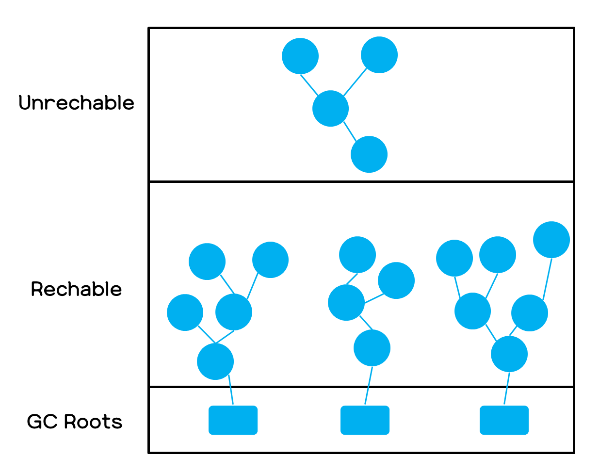

<p align="center" style="font-size:50px">
    <a href="https://github.com/lsw6684/ComputerScience">HOME</a>
</p>

***

<br />

# Java
- [**JVM**](#JVM)

<br />


## JVM
Java Virtual Machine, 자바 프로그램이 실행되는 가상 컴퓨터입니다. JAVA와 OS 사이에서 중개 역할을 하며, OS에 구애받지 않고 재사용 할 수 있게 해줍니다.

<p align="center"></p>

### 크로스 컴파일 Cross Compile
C/C++는 컴파일 플랫폼과 타겟 플랫폼이 다를 경우, 프로그램이 동작하지 않습니다. 이러한 경우를 고려하여 타겟 플랫폼에 맞춰 컴파일 하는 것을 크로스 컴파일 이라고 합니다.


### 크로스 컴파일이 있는데 왜 JVM을 사용할까?
JVM의 목적은 스마트폰, 패드, 리눅스 등 모든 디바이스에서 작동하는 것을 목적으로 합니다. 특정 기기마다 크로스 컴파일 하는 것을 개선하여 모든 환경에 적합하도록 합니다.

### GC, Garbage Collection
JVM이 동적으로 할당된 메모리(Heap영역) 중 사용하지 않는 영역을 탐지하여 해제하는 프로세스를 말합니다. 
- Stack : 정적으로 할당된 메모리 영역
    - 원시 타입의 데이터가 값과 함께 할당.
    - Heap영역에 생성된 Object 타입 데이터의 참조 값 할당.
- Heap : 동적으로 할당된 메모리 영역
    - 모든 Object 타입의 데이터 할당
    - Heap영역의 Object를 가리키는 참조 변수가 Stack에 할당.

```java
public class Main {
    public static void main(String[] args) {
        int num1 = 10;
        int num2 = 5;
        int sum = num1 + num2;
        String name = "test";
    }
}
Stack : num1, num2, num, name
Heap : String - test
```
위와 같은 상황에서 Main method가 종료 되면 Stack 영역은 비어지며 Heap영역에 객체 타입의 데이터만 남게 됩니다. 어떤 객체의 참조가 유효하다면 **Reachable**, 그렇지 않다면 **Unreachable Object**라고 칭하는데, 위 상황은 후자로 말씀드릴 수 있습니다. 그리고 이 것을 제거하는 대상이 **Garbage Collector**입니다.
<p align="center"></p>

### GC의 과정
1. Mark and Sweep - Mark <br />
GC Root로부터 모든 변수를 스캔하며 각각 어떤 객체를 참조하고 있는지 마킹합니다.
2. Mark and Sweep - Sweep <br />
Heap에서 Unreachable 객체들을 제거합니다.
3. Compact <br />
Sweep 후의 압축 과정입니다. 분산된 객체들을 Heap의 시작 주소로 모아 할당된 부분과 그렇지 않은 부분으로 나누어 **단편화**를 예방합니다.
    - 단편화   
        ```
        기억 장치의 빈 공간 또는 자료가 여러 개의 조각으로 나뉘는 현상을 말합니다. 사용 가능한 공간이 줄어들고, 읽기와 쓰기의 수행 속도를 늦추는 문제점이 있습니다.
        ```
        - 외부 단편화 : 프로세스의 필요 이상으로 메모리 공간을 보유하지만, 할당 가능 공간이 분리되어 있어서 수용 불가능합니다.
            <p align="center"></p>

        - 내부 단편화 : 프레소스의 필요 공간보다 할당 가능한 메모리 공간이 작기 때문에 수용 불가능합니다.
            <p align="center"></p>

### Heap의 구조

<p align="center"></p>

### Young Generation
- 새로운 객체들이 할당되는 영역으로 Eden, Survivor 0, Survivor 1로 나뉩니다.
    - Eden : 새로운 객체들이 할당되고, 
### Old Generation
- Young Generation에서 오랫동안 살아남은 객체들이 존재하는 영역.
### Permanent Generation
- Method Area라고도 하며 자바8 이후, **Meta space**가 대체합니다.