<p align="center" style="font-size:50px">
    <a href="https://github.com/lsw6684/ComputerScience">HOME</a>
</p>

***

<br />

# Natural Language Processing
- [Foundation](#foundation)
- [Machine Learning with scikit-learn](#machine-learning-with-scikit-learn)
- [Optimization](#optimization)
- [Probability](#probability)
- [Information Theory_Entropy](#information-theoryentropy)
<br />

## Foundation
**SciPy** : Scientific Computing으로 수학, 과학, 그리고 공학 관련된 연산을 지원합니다. MATLAB에 대응하기 위한 오픈소스 Computing Tool이라고 생각합니다.
- **array**
    ```python
    import numpy as np
    # From a composite data (list or tuple, not set and dictionary)
    A = np.array([3, 29, 82])                   #리스트
    B = np.array(((3., 29, 82), (10, 18, 84)))  #튜플, "."은 float 64 의미. 
    C = np.array([[3, 29, 82], [10, 18, 84]], dtype=float)
    D = np.array([3, 29, 'choi'])
    E = np.array([[3], [29], [82]])

    # ndim = 차원, size = element 개수, shape = 행렬. 왜 1이 안나올까
    # dtype = 데이터타입. 하나를 설정해 놓으면 모두 바뀐다 - homogenous
    print(A.ndim, A.size, A.shape, A.dtype)     # 1 3 (3,) int 32
    print(B.ndim, B.size, B.shape, B.dtype)     # 2 6 (2, 3) float64
    print(C.ndim, C.size, C.shape, C.dtype)     # 2 6 (2, 3) float64
    print(D.ndim, D.size, D.shape, D.dtype)     # 1 3 (3, 1) 유니코드로 나오고 
    print(D) # ['3' '29' 'choi']정수들도 텍스트로 변환
    print(E.ndim, E.size, E.shape, E.dtype)     # 2 3 (3, 1) int32

    # Using initialization functions
    F = np.zeros((3, 2))            # Create a 3x2 array filled with 0 (default: float 64)
    G = np.ones((3, 2))             # Create a 2x3 array filled with 1
    H = np.eye(3, dtype=np.float32) # Create a 3x3 identity matrix (single-precision)
    I = np.empty((3, 2))            # zeros((3, 2)) but the elemets are 1
    J = np.empty((0, 9))            # [] width size of (0, 9). just space.
    K = np.arange(0, 1, 0.2)        # 0이상 1 미만, 0.2(step)차이로 나열
    L = np.linspace(0, 1, 5)        # 0이상 1 이하, 5개로 나누기
    M = np. random.random((3, 2)) # == np.random.uniform(size=(3, 2)) cf. normal()    
    ```
- **Indexing and slicing**
<p align="center">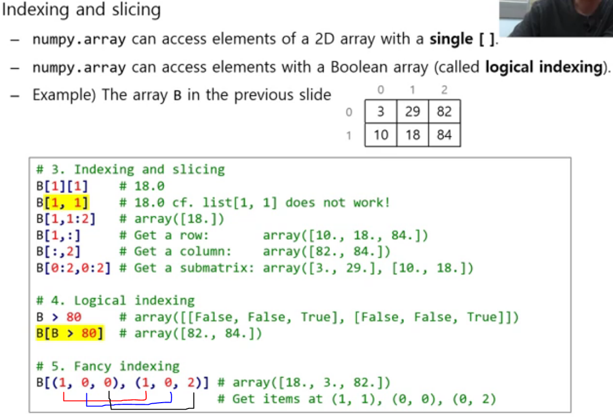</p>


- **Matplotlib** : 2차원 그래프를 그려주기 위함입니다. 3차원도 지원 하지만, 별로...
    ```python
    import matplotlib.pyplot as plt
    import numpy as np

    xs = np.arange(-4, 10, 0.001) # -4이상 10미만까지 0.001간격으로 생성
    ys = [0.1*x**3 - 0.8*x**2 - 1.5*x +5.4 for x in xs]
    yt = [-3.5*x + 7 for x in xs]

    fig = plt.figure()              # figure는 그림 단위. plot을 관리
    trim = fig.add_subplot(1, 1, 1) # subplot은 plot 1개를 의미. 1x1 비율로, 첫 번째 plot
    trim.set_aspect('equal')        # 지금은 plot이 1개 뿐이라 마지막 매개변수는 1밖에 안됨.

    plt.plot(xs, ys, color='r', label = 'y')
    plt.plot(xs, yt, color='b', label='tangent line')

    plt.grid()   # 그리드
    plt.legend() # 라벨
    plt.show()   # 화편에 출력.
    ```
<p align="center">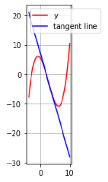</p>

- **SymPy** : 수학적 계산을 위한 라이브러리입니다.
<p align="center">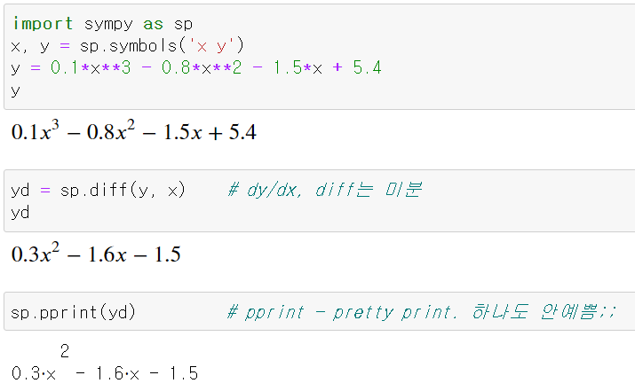</p>

<p align="center">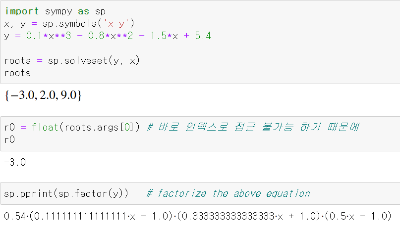</p>

- **NumPy** : 다차원 벡터, 행렬을 쉽게 처리할 수 있는 빠른 속도의 라이브러리입니다. array형태의 데이터를 효율적으로(속도↑ 메모리↓) 처리합니다.
    <p align="center">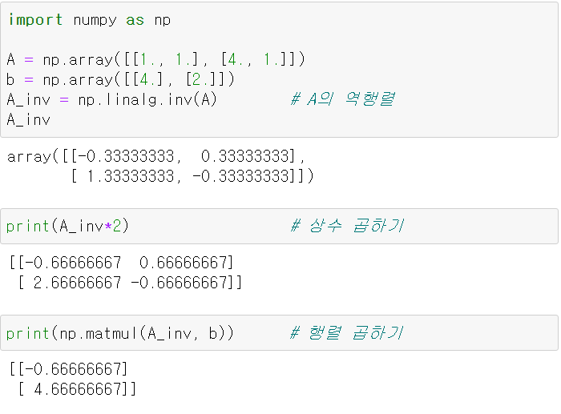</p>
    Numpy.array는 **homogeneous**, 제차형 데이터 타입만 포함할 수 있습니다. 
    
- **Data types**

    대소문자를 구분합니다.
    ```python
    profs = [
    'My name is Choi and my E-mail is sunglok@seoultech.ac.kr.',
    'My name is Kim and my e-mail address is jindae.kim@seoultech.ac.kr.'
    ]
    print(['e-mail' == prof for prof in profs ])        # [False, False] cf. matching
    print(['e-mail' in prof for prof in profs])         # [False, True] cf. searching
    print(['e-mail' in prof.lower() for prof in profs]) # [True, True] cf.
    print([prof.find('e-mail') for prof in profs])      # [-1, 22]
    print([prof endswith('.') for prof in profs])       # [True, True] cf. startswith
    ```
    - **fnmatch**
        - \* : matches everything
        - ? : matches any single character
        - [seq] : matches any character in seq
        - [!seq] : matches any character not in seq 
        
            **fnmatch는** 대/소문자를 구별하지 않고, **fnmatchcase**를 사용해야 대/소문자를 구별합니다.
        ```python
        import fnmatch

        profs = [
        'My name is Choi and my E-mail is sunglok@seoultech.ac.kr.',
        'My name is Kim and my e-mail address is jindae.kim@seoultech.ac.kr.'
        ]

        # for a single string
        print([fnmatch.fnmatch(prof, 'e-mail') for prof in profs])
        print([fnmatch.fnmatch(prof, '*e-mail*') for prof in profs])
        print([fnmatch.fnmatchcase(prof, '*e-mail*') for prof in profs])
        print([fnmatch.fnmatchcase(prof, '*[Ee]-mail*') for prof in profs])

        # for a list of strings
        print(fnmatch.filter(profs, '*e-mail*'))
        print(fnmatch.filter(profs, '*ch?i*'))        
        >>>
            [False, False]
            [True, True]
            [False, True]
            [True, True]
            ['My name is Choi and my E-mail is sunglok@seoultech.ac.kr.', 'My name is Kim and my e-mail address is jindae.kim@seoultech.ac.kr.']
            ['My name is Choi and my E-mail is sunglok@seoultech.ac.kr.']

        ```
- **정규식 Regular Expression** <br />
search를 위한 string 패턴입니다. 복잡한 문자열을 처리할 때 사용하는 기법으로, Python만의 고유 문법이 아니라 문자열을 처리하는 모든 곳에서 사용됩니다. 정규 표현식을 배우는 것은 Python을 배우는 것과는 또 다른 영역의 과제라 할 수 있습니다.
<p align="center">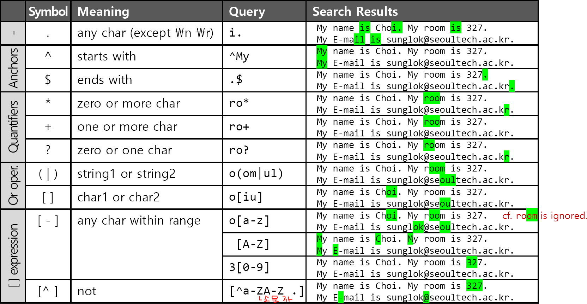</p>

<p align="center">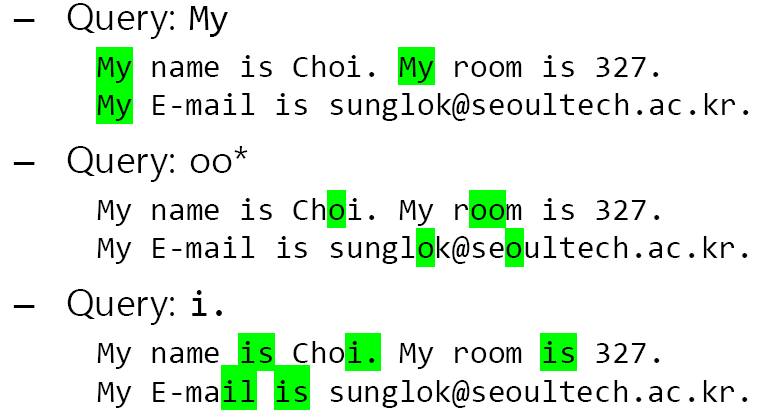</p>

<p align="center">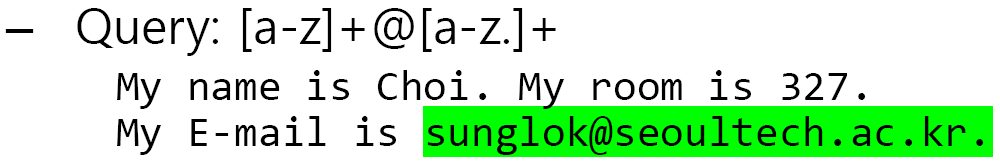</p>

<p align="center">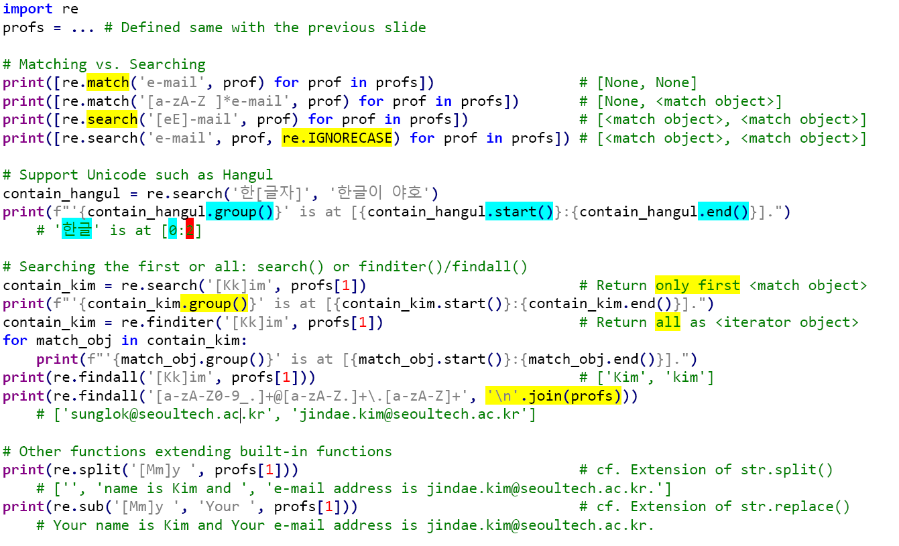</p>

## Machine Learning with scikit-learn
- **Machine Learning**
    - 데이터나 경험을 통해 자동으로 알고리즘을 향상시킵니다.
    - **Data-driven approaches** vs **rule/model-based approaches**
    - **귀납법 Induction** vs **연역법 deduction**
    <p align="center">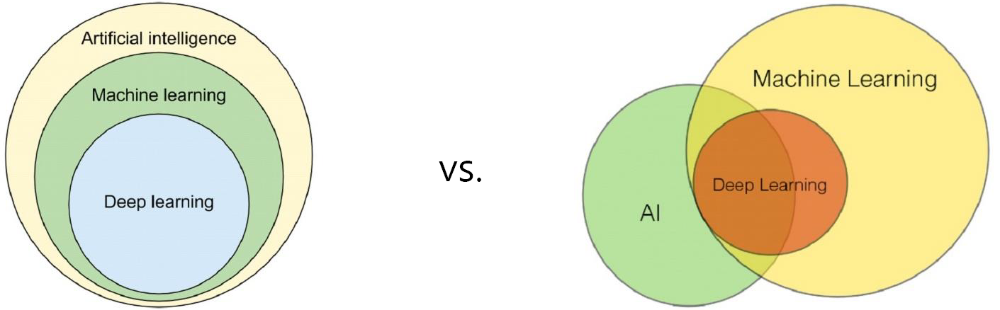</p>
- **ML procedure**
    1. Data acquisition, 데이터 준비
    2. Data preprocessing, 전처리(라벨링, 정규화 등)
    3. Feature selection and extraction, 유의미한 특징 도출
    4. Model and cost function selection (or design)
    5. Hyperparameter selection (learning rate, optimizer)
    6. Model **training**
    7. Model **testing**
- **ML approaches (with respect to ***the given data***)**
    - 지도 학습 Supervised learning - input, desired target이 함께 부여됩니다.
        - Weakly supervised learning : semi-supervised learning
    - 비지도 학습 Unsupervised learning - input만 부여됩니다.
        - Clustering, Dimensional reduction
    - Reinforcement learning - feedback(reward/penalty)가 부여됩니다.
- **ML problem formulation**
    <p align="center">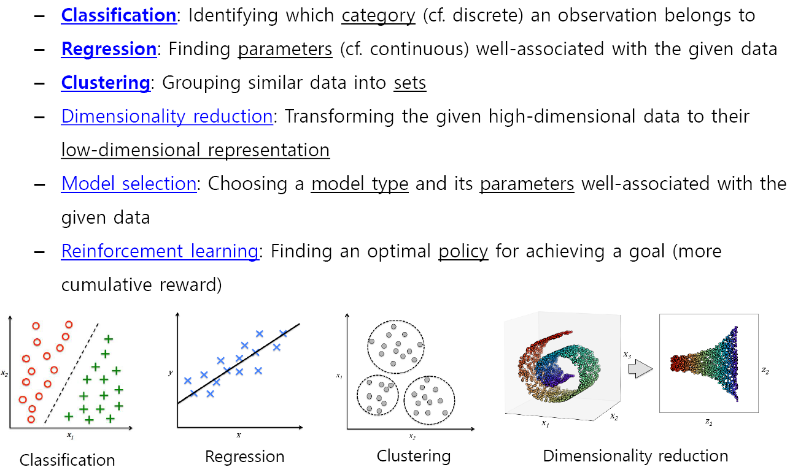</p>
- **ML Road Map - Choosing the right algorithm**
    <p align="center">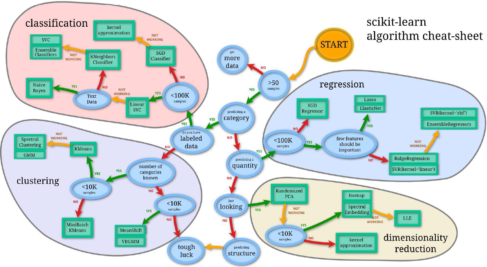</p> <br />
- **scikit-learn**
    - A Python-based open-source ML library
    - Built on NumPy, SciPy, and matplotlib
    - Included in Anaconda by default
    - Includes *example datasets* <br />

    사용 순서
    1. Instantiation, 객체를 생성합니다.
    2. Training(fit)
    3. testing(predict)
- ### SVM Support vector machine
    - 데이터가 적을 때와 high-dimensional일 때 적절합니다.
    - Supervised learning models(보통 classification and regression)
    - A non-probabilistic (deterministic), 비확률적 (결정론적) binary linear classifier.
        - Finding the maximum-margin **초평면 hyperplane**(boundary - 2D, plane in 3D)
        - Optimization. 다른 영역으로 가면 음수 - 각 영역에 맞게 Maximize
    - **Kerner trick**을 이용하면 non-linear classification이 가능합니다.
        - **Advantages**
        1. Effective in high-dimensional spaces
        2. when dimensions > samples
        3. Customizable by specifying kernel functions
        - **Disadvantages**
        1. probabilistic estimates를 바로 제공할 수 없습니다.
        2. noisy data and large-scale data에서 적절한 사용이 어렵습니다.
- **How to get good results?**<br />
    답이 없습니다. <br />
    Trial and error (more data and more computing power), but your intuition and experience are also important.
- **Cross-validation, CV** <br />
    trained model이 독립적인 data set으로 일반화 되는 model evaluation입니다.
    - **Exhaustive cross-validation**, 모든 조합에 대하여 적용
        - **Leave-p-out cross-validaion, LpOCV** : n-p data and test p data
        - **Leave-one-out cross-validation, LOOCV** : n times of trainings (p=1)
    - **Non-exhaustive corss-validation**, 근사적으로 일부 조합에 대하여 적용
        - **k-foldcross-validation** : LOOCV에서 One이 한 개의 데이터가 아닌 한 개의 Unit입니다.
- **Classification**
    - **Binary classification**
        - 2가지로 분류합니다. (0 or 1, True or False)
        - e.g. 대화내용에서 주소 찾기
        - Accuracy는 imbalanced data에 적절하지 않습니다.
        - **Confusion matrix**
        
    - **Multiclass classification**
        - 3개 이상인 멀티클래스
        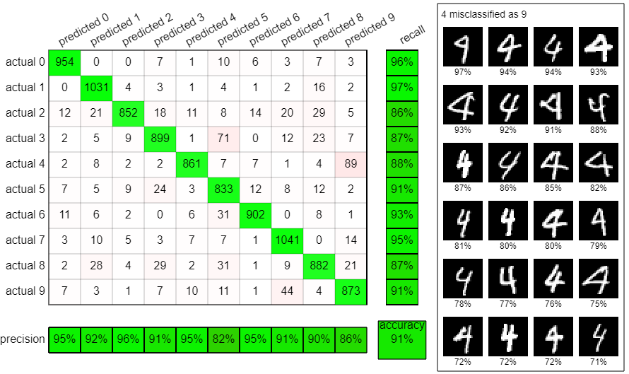
    - [**SVM**](#svm-support-vector-machine)
    - **Decision tree**
        - if-then-else flowchart
        - 장점 : white box로 과정을 볼 수 있으며 modifying이 쉽습니다.
        - 단점 : Unstable, sensitive and inaccurate. <br />
        이를 보완하기 위해**Random forest**를 사용합니다. 여러 개의 decision tree를 사용합니다.
    - **Naive Bayes classifiers**
        - Naive assumption을 기반으로 bayes' theorem을 이용합니다.
- **Regression**
    - **Linear regression** : scalar response(y)와 observed variables(x) 사이의 관계를 모델링하는 선형 approach입니다.
- **Clustering**
    - **k-means clustering** : within-cluster sum of squares(WCSS)를 최소화 하는 centroid(mean)를 찾습니다.
- **Feature Extraction**
    - **Bag-of-words model, BoW** : 각각의 단어로 쪼개고 순서와 상관 없이 벡터화합니다.<br />
        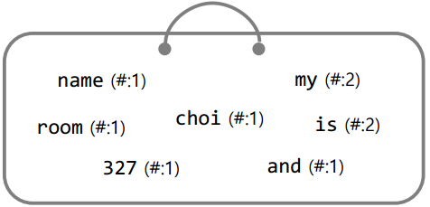    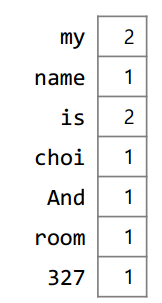
    - **TF-IDE weighting** : 단순한 count가 아닌 단어의 중요도를 반영합니다.
        - **TF, term frequency** - document d를 단어의 빈도에 대하여 normalize 시켜줍니다.
    - **IDF, inverse document frequency** - in all documents D
    - **TF-IDF** = tf(t, d) x idf(t, D)

<br />

## Optimization
최적화, Criterion(and constraints)에 기반하여 가장 적합한 Element를 찾는 것입니다.

- **Nonlinear Optimization**
    - 비선형 최적화, NLP
    - Maxima, Minima or stationary points를 찾는 과정입니다.
        - Object functions and constraints : nonlinear하며 결과 값이 real-valued인 함수입니다.<br />
            Maximization : Profit/Utility/Fitness/Reward/...functions <br />
            Minimization : Loss/Cost/Penalty/...functions <br />
            🍔Maximization and Minimization is dual.(**Minimization** is usually preferred)
    - **Gradient descent**
        - 극값에 이를 때까지 기울기의 절댓값이 낮아지는(가파른) 방향으로 이동합니다.
    - **Stochastic gradient descent, SGD**
        - random으로 선택된 데이터로 계산하여 대략적인 기울기를 이용합니다.
        <p align="center">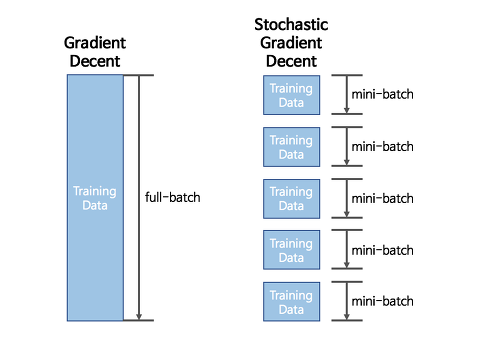</p>
    - **Newton's method**
        - 기울기가 아닌, 한 번 더 미분한 값을 이용합니다.
    - **Gauss-Newton method**
        - 제곱꼴로 주어진 함수를 이용합니다.

<br />

## Probability
Event가 얼마나 발생할 지, 어떤 명제의 참/거짓일 정도를 의미합니다.
- **Axioms**
    - For any event X, 0 <= P(X) : 확률 값은 항상 0이상입니다.
    - Probability of the sample space S is P(S) = 1 : 모든 사건들이 일어날 확률은 1입니다.
    - 독립적인(상호배타적인) 사건 즉 A or B 형태에서 P(X1 U X2) = P(X1) + P(X2) ※*(X1 ∩ X2) = 0*    
- **Why probability?** 
    - 불확실한 관찰(noise or error)
    - 불완전한 데이터(unobservable or missing elements)
    - 불완벽한 knowledge and model(over-simplified or incorrect)
- **Random variable**
    - 특정 상황을 숫자로 Mapping해 주는 것입니다.
- **Probability mass function, pmf, 확률 질량 함수**
    - discrete random variable, 이산 확률 변수
- **Probability density function, pdf, 확률 밀도 함수**
    - continuous random variables, 연속 확률 변수
- **Cumulative distribution function, cdf, 누적 분포 함수**
    - None-decreasing, right-continuous
- **Joint probability, 결합 확률**
    - X와 Y라는 이벤트가 있을 때, 동시에 일어날 확률 `P(X,Y) or P(X∩Y)`
    - cf. Independence : P(X, Y) = P(X)P(Y)
- **Conditional probability, 조건부 확률**
    - X가 일어날 때 Y가 일어날 확률, P(Y|X) = P(Y, X)/P(X)
    - cf. Independence : P(Y|X) = P(Y)
    - **Chain rule** : 연쇄적 사건이 발생할 때, 꼬리에 꼬리를 뭅니다.<br />
        `P(X, Y)=P(Y|X)P(X) / P(X3, X2, X1)=P(X3|X2, X1)P(X2|X1)P(X1)`
    - **Bayes's theorem** : <br />
        posterior`P(Y|X)`= likelihood`P(X|Y)`prior`P(Y)`/marginalization`P(X)`
    - **Marginal probability**
        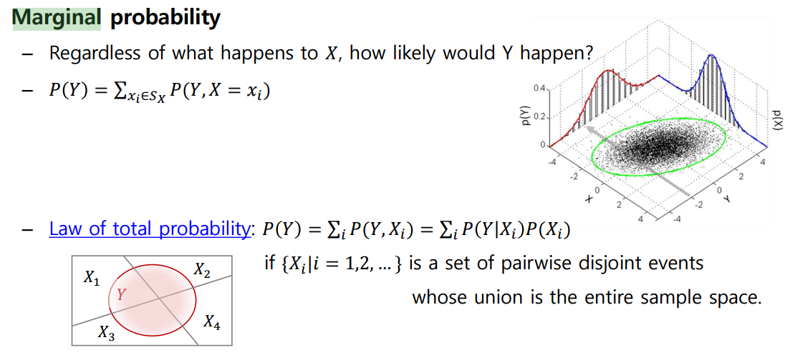
    - **Expectation, 기댓값** : Weighted Average, 가중 평균
        - Alias : Mean, average, the first moment
        - cf. Arithmetic mean, 산술 평균 : 각 요소들이 균일하게 발생합니다.
        - Properties
            - Linearity : E[X + Y] = E[X] + E[Y] and E[aX] = aE[X]
            - Non-multiplicativity: E[XY] != E[X]E[Y] <br />
                `cf. If X and Y are independent, E[XY] = E[X]E[Y]`
    - **Variance** : 한 개의 random variable에 해당합니다.
        - Alias : The second central moment.
        - Calculation : Var(X) = E[X<sup>2</sup>] - E[X]<sup>2</sup>
        - cf. Covariance : 2개 이상의 random variable에 해당합니다.<br />
            Cov(X, Y) = E[(X-E[X])(Y-E[Y])]<br />
            Var(X) = Cov(X, X)
        - Properties
            - Var(X) >= 0 : Non-negative
            - Var(X+a) = Var(X) : Invariant to a location parameter
            - Var(aX) = a<sup>2</sup>Var(X) : Squared scale
            - Var(aX + bY) = a<sup>2</sup>Var(X) + b<sup>2</sup>Var(Y) + 2abCov(X, Y)
<br />

## Information Theory_Entropy
- **(Shannon)Information** : I(x) = -log<sub>2</sub>P(x) <br />
    잘 일어나지 않는 사건(unlikely event)의 정보는 자주 발생할만한 사건보다 정보량이 많다는 것이 핵심입니다. 
    - Alias : Surprisal, information content
- **Entropy**
    - Shannon information의 평균 or 'average of surprise' or 'average of the number of bits'입니다.
    - **Bernoulli distribution** : 동전을 던질 때
    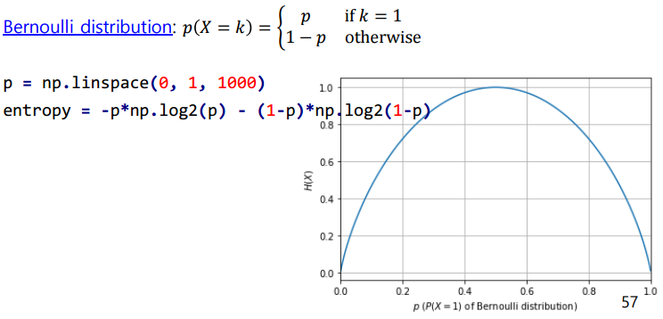
