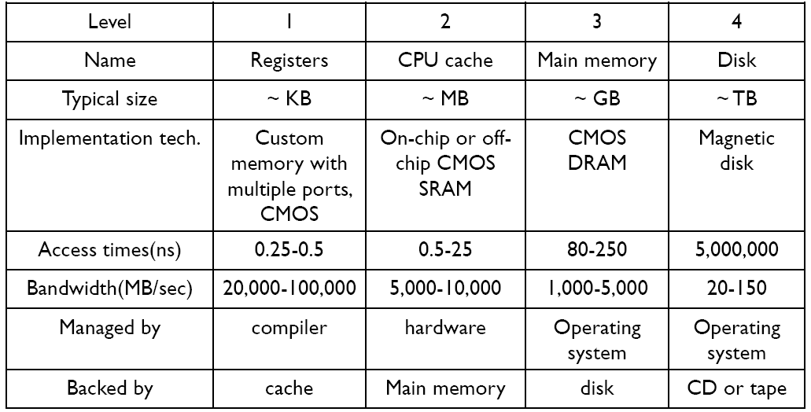

<p align="center" style="font-size:50px">
    <a href="https://github.com/lsw6684/ComputerScience">HOME</a>
</p>

***

<br />

# Operating System
- [컴퓨터 시스템](#컴퓨터-시스템)
- [프로세스와 스레드](#프로세스와-스레드)

<br />

## 컴퓨터 시스템
- 프로세서 : 처리기, 프로그램을 실행시키는 장치
- 메인 메모리 : Main Memory, 휘발성으로 램 따위를 말합니다. 명령문, 데이터 등이 있으며 데이터는 CPU로 한 문장씩 전달되어 실행됩니다.
- I/O 모듈
    - 보조기억장치 : 시스템 외부에 존재하며 주기억장치의 한정된 용량을 보조합니다.
    - 통신 장비 : 네트워크 관련 장치들
    - 터미널 : 사용자가 컴퓨터 시스템과 상호작용 하기 위해 필요한 키보드, 스크린, 프린터 따위를 말합니다.
- 시스템 버스 : 데이터의 교통수단으로 상위에서 언급한 프로세스, 메인 메모리, I/O 모듈들이 연결되어있습니다.

<p align="center"></p>

**ex) 하드디스크에 들어있는 파일을 실행시킨다면**
```
1. I/O Module의 하드디스크에 있는 파일이 시스템 버스를 통해 주기억장치로 이동합니다.
2. 메인 메모리에 저장 후 프로그램이 실행되며 한 문장씩 시스템 버스를 통해 CPU로 이동됩니다.
3. 프로그램이 실행되는 동안 주기억장치의 백업 데이터가 I/O Module의 하드디스크로 이동합니다.

❗
PC - Program Counter, 다음에 실행할 명령의 주소가 들어있습니다.
IR - Instruction Register, 지금 실행 중인 명령의 내용이 들어있습니다.
PSW - Program Status Word, 비트 단위로 여러 가지 정보를 포함합니다.
    (1) Condition codes : 2bit를 사용하며 연산의 결과가 양수, 음수, 0, Overflow인지 판단합니다.
    (2) Interrupt enable/disable : 1bit를 사용하여 인터럽트가 발생 여부를 확인합니다.
    (3) Supervisor/user mode : Supervisor - OS 실행 중, user - 유저 프로그램 실행 중, 각 시기에 맞는 권한을 사용하기 위해 구분합니다.
MAR - 주기억장치에 있는 Instruction, Data는 주소로 접근이 가능합니다. 이를 위해 사용할 Instruction or Data 주소를 MAR에 저장합니다.
MBR - 주기억장치와 CPU 사이에 Instruction, Data가 오가는 중간 저장소 역할을 합니다.
AC - 범용 레지스터, 연산 결과를 임시로 저장합니다.

❗
MAR, MBR - 주기억장치와 CPU 사이에 데이터가 이동할 때
I/O AR, I/O BR - CPU와 I/O Module 사이에 데이터가 이동할 때

❗
I/O AR - MAR과 같은 역할을 합니다. 
I/O BR - MBR과 같은 역할을 합니다.
```
- **Instruction Execution :** 하위 2가지를 반복하여 프로그램을 실행합니다.
1. Fetch Stage - 메모리에서 Instruction을 가져오기.
2. Execute Stage - Instruction을 실행.
<p align="center"></p>

**ex) 3 개의 명령 실행**
<p align="center"></p>

***순서***
```sql
첫 번째 Fetch Stage 시작 전, PC - 300, IR : 이전 실행 명령 주소
--------------------------------------------------------------
Fetch Stage:
1) PC -> MAR, PC++
2) memory read, MAR에 저장된 명령 -> MBR
3) MBR -> IR

Execution Stage #1:
1) 명령 분석(1)
2) IR의 주소부분(940) -> MAR
3) memory read, MAR에 저장된 데이터 -> MBR 
4) MBR -> AC                                -- 명령을 보낼 때와 다릅니다.

Execution Stage #2:
1) 명령 분석(5)
2) IR의 주소부분(941) -> MAR
3) memory read, MAR에 저장된 데이터 -> MBR
4) AC + MBR -> AC

Execution Stage #3:
1) 명령 분석(2)
2) IR의 주소부분(941) -> MAR, AC -> MBR
3) memory write, MBR -> MAR에 저장된 번지의 memory 공간 
```

- **Interrupt** 
    - 사용자의 의도와 상관 없이 정상적인 진행이 방해되는 상황을 의미합니다.
    - 프로그램은 **동시에 실행 되는 것이 아니라 CPU를 일정 시간씩 번갈아서 사용 하여 실행**됩니다.
- **Interrupt Handler :** OS의 한 부분으로 I/O의 끝처리를 합니다.

<p align="center"></p>

- **Interrupt의 종류**
    - Program Interrupt : 프로그램이 실행되는 과정에서 오버플로우, 나누기 0, 잘못된 명령을 실행하려고 할 때, 유저에게 허용되지 않은 메모리를 참조하기 등에서 발생
    - Timer Interrupt : 각 프로그램이 일정 시간동안 CPU를 사용 할 때, CPU 안에 있는 타이머가 timeout을 알려줍니다.
    - I/O Interrupt : I/O 장치가 입력 도중에 문제가 발생했음을 알려줍니다.
    - Hardware failure Interrupt : Power, Memory 등에 문제가 발생 했을 때 발생합니다.

    ※ 실제로 Interrupt를 거는 주체는 Hardware devices입니다. Hardeware devices가 CPU의 PSW 안에 있는 Interrupt enable/disable bit를 세팅합니다.

<br />

- **Interrupt Processing**
<p align="center"></p>

- **Storage Hierarchy**
<p align="center"></p>

- **캐시 메모리**
    - 메인메모리와 CPU 사이에 존재합니다.
    - Processor와 CPU와 속도가 비슷하며 **굉장히 빠르다**고 할 수 있습니다.
    - 메인메모리에서 명령을 한 줄씩 가져오고 실행하는 것이 원칙이지만, 속도 향상을 위해 더욱 가까운(빠른) **캐시 메모리에 일부를 가져다 놓고 실행**합니다.
    - 캐시 메모리의 **크기는 매우 작기 때문에** 실행할 프로그램들의 데이터들을 모두 가져올 수는 없습니다.
    - **국부성, Locality** - 전체가 아닌 일부를 반복해서 사용하는 경향을 의미합니다.
    - OS에서 관리하는 것이 아니기 때문에 **(Hardware적인 관리) 속도가 빠릅니다.**

## 프로세스와 스레드
### 프로세스
실행 중인 프로그램으로 디스크로부터 메모리에 적재되어 CPU의 할당을 받습니다. OS로부터 주소 공간, 파일, 메모리 등을 할당받으며 이것들을 총칭하여 프로세스라고 합니다.
- 함수의 매개변수, 복귀 주소, 로컬 변수와 같은 임시 자료를 갖는 프로세스 스택과 전역 변수들을 수록하는 데이터 섹션, 그리고 동적으로 할당되는 힙 메모리를 포함합니다. 

### 프로세스 제어 블록, Process Control Block, PCB
특정 프로세스에 대한 중요 정보를 저장하는 운영체제의 자료구조입니다. OS는 프로세스를 관리하기 위해 프로세스의 생성과 동시에 고유한 PCB를 생성합니다. 프로세스가 CPU를 할당받아 작업을 처리하는 도중, 프로세스 전환이 발생하면 진행하던 작업을 PCB에 저장하고 CPU를 반환합니다. 그리고 다시 CPU를 할당받게 되면 PCB에 저장된 내용을 불러와 이전에 종료됐던 시점부터 다시 작업을 수행합니다.
- PCB에 저장되는 정보
    - 프로세스 식별자(Process ID, PID) : 프로세스 식별 번호.
    - 프로세스 상태 : new, ready, running, waiting, terminated 등의 상태 저장.
    - 프로그램 카운터 : 프로세스가 다음에 실행할 명령어의 주소
    - CPU 레지스터
    - CPU 스케쥴링 정보 : 프로세스의 우선순위, 스케줄 큐에 대한 포인터 등
    - 메모리 관리 정보 : 페이지 테이블 또는 세그먼트 테이블 등과 같은 정보를 포함.
    - 입출력 상태 정보 : 프로세스에 할당된 입출력 장치들과 열린 파일 목록
    - 어카운팅 정보 : 사용된 CPU 시간, 시간제한, 계정번호 등

### 스레드, Thread
프로세스의 실행 단위라고 할 수 있습니다. 한 프로세스 내에서 동작되는 여러 실행 흐름으로 프로세스 내의 주소 공간이나 자원을 공유할 수 있습니다. 하나의 프로세스를 다수의 실행 단위로 구분하여 자원을 공유하고 자원의 생성과 관리의 중복성을 최소화하여 수행 능력을 향상시키는 것을 멀티스레딩이라 합니다. 이 경우 각각의 스레드는 독립적인 작업을 수행해야 하기 때문에 각자의 스택과 PC 레지스터 값을 갖습니다.
- 스레드 ID, 프로그램 카운터, 레지스터 집합, 스택으로 구성.
- 

