<p align="center" style="font-size:50px">
    <a href="https://github.com/lsw6684/ComputerScience">HOME</a>
</p>

***

# Reinforcement Learning
- [Introduction to Reinforcement Learning](#introduction-to-reinforcement-learning)
- [OpenAI and TensorFlow(with Docker)](#openai-and-tensorflowwith-docker)
- [Markov Decision Process and Dynamic Programming](#markov-decision-process-and-dynamic-programming)
- [Monte Carlo Methods](#monte-carlo-methods)

<br />

## Introduction to Reinforcement Learning
- **ML : Machine Learning**
    - 프로그램이 데이터로부터 자동으로 학습을 합니다.
    - 데이터의 일부 Example들을 일반화여 특정 문제를 해결하는 알고리즘입니다.
    - 모델을 만들기 위한 샘플 데이터를 Training data라고 부릅니다.
- **ML 알고리즘의 종류**
    - **지도 학습 Supervised Learning** : **input(X) & desired output(Y)** 을 포함하는 데이터를 기반으로 수학적 **모델(f)** 을 만듭니다.
        - Regression : Data point를 Generalization 하여 ax + b 형태의 함수 f, **연속적인** Function line을 만들어 **real value**를 예측합니다.
        - Classification : Input이 **어떤 class**에 속하는지 예측합니다.
    - **비지도 학습 Unsupervised Learning** : 데이터에 input(X)만이 있으며 **desired output(Y)이 없습니다**. 데이터의 패턴, 구조를 찾아내어 그룹핑이나 **클러스터링**을 합니다.
        - desired output이 없기 때문에 y=f(x) 불가능.

    - **강화 학습 Reinforcement Learning** : 특정 환경에서 Agent(SW or HW)가 현재의 상태를 인식하여, 누적된 보상을 최대화하는 행동 혹은 행동 순서를 선택하는 방법입니다.
        - 데이터라는 표현이 존재하지 않고 특정 Agent의 행동에 따라 Reward를 maximize하여 이해할 수 있도록 합니다.
        - **Trial and Error**, 시행착오를 통해 에러를 줄이고 Reward를 높이는 방향으로 진행됩니다.
        - There might be **delayed rewards** - Positive reward가 나올만한 action이 즉각적으로 발생하지 않으면 지연됩니다.
        - ex) Dog 
            ```
            강아지(Agent)에게 캐치볼 하는 것을 가르칩니다. 하지만 명시적으로 가르칠 수 없으니 공을 던지고 다시 가져오는 것을 성공할 때마다 간식(Positive Reward)을 줍니다. 그리고 실패 하면 간식을 주지 않습니다(Negative Reward). 이 과정을 반복하면, 강아지는 어떤 Action을 해야 간식을 얻을 수 있는지 알게 됩니다.
            ```
        - Agent가 사용할 수 있는 2가지 전략
        1. Positive reward를 얻기 위해 **다른 Action을 탐험**합니다.
        2. 이전의 Action들 중에 **positive reward가 있던 행동에 집착**합니다.
            ```
            장단점이 공존하므로 Trade-off가 존재합니다.
            두 가지 전략은 적당한 비율로 유지되어야 합니다.
            ```
        - **exploration(탐험)과 exploitation(활용)엔 trade-off가 있으며 동시에 둘 다 시행할 수 없어서 선택이 필요합니다.**
- **Typical RL Algorithm**
1. Agent가 환경과 Interaction 하여 Action을 취합니다.
2. Agent가 Another state로 움직입니다.
3. 수행한 Action과 state를 기반으로 특정 Reward를 받습니다.
4. 지금까지의 Reward를 기반으로 어떤 Action이 좋고 나쁜지 이해합니다.
5. 좋은 Action이 있다면 그 행동을 Exploitation하고 Another action 즉, Exploration을 시도합니다.
`Agent는 상위 과정을 반복하여 강화됩니다.`

- **RL이 ML들과 다른 점**
    - Compared to **Supervised Learnning**
        - 지도학습(Supervised Learning)은 Machine(agent)이 training data로부터 무언가(패턴)를 배웁니다. Learning Data로부터 정규화(normalization)하는 모델을 만드는 것으로 input과 output 즉, 정답값(label)을 가지고 있는  data를 가진다고 할 수 있습니다. 실제로 본적 없는 데이터(unseen data)를 적용했을 때 올바른 결과에 근접할 수 있도록 특정 환경을 기반으로 하는 지식을 보유한 External Supervisor가 존재합니다. 즉, **Supervised Learning은 명확한 지표가 있습니다.**
    - Compared to **Unsupervised Learning**
        - 모델에 training data를 준다는 점은 Supervised Learning과 같지만 Unsupervised Learning은 output 없이 input만 전달하고 **input에 포함된 hidden structure**을 학습하는 것입니다. 그리고 **RL의 Model은 reward를 maximizing**하는 것을 의미합니다. `RL은 지속적 피드백을 요구합니다.`

<br />

- **Elements of RL**
    - **Agent**
        - RL로 무언가를 배우고 지적인 결정을 만드는 Learner, Software program입니다.
        - 환경과 상호작용 함으로써 행동을 취하며, 그 행동으로부터 reward를 취합니다.
        - ex) Super Mario 게임에서의 Super Mario
    - **Policy function**
        - 일종의 규칙으로, 특정 환경에서 Agent가 하는 행동을 결정합니다.
        - **Lookup table** or **Search tree** 형식을 가질 수 있습니다. 
        - Policy의 symbol은 **𝝅**입니다.
        - ex) 사무실에서 집으로 가는 길이 있다.
            - 짧은 길들과 있고 긴 길들이 있다.
            - 여기서 **길**은 어느 쪽으로 가야할 지 알려주는 **Policy**입니다.
    - **Value Function**
        - Reward를 의미하며 Policy마다 Value Function을 가진다고 할 수 있습니다.
        - Value Function의 symbol은 **v(s)** 로 state인 s를 인자로 받습니다. 
        - Agent가 Environment의 특정 state에 위치할 때, 최종적으로 받을 수 있는 total expected reward를 의미합니다.
        - **Optimal Value Function**은 모든 states에 대하여 더욱 좋은 값을 가지는 Value Function을 최적의 Value Function, Optimal Value Function이라 칭합니다.
        - RL의 궁극적인 목표는 Optimal Value Function을 갖는 **Optimal Policy**를 찾는 것입니다. 
    - **Model**
        - 환경에 대한 Agent의 Representation입니다.
        - RL은 **Model-based learning** And **Model-free learning**, 총 2가지 타입이 존재합니다.
            - Model-based learning : Agent는 Environment에 대한 Modeling을 갖고 있을 때, Model을 사용하여 특정 Action을 취했을 때 다음 State가 어떻게 될지 정확히 알게 됩니다.
            - Model-free learning : Agent가 Environment에 대한 정보가 전혀 없을 때, 무작정 Action을 취하고 Reward를 받습니다. just **trail-and-error(시행착오)** 에 의존합니다.

- **Agent Environment Interface**
<p align="center">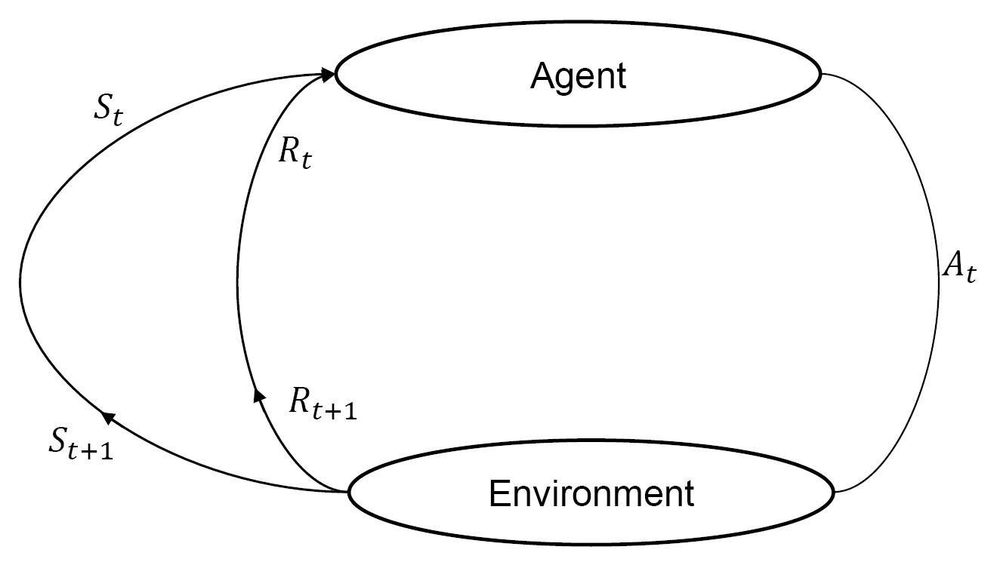</p>

```
Agent, A. 특정 time state, t. At가 Action을 하면
Environment로 부터 Reward, Rt를 받고 St+1로 State로 바뀝니다.
위 과정을 반복합니다.
```
- **Model-free learning**을 통한 예시
<p align="center"></p>

- **RL Environment의 종류**, `2 종류씩 비교`
    - **★ Deterministic environment** - Agent가 취하는 현재 State에 대한 Action의 결과가 명확할 때, 다음 State가 확정이 되는 것을 의미합니다. `ex) 체스게임에서 player에 의한 outcome을 명확히 알 수 있습니다.`
    - **★ Stochastic environment** - 다음 State가 어떻게 될지 확정할 수 없을 때를 의미합니다. `ex) 주사위`
    - **◆ Fully observable environment** - RL의 모든 시간 동안 Agent가 결정할 수 있는 State가 **모두 보여집니다.** Partially observable environment와 비교해 보자면, Fully observable environment는 Optimal Policy를 찾기 적합합니다. `ex) 체스`
    - **◆ Partially observable environment** - 모든 시간 동안 State를 부분적으로만 관찰할 수 있습니다. `ex) 포커 게임`
    - **▣ Discrete environment** - 다른 State로 이동 할 Action의 수가 유한할 때를 말합니다. `ex) 체스게임에서 말이 움직일 수 있는 Action의 종류`
    - **▣ Continuous environment** - 다른 State로 이동할 Action의 수가 무한할 때를 말합니다. `ex) self-driving car control`
    - **▩ Episodic and non-episodic environment**
        - Episode 기반으로 정확하게 나뉘느냐, 안나뉘느냐를 기준으로 합니다.
        - Episodic environment는 non-sequential environment로도 불립니다.
        - Episodic environment는 State만 바뀔 뿐 Action간에 서로 영향을 끼치지 않습니다.(Independent)
        - non-episodic environment는 Sequential environment로도 불립니다.
        - Agent의 현재 행동이 State만 바뀔 뿐 아니라 미래의 Action에도 영향을 끼칩니다. (dependent)
    - **◈ Single and multi-agent environment**
        - Agent 개수가 1개냐 아니냐가 기준입니다.
        - Multi-agent environment가 상대적으로 훨씬 복잡합니다.
```
짝 지어진 environment를 제외하고 여러 environment를 정의할 수 있습니다.
ex)
1. Deterministic, Episodic한 Environment (OK)
2. Episodic, Non-episodic한 Environment (Invalid)
```
- **RL Platforms** - 시뮬래이션, 빌딩, 렌더링, 그리고 Environment에서 RL 알고리즘을 실험할 수 있습니다.
    - ### OpenAI Gym and OpenAI Universe
        - RL 알고리즘을 만들고, 평가하고, 비교할 수 있는 Tool kit입니다.
        - RL은 ML의 한 종류입니다. Tensorflow, Theano, Keras 등 다양한 ML Framework로 작성된 알고리즘들을 호환하여 사용할 수 있습니다.
        - Agent Structure에 대한 assumption이 없기 때문에 모든 Agent를 사용할 수 있습니다.
        - OpenAI Universe는 OpenAI Gym의 확장판입니다.
        - 굉장히 넓은 범위의 complex environment, 간단한 것부터 real-time까지 training시키고 평가할 수 있습니다.
        - OpenAI Universe는 가상 네트워크 환경을 이용 함으로써 기존에 존재하는 다양한 프로그램과 Gym의 connection을 별다른 제약 없이 쉽게 연동해 줍니다. 확장성이 굉장합니다.
        - Environment 자유롭게 구현 가능
    - **DeepMind Lap** - *알파고*
        - fist-person 3D game platform, 1인칭 시점의 3D게임플랫폼으로 강화학습 개발과 연구를 위해 만들어졌습니다. - ***Customizable and Extndable***
        - Environment 자유롭게 구현 가능
    - **RL-Glue**
        - Agent, Environment, Program이 서로 다른 프로그래밍 언어로 구현되어 있는 경우에도 연결해 주는 인터페이스를 제공합니다.
        - 다른 사람들이 만들어 놓은 작업물을 공유할 수 있어서 Reusability가 높습니다.
    - **Project Malmo**
        - 마인크래프트를 기반으로 AI실험 플랫폼입니다.
        - 시나리오의 시간을 빠르게 설정하여 학습시킬 수 있습니다.
        - 마인크래프트만 실행 가능하다는 단점이 있습니다.
    - **ViZDoom**
        - Multi-agents 시스템 지원을 제공합니다.
        - Doom(1인칭 슈팅 게임) environment만 가능하다는 단점이 있습니다.
- **Aplications of RL**
    - **Education** - personalized content를 제공합니다.
    - **Manufacturing** - 산업용 로봇, 로봇 팔 등 intelligent robot으로 특정 임무를 수행하도록 강화학습 되어 사용됩니다.
    -**Inventory management**- 공급망 Supply chain management, 수요 예측 demand forecasting, warehouse operation 등을 강화학습으로 최적화 시켜 이용됩니다. (전력 소비량 등)
    - **Finance** - 상업적 거래를 예측하기 위한 포트폴리오를 관리합니다.
    - **Natural language processing and Computer vision** - DL과 결합된 DRL에 사용되며, text 요약, 정보 축약, 기계 번역(papago 등), 이미지 인식 등의 정확성을 높히는데 사용됩니다.

## OpenAI Gym and TensorFlow(with Docker)
- **Docker**
    - virtual system의 일종으로, 컨테이너에 소프트웨어들이 패키징되어 있습니다.
    - 컨테이너에는 소프트웨어를 사용하는 데 필요한 libraries, system tools, code, and runtime 등이 모두 포함되어 있습니다.
    - Application 실행에 필요한 모든 dependency를 제공하기 때문에 쉽고 빠르게 배포할 수 있습니다.
    - Docker Hub에서 Docker image파일을 사용하여 환경 셋팅이 되어있는 Container를 load하여 쉽고 빠르게 사용할 수 있습니다. 
        - **Container** - resource-isolated에서 dependency 없이 실행할 수 있도록 해주는 **virtualization**입니다. Application의 코드, dependencies 등 모든 것을 하나의 block으로 패키징 할 수 있습니다.
        - **Container benefits**
        1. **Environment consistency** - portability가 있고 organizational and technical frictions of moving and applications를 줄일 수 있습니다. 각 서버를 manually configuring하는 것 없이 새로운 features를 빠르게 release할 수 있습니다.
        2. **Operational efficiency** - 같은 서버에서 multiple applications를 쉽게 사용할 수 있습니다. 컨테이너에는 정확하게 측정된 memory, disk space, and CPU가 정해져 있기 때문에 사용 시에, 구체화 하기 용이합니다. 일반 virtual system은 Hardware level부터 virtualization이 이루어지기 때문에 매우 느리지만, Container는 하단 level부터 virtualization을 하는 것이 아니기 때문에 **부팅이 매우 빠릅니다.** **Scale-up and Scale-down**에 용이하며 **Blue-Green deployment**패턴과 process isolation을 제공합니다.

            `Blue-Green 배포란, 무중단 배포 Continuous Delivery입니다. 구 버전과 새 버전을 나란히 구성하고 배포 시점이 되면 트래픽을 일제히 전환시키는 방법을 사용하므로 버전 관리 문제를 방지할 수 있고 빠른 롤백이 가능합니다. 또 다른 장점으로, 운영 환경에 영향을 주지 않고 실제 서비스 환경으로 새 버전 테스트가 가능합니다. `
        3. **Developer Productivity** - independently upgrade each service
        4. **Version control** - Docker container images have a **manifest file**. 그렇기 때문에, 버전 컨트롤을 하기 용이합니다.
    - **Container vs Virtual Machine**
    <p align="center">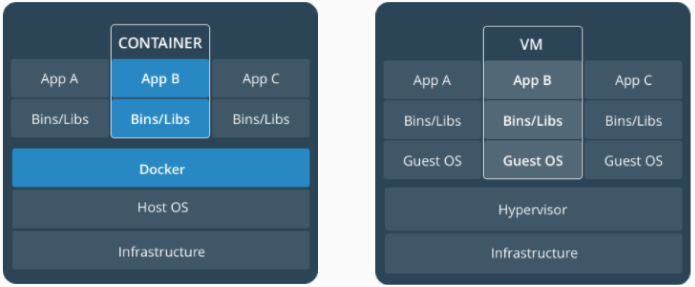</p>
- [**OpenAI**](#openai-gym-and-openai-universe)
- **Tensorflow**
    - numerical computation을 널리 사용할 수 있는 Google open source software library입니다.
    - DL, ML 등에서 주로 사용됩니다.
    - **data flow graph**를 사용하여 계산하기 때문에 다른 플랫폼에서도 쉽게 실행할 수 있습니다.
    - multi-dimensional array를 지원합니다.<br /><br />
    **Varialbes, Constants, Placeholders**
        ```python
        Variables : 값을 저장하는 Container입니다.
        - tf.Variable()
            >> weights = tf.Variable(tf.random_normal({3, 2}, stddev=0.1), name="weights")

        Constants : 상수와 같습니다. 값이 변하지 않습니다.
        - tf.constant()
            >> x = tf.constant(13)

        Placeholders : variable과 비슷합니다. data type과 dimension of array를 define하고 value는 assign 하지 않습니다. 즉, value없이 정의 하고 특정 메모리만 잡아둔 다음 runtime에 사용됩니다. 
        - tf.placeholder()
            >>> x = tf.placeholder("float", shape = None)
        # shape이 None으로 설정되어 있으면 어떤 차원의 array도 삽입 가능합니다.

        😃 Variable은 데이터를 저장하기 위해, Placeholder는 external data를 computational graph에 삽입하기 위해 사용됩니다.
        ```
    - **Computation Graph**
        - nodes(mathematical operations)와 edges(tensors)로 구성됩니다.
        - **Tensorflow에서의 DL**은 multi-dimensional array. 즉 Tensor들이 mathematical operations를 거치면서 결과를 내고 계산하는 과정입니다. 그렇기 때문에 Graph로 표현한다는 것은 굉장히 합리적인 선택이라 할 수 있습니다.
        - computation graph를 multi core로 독립적인(edge로 연결되어 있지 않은 노드들) 분배 계산을 하여 빠른 계산을 할 수 있기 때문에 효율적입니다.
    - **Sessions**
        - 상위 설명한 계산들로 define한 코드들을 열고, 실행합니다.<br />
        `sess = tf.Session()`<br /> 
        ***And***<br />
        `sess.run()`
        ```python
        import tensorflow as tf
        a = tf.multiply(2, 3)
        print(a)
        # 6이 나오는 것이 아니라 a라는 노드의 주소 값이 나옵니다.

        import tensrflow as tf
        a = tf.multiply(2, 3)
        with tf.Session() as sess:
            print(sess.run(a))       # 세션 실행
        ```
- **TensorBoard** : TensorFlow의 가상화로 계산 과정일 보여줍니다.
    - **Adding Scope** : 계산을 그룹핑하여 노드들로 나눕니다. 복잡성이 줄고 이해하기 쉬운 TensorBoard를 출력할 수 있습니다.<br />
    `tf.name_scope()`

<br />

## Markov Decision Process and Dynamic Programming
- Markov Chain and Markov Process
    - Markov property : 미래는 오직 현재에 의하며, 그 이상의 과거에는 영향을 받지 않습니다. <br />`t >> t+1 (O), t-1 >> t+1 (X)`
    - Markov chain
        - 현재 state에만 기반하여 다음 state를 예측합니다. not previous states
        - 미래는 과거에 대하여 conditionally independent합니다.
        - decision-making process가 아니라, 단순히 Markov property를 따르는 확률 모델을 표현합니다.
            ```
            지금 구름이 끼면 비가 올 수 있지만, 과거에 구름이 있다고 해서 미래를 예측하진 않습니다.
            ```
        - **Transition** : 다음 state로 넘어갑니다.
        - **Transition probability** : 다음 state로 넘어갈 확률입니다.
        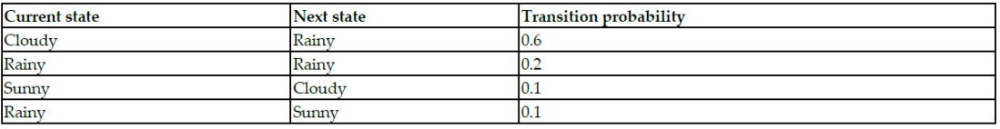
        - **Markov chain in the form a state diagram with transition probability**
        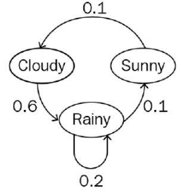
    - **Markov Decision Process, MDP**
        - Markov chain의 확장판입니다.
        - decision-making의 framework를 Mathematic하게 modeling합니다.
        - 대부분의 RL problem은 MDP로 모델링할 수 있습니다.
        - **Five important elements to represent MDP**
        1. **States, (S)** : Agent가 실제로 무언가를 하는 환경의 집합입니다.
        2. **Actions, (A)** : Agent가 하는 행동에 대한 집합입니다.
        3. **Transition probability, (P <sup>a</sup><sub>ss'</sub>)** state (s)에서 another state (s')로 이동하면서 action (a)를 함으로써 s에서 s'로 transition될 확률입니다.<br />
        P <sup>a</sup><sub>ss'</sub> = pr(S <sub>t+1</sub> = s' | s <sub>t</sub> = s, a <sub>t</sub> = a)
        4. **Reward probability, (R <sup>a</sup><sub>ss'</sub>)** : S 에서 another state s'로 이동하기 위해 a를 수행했을 때 받을 수 있는 Reward의 확률을 의미합니다. <br />
        R <sup>a</sup><sub>ss'</sub> = E(R <sub>t+1</sub> | s <sub>t</sub> = s, s <sub>t+1</sub> = s', a <sub>t</sub> = a)
        5. ### Discount factor, (γ)
            (γ) 당장의 Reward와 미래의 Reward 사이에 importance를 의미합니다. <br />
            γ를 곱해줌으로써 Episodic task, Continuous task 모두에 대하여 unified <br /> `Hyperparameter - 기계학습에서 자동으로 학습되지 않는 파라미터` <br />
            Immediate reward보다 Future reward의 중요성을 보장하는 방향으로 합니다.
            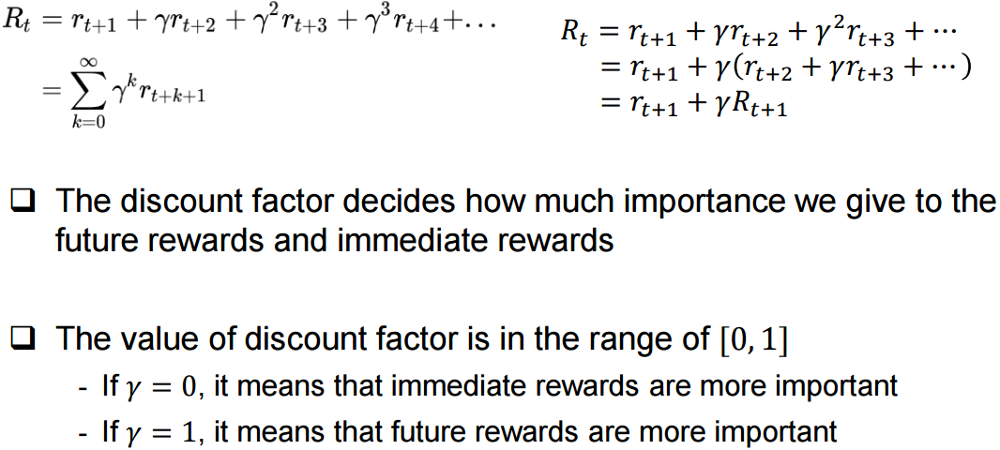

            

- **Rewards and Returns**
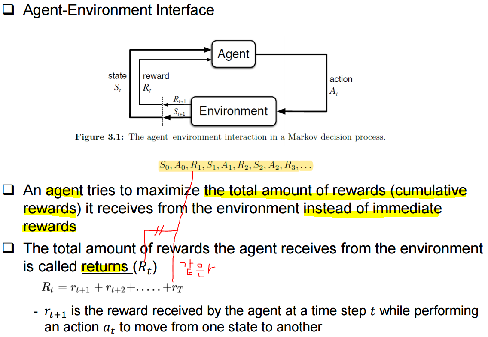

- **Episodic and Continuous Tasks**
    - **Episodic task**
        - 끝이 존재하는 task(end - terminal state)
        - In RL, Episode는 agent와 environment 사이의 interaction으로 볼 수 있습니다. `interaction : from initial to final states(end)`
        - 시작 점과 끝 점의 경계 가 명확하고 각 Episode가 독립적으로 전혀 영향을 끼치지 않습니다.
    - **Continuous Tasks**
        - 끝나지 않는 task(there is not a terminal state)
        - R <sub>t</sub>가 존재하지 않습니다. (무한정으로 더해야 하기 때문)
        - 즉, Reward를 maximize하는 방법이 없으므로 [Discount factor](#discount-factor-γ)를 이용합니다.
- **Policy Function(π)**
    - π(s) : S → A, 특정 state에서 어떤 action을 취할 ***확률***입니다.
- **Value Function, V(s)***(=State Value Function)*
    - Agent가 policy π에 기반하여 특정 state에 있을 때, 해당 Agent가 머물기 좋은 정도를 의미하는 return 값입니다.
    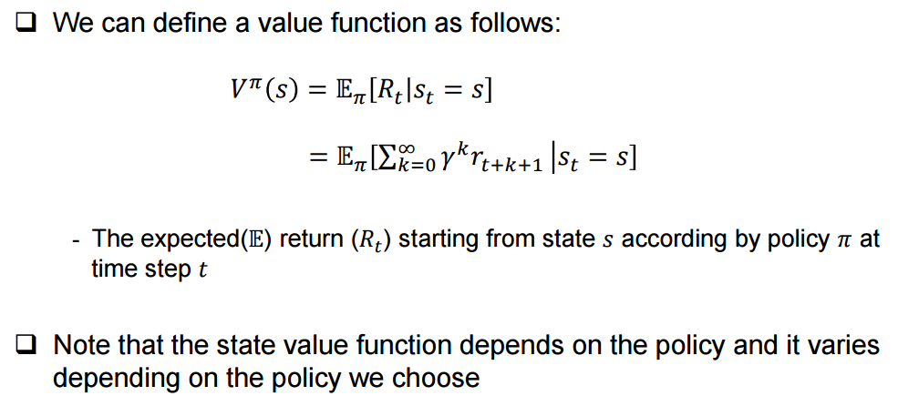
- **State-Action Value Function (=Q function), Q(s, a)**
    - policy π에 기반하여 특정 state에서 어떤 Action이 얼마나 좋은지를 표현하는 return 값입니다.
    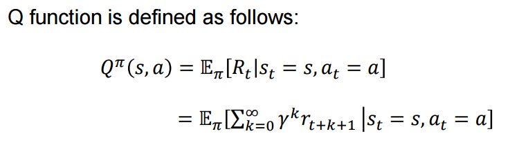
```
Value Funftion이 특정 state에 있는 것이 얼마나 좋은지 표현하는 것이라면
Q function은 해당 state에서 특정 action이 얼마나 좋은지 표현합니다.
```
- **Recursive Relationships in Value Function**
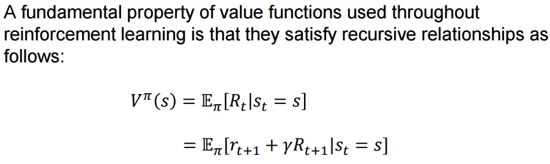 

<br />

- **Bellman Equation and Optimality**
    - MDP를 풀 수 있습니다. `= Optimal policy와 Optimal value function을 찾을 수 있습니다.`
    - Policy가 바뀌면 value function도 바뀝니다.
    - Optimal value function V*(s)는 모든 state에서 다른 value function보다 더 큰 value를 가집니다. `Optimal = *`<br /> 
    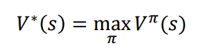 - V <sup>π</sup> (s)가 최대의 S를 가질 때 V값을 말합니다. 
    - V*(s)가 Maximum return이기 때문에 Maximum Q function도 됩니다. <br />
    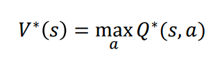
```
Expectation(E), 기댓값
- 확률변수의 기댓값은 각 사건이 벌어졌을 때의 이득과 그 사건이 벌어질 확률을 곱한 것을 전체 사건에 대해 합한 값입니다.
- 선형 연산자이며 가산성, 동차성이 성립합니다.
    >>> E(X + Y) = E(X) + E(Y)
    >>> E(cX) = cE(X)
ex) 주사위값의 기댓값
1*1/6 + 2*1/6 ... 6*1/6 = 3.5
```
`MDP를 푼다는 것은 Bellman Equation을 이용하여 Optimal policy를 찾는 것을 의미`

<br />

- **Dynamic Programming(DP)**
    - MDP로 정의된 Environment의 perfect model에 대해 Optimal policy를 계산하는 알고리즘입니다.
        - Perfect model이 주어졌다? <br />
        해당 MDP에 대하여 state, action, reward를 알고 있다는 것을 의미
    - Bellman Optimality equation을 알아냅니다.
    - Bellman equation을 해결하는 2가지 방법
        - [Value iteration](#value-iteration)
        - [Policy iteration](#policy-iteration)

    <br />

    - ### Value Iteration
    1. Value를 기준으로 반복합니다. 
    2. random value function으로 시작하여(`ex: 모든 state에 대한 value를 모두 0으로 시작`) optimal value function이 될 때까지 새로운 improved value function을 반복(순환)하여 찾아냅니다.
        - Optimal은 아니겠지만, V(s)가 도출됩니다. 현재 V(s)를 기준으로 모든 state action pair에 대하여 Q function을 계산하고 특정 state에 max value를 가지는 Q값을 해당 state의 value로 업데이트 합니다.
    3. 현재 value function이 이전 iteration의 value function의 차이(change in the value between each iteration)가 작을 때 까지 반복합니다.
        - 찾아낸 optimal value function으로 optimal policy를 쉽게 알아낼 수 있습니다.
        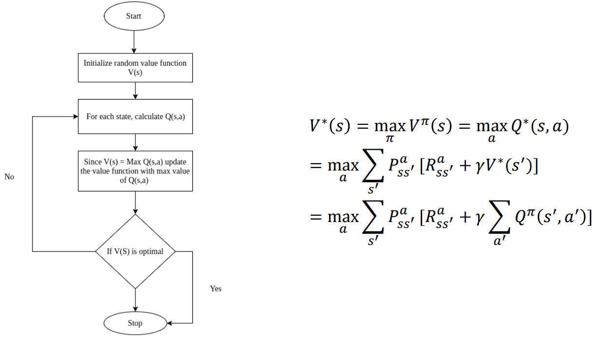

    - ### Policy Iteration
    1. random policy로 시작하여 해당 policy의 value function을 찾아내는 방식으로 iteration합니다.
    2. optimal value function이 아니면 new improved policy를 찾습니다.
    3. 상위 과정을 반복합니다.
    
        **Policy iteration의 2가지 steps**
        - **Policy evaluation** : policy의 value function을 계산합니다.
        - **Policy improvement** : optimal value function이 아니라면 new improved policy를 찾습니다. <br />

            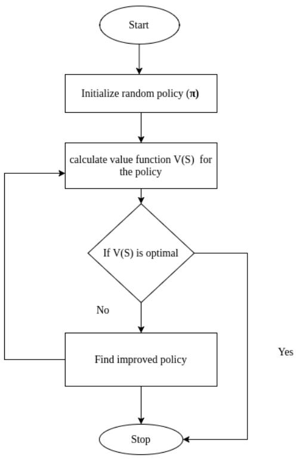

<br />

## Monte Carlo Methods
공학 전반에서 사용되는 방법으로 RL에 적용될 수 있습니다.
- 환경에 대한 정보를 모를 때, model dynamics(transition probaility)를 모를 경우, 모집단에서 random sampling한 표본집단으로 approximate solution을 찾아냄으로 statistical technique입니다.
- random sampling을 통해 approximates(근사치)를 찾아내며 실행 횟수를 늘릴수록 optimal solution과 가까워집니다.
- terminal state(끝 점)가 있어야 하기 때문에 episodic task에만 적용할 수 있습니다.
- model 없이도 가능하기 때문에 **model-free learning algorithm**으로도 불립니다. `DP는 model based learning algorithm`
- expected return이 아닌 episode에서 나오는 평균 값(mean return)을 구함으로써 state의 value function을 approximation합니다.
- 과정
1. value function을 estimation하는 것이 목적이므로 value function을 random 값으로 initialize 시킵니다.
2. return들을 저장 할 empty list를 만듭니다.
3. episode를 생성하고 해당 episode의 states에 대한 return을 계산하여
4. empty list에 append합니다.
5. return의 평균을 구하고 value function을 update합니다.
<p align="center">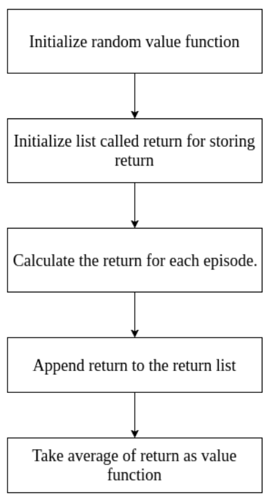</p>

- **Two types of Monte Carlo Prediction**
    - **First visit Monte Carlo** <br />
        - 하나의 episode에서 같은 state에 여러 번 방문할 수 있지만, 첫 번째 방문만 고려합니다.
        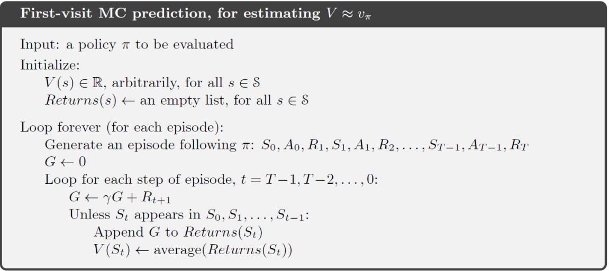
        
    - **Every visit Monte Carlo**
        - 첫 번째 방문만 고려하는 것이 아니라 states 방문에 대한 모든 value를 각각 사용하여 평균을 냅니다.<br />

    두 MC 모두 state S에 visit하는 횟수가 무한대로 갈 수록 V<sup>π</sup>(s)에 converge합니다. 하지만 현실적으로 무한대만큼 할 수 없기 때문에 **해당 state에 업데이트 되는 value function이** 이전 루프에서의 값과 **차이가 작다면 converge**한 것으로 봅니다.
    - **converge 하는 이유**
        - 각각의 return은 independent(episode끼리 독립이라)하고 유한 분산을 가지는 V<sup>π</sup>(s)이다(IID).
        - **The law of large numbers, 큰 수의 법칙**을 따릅니다.<br />
            `큰 모집단에서 무작위로 뽑은 표본의 평균은 모집단의 평균과 가까울 가능성이 높다.`
- **Monte Carlo Control**<br />cc
    DP의 Policy iteration처럼 Policy evaluation과 Policy improvement를 반복하여 Optimal policy를 찾습니다. Policy는 업데이트된 value function으로 improve되고 value function은 새롭게 계산된 Policy로 다시 업데이트 됩니다.
    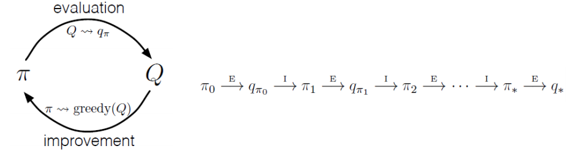
- **Monte Carlo Exploration Starts**
    각 에피소드마다 임의의 상태에서 시작하여 탐험적으로 행동을 수행하는 것을 의미합니다. 즉, 많은 에피소드가 있을 경우, 가능한 모든 행동으로 모든 상태를 포괄할 수 있습니다. 이 것을 **MC-ES**라고 합니다. <br />

    **MC-ES 순서**
    1. Q function과 Policy를 Random value로 초기화하고 return을 저장할 empty list를 생성합니다.
    2. 임의로 초기화된 정책으로 에피소드를 시작합니다.
    3. 에피소드에서 발생하는 모든 고유한 상태-행동 쌍에 대한 계산을 하고 return 리스트에 추가합니다.
    4. 하나의 에피소드에 동일한 상태-행동 쌍이 여러번 발생하기 때문에 고유한 상태-행동 쌍에 대해서만 계산합니다.
    5. return 리스트에서 평균을 취해 그 값을 규함수에 할당합니다.
    6. 최적의 Policy를 선택하고 그 상태에서 최대 Q(s, a)를 갖는 행동을 선택합니다.
    7. 모든 states와 action 쌍을 포괄하도록 위 과정을 반복합니다.
    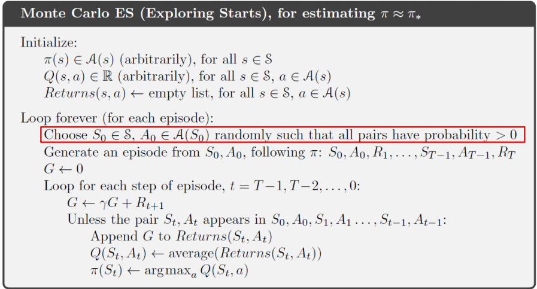

- **On-policy / Off-policy MC Control** <br />
MC-ES에서 모든 combination의 states와 actions를 explore하기엔 너무 많은 시간이 걸립니다. 이 문제를 현실적으로 해결하기 위해 2 가지 control algorithm을 사용합니다.
    - **In On-policy MC control, ε-greedy policy or ε-soft policy**
        - 1-ε의 확률로 탐험 없이 현재 상태에서 최선의 행동을 선택합니다.
    - **Off-policy MC control**
        - **Target policy** : 학습을 하여 Optimal policy가 되도록 합니다.
        - **Behavior policy** : 행동을 generation할 때 쓰이며 가능한 모든 possible states와 action을 explore합니다.
    - **Importance sampling** : 다른 distribution의 sample에서 표본을 추출하고 원래의 모집단 value를 계산합니다.
        - **Ordinary importance sampling**
        - **Weighted importance sampling**