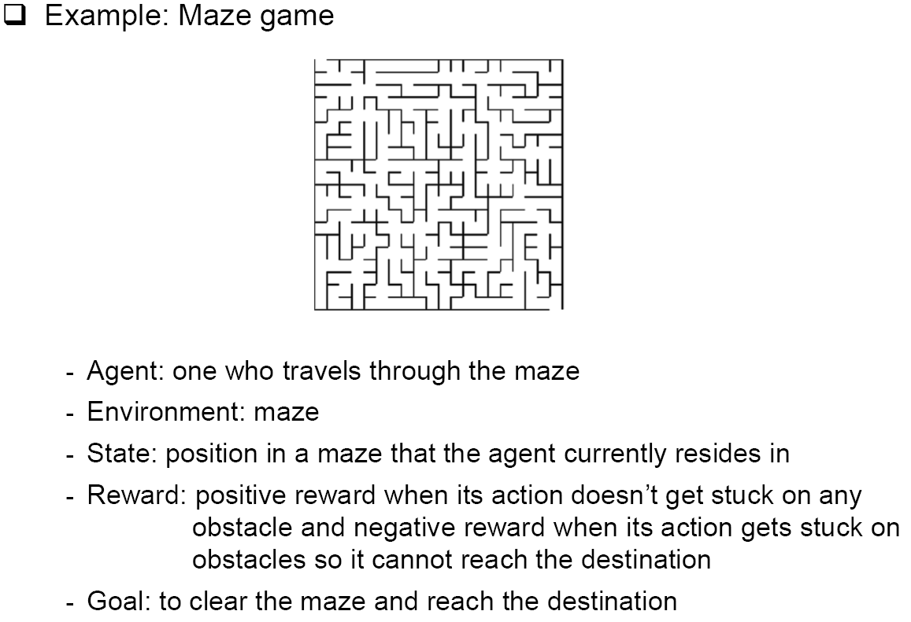

<p align="center" style="font-size:50px">
    <a href="https://github.com/lsw6684/ComputerScience">HOME</a>
</p>

***

# Reinforcement Learning
- [Introduction to Reinforcement Learning](#introduction-to-reinforcement-learning)

<br />

## Introduction to Reinforcement Learning
- **ML : Machine Learning**
    - 프로그램이 데이터로부터 자동으로 학습을 합니다.
    - 데이터의 일부 Example들을 일반화여 특정 문제를 해결하는 알고리즘입니다.
    - 모델을 만들기 위한 샘플 데이터를 Training data라고 부릅니다.
- **ML 알고리즘의 종류**
    - 지도 학습 Supervised Learning : input(X) & desired output(Y)을 포함하는 데이터를 기반으로 수학적 모델(f)을 만듭니다.
        - Regression : Data point를 Generalization 하여 ax + b 형태의 함수 f,**연속적인** Function line을 만들어 **real value**를 예측합니다.
        - Classification : Input이 **어떤 class**에 속하는지 예측합니다.
    - 비지도 학습 Unsupervised Learning : 데이터에 input(X)만이 있으며 **desired output(Y)이 없습니다**. 데이터의 패턴, 구조를 찾아내어 그룹핑이나 **클러스터링**을 합니다.

    - 강화 학습 Reinforcement Learning : 특정 환경에서 Agent(SW or HW)가 현재의 상태를 인식하여, 누적된 보상을 최대화하는 행동 혹은 행동 순서를 선택하는 방법입니다.
        - 데이터라는 표현이 존재하지 않고 특정 Agent의 행동에 따라 Reward를 maximize하여 이해할 수 있도록 합니다.
        - **Trial and Error**, 시행착오를 통해 에러를 줄이고 Reward를 높이는 방향으로 진행됩니다.
        - There might be **delayed rewards** - Positive reward가 나올만한 action이 즉각적으로 발생하지 않으면 지연됩니다.
        - ### ex) Dog 
            ```
            강아지(Agent)에게 캐치볼 하는 것을 가르칩니다. 하지만 명시적으로 가르칠 수 없으니 공을 던지고 다시 가져오는 것을 성공할 때마다 간식(Positive Reward)을 줍니다. 그리고 실패 하면 간식을 주지 않습니다(Negative Reward). 이 과정을 반복하면, 강아지는 어떤 Action을 해야 간식을 얻을 수 있는지 알게됩니다.
            ```
        - Agent가 사용할 수 있는 2가지 전략
        1. Positive reward를 얻기 위해 **다른 Action을 탐험**합니다.
        2. 이전의 Action들 중에 **positive reward가 있던 행동에 집착**합니다.
            ```
            장단점이 공존하므로 Trade-off가 존재합니다.
            두 가지 전략은 적당한 비율로 유지되어야 합니다.
            ```
- **Typical RL Algorithm**
1. Agent가 환경과 Interaction 하여 Action을 취합니다.
2. Agent가 Another state로 움직입니다.
3. 수행한 Action과 state를 기반으로 특정 Reward를 받습니다.
4. 지금까지의 Reward를 기반으로 어떤 Action이 좋고 나쁜지 이해합니다.
5. 좋은 Action이 있다면 그 행동을 Exploitation하고 Another action 즉, Exploration을 시도합니다.
`Agent는 상위 과정을 반복하여 강화됩니다.`

- **RL이 ML들과 다른 점**
    - Compared to **Supervised Learnning**
        - 지도학습(Supervised Learning)은 Machine(agent)이 training data로부터 무언가(패턴)를 배웁니다. Learning Data로부터 정규화(normalization)하는 모델을 만드는 것으로 input과 output 즉, 정답값(label)을 가지고 있는  data를 가진다고 할 수 있습니다. 실제로 본적 없는 데이터(unseen data)를 적용했을 때 올바른 결과에 근접할 수 있도록 특정 환경을 기반으로 하는 지식을 보유한 External Supervisor가 존재합니다. [❗상단의 강아지 예시](#ex-dog)
    - Compared to **Unsupervised Learning**
        - 모델에 training data를 준다는 점은 Supervised Learning과 같지만 output 없이 input만 전달하고 **input에 포함된 hidden pattern**을 학습하여 reward를 maximizing하는 모델을 만듭니다.

<br />

- **Elements of RL**
    - **Agent**
        - RL로 무언가를 배우고 지적인 결정을 만드는 Learner, Software program입니다.
        - 환경과 상호작용 함으로써 행동을 취하며, 그 행동으로부터 reward를 취합니다.
        - ex) Super Mario 게임에서의 Super Mario
    - **Policy function**
        - 일종의 규칙으로, 특정 환경에서 Agent가 하는 행동을 결정합니다.
        - **Lookup table** or **Search tree** 형식을 가질 수 있습니다. 
        - Policy의 symbol은 **𝝅**입니다.
        - ex) 사무실에서 집으로 가는 길이 있다.
            - 짧은 길들과 있고 긴 길들이 있다.
            - 여기서 **길**은 어느 쪽으로 가야할 지 알려주는 **Policy**입니다.
    - **Value Function**
        - Reward를 의미하며 Policy마다 Value Function을 가진다고 할 수 있습니다.
        - Value Function의 symbol은 **v(s)**로 state인 s를 인자로 받습니다. 
        - Agent가 Environment의 특정 state에 위치할 때, 최종적으로 받을 수 있는 total expected reward를 의미합니다.
        - **Optimal Value Function**은 모든 states에 대하여 더욱 좋은 값을 가지는 Value Function을 최적의 Value Function, Optimal Value Function이라 칭합니다.
        - RL의 궁극적인 목표는 Optimal Value Function을 갖는 **Optimal Policy**를 찾는 것입니다. 
    - Model
        - 환경에 대한 Agent의 Representation입니다.
        - RL은 **Model-based learning** And **Model-free learning**, 총 2가지 타입이 존재합니다.
            - Model-based learning : Agent는 Environment에 대한 Modeling을 갖고 있을 때, Model을 사용하여 특정 Action을 취했을 때 다음 State가 어떻게 될지 정확히 알게 됩니다.
            - Model-free learning : Agent가 Environment에 대한 정보가 전혀 없을 때, 무작정 Action을 취하고 Reward를 받습니다. just **trail-and-error(시행착오)** 에 의존합니다.

- **Agent Environment Interface**
<p align="center"></p>

```
Agent, A. 특정 time state, t. At가 Action을 하면
Environment로 부터 Reward, Rt를 받고 St+1로 State로 바뀝니다.
위 과정을 반복합니다.
```
- **Model-free learning**을 통한 예시
<p align="center"></p>

- **RL Environment의 종류**, `2 종류씩 비교`
    - **★ Deterministic environment** - Agent이 취하는 현재 State에 대한 Action의 결과가 명확할 때, 다음 State가 확정이 되는 것을 의미합니다. `ex) 체스게임에서 player에 의한 outcome을 명확히 알 수 있습니다.`
    - **★ Stochastic environment** - 다음 State가 어떻게 될지 확정할 수 없을 때를 의미합니다. `ex) 주사위`
    - **◆ Fully observable environment** - RL의 모든 시간 동안 Agent가 결정할 수 있는 State가 **모두 보여집니다.** Partially observable environment와 비교해 보자면, Fully observable environment는 Optimal Policy를 찾기 적합합니다. `ex) 체스`
    - **◆ Partially observable environment** - 모든 시간 동안 State를 부분적으로만 관찰할 수 있습니다. `ex) 포커 게임`
    - **▣ Discrete environment** - 다른 State로 이동 할 Action의 수가 유한할 때를 말합니다. `ex) 체스게임에서 말이 움직일 수 있는 Action의 종류`
    - **▣ Continuous environment** - 다른 State로 이동할 Action의 수가 무한할 때를 말합니다. `ex) self-driving car control`
    - **▩ Episodic and non-episodic environment**
        - Episode 기반으로 정확하게 나뉘느냐, 안나뉘느냐를 기준으로 합니다.
        - Episodic environment는 non-sequential environment로도 불립니다.
        - Episodic environment는 State만 바뀔 뿐 Action간에 서로 영향을 끼치지 않습니다.(Independent)
        - non-episodic environment는 Sequentil environment로도 불립니다.
        - Agent의 현재 행동이 State만 바뀔 뿐 아니라 미래의 Action에도 영향을 끼칩니다. (dependent)
    - **◈ Single and multi-agent environment**
        - Agent 개수가 1개냐 아니냐가 기준입니다.
        - Multi-agent environment가 상대적으로 훨씬 복잡합니다.
```
짝 지어진 environment를 제외하고 여러 environment를 정의할 수 있습니다.
ex)
1. Deterministic, Episodic한 Environment (OK)
2. Episodic, Non-episodic한 Environment (Invalid)
```
- **RL Platforms** - 시뮬래이션, 빌딩, 렌더링, 그리고 Environment에서 RL 알고리즘을 실험할 수 있습니다.
    - **OpenAI Gym and OpenAI Universe**
        - RL 알고리즘을 만들고, 평가하고, 비교할 수 있는 Tool kit입니다.
        - RL은 ML의 한 종류입니다. Tensorflow, Theano, Keras 등 다양한 ML Framework로 작성된 알고리즘들을 호환하여 사용할 수 있습니다.
        - Agent Structure에 대한 assumption이 없기 때문에 모든 Agent를 사용할 수 있습니다.
        - OpenAI Universe는 OpenAI Gym의 확장판입니다.
        - 굉장히 넓은 범위의 complex environment, 간단한 것부터 real-time까지 training시키고 평가할 수 있습니다.
        - OpenAI Universe는 가상 네트워크 환경을 이용 함으로써 기존에 존재하는 다양한 프로그램과 Gym의 connection을 별다른 제약 없이 쉽게 연동해 줍니다. 확장성이 굉장합니다.
        - Environment 자유롭게 구현 가능
    - **DeepMind Lap** - *알파고*
        - fist-person 3D game platform, 1인칭 시점의 3D게임플랫폼으로 강화학습 개발과 연구를 위해 만들어졌습니다. - ***Customizable and Extndable***
        - Environment 자유롭게 구현 가능
    - **RL-Glue**
        - Agent, Environment, Program이 서로 다른 프로그래밍 언어로 구현되어 있는 경우에도 연결해 주는 인터페이스를 제공합니다.
        - 다른 사람들이 만들어 놓은 작업물을 공유할 수 있어서 Reusability가 높습니다.
    - **Project Malmo**
        - 마인크래프트를 기반으로 AI실험 플랫폼입니다.
        - 시나리오의 시간을 빠르게 설정하여 학습시킬 수 있습니다.
        - 마인크래프트만 실행 가능하다는 단점이 있습니다.
    - **ViZDoom**
        - Multi-agents 시스템 지원을 제공합니다.
        - Doom(1인칭 슈팅 게임) environment만 가능하다는 단점이 있습니다.
- **Aplications of RL**
    - **Education** - personalized content를 제공합니다.
    - **Manufacturing** - 산업용 로봇, 로봇 팔 등 intelligent robot으로 특정 임무를 수행하도록 강화학습 되어 사용됩니다.
    -**Inventory management**- 공급망 Supply chain management, 수요 예측 demand forecasting, warehouse operation 등을 강화학습으로 최적화 시켜 이용됩니다. (전력 소비량 등)
    - **Finance** - 상업적 거래를 예측하기 위한 포트폴리오를 관리합니다.
    - **Natural language processing and Computer vision** - DL과 결합된 DRL에 사용되며, text 요약, 정보 축약, 기계 번역(papago 등), 이미지 인식 등의 정확성을 높히는데 사용됩니다.