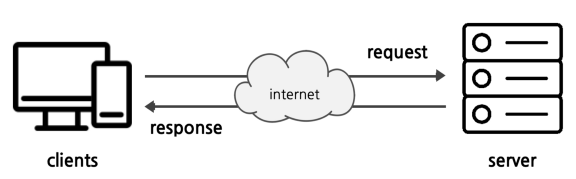
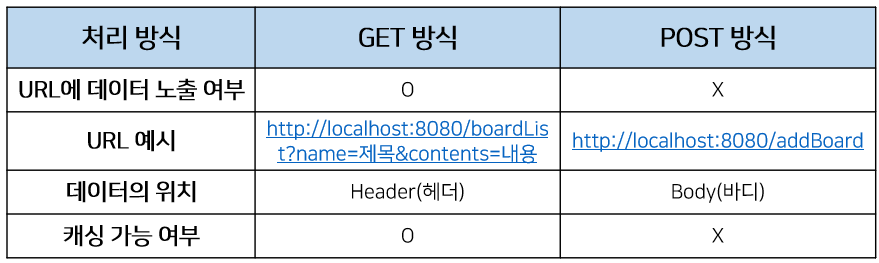

# WEB
  - [언어](#언어)
  - [HTTP Protocol](#http)
  - [WAS](#was)

</br>

## 언어
**저급 언어 :** 기계 중심의 언어로써 기계가 알아들을 수 있는 말로 '프로그램 코드를 작성한다' 할 수 있습니다. 2진수로 작성하는 프로그래밍 언어를 ***기계어(Machine Language)*** 라고 하는데 숫자로만 되어 있기 때문에 유지보수와 사용이 어렵습니다. 이러한 이유로, 숫자로 된 문장과 1:1로 대응하는 기호인 ***어셈블리어(Assembly Language)*** 가 만들어 졌으며, 이것을 기계가 알아들을 수 있도록 원래의 숫자로 바꾸어 주는 것이 ***컴파일러(Compiler)*** 입니다.

현재는 아주 특수한 경우를 제외하고는 기계어, 어셈블리어로 개발하는 경우가 거의 없습니다. 그만큼 사용하기 어렵고 유지보수가 힘들기 때문입니다.

</br>

**고급 언어 :** 사람 중심으 언어로써 상대적으로 이해하기 쉬운 문법을 사용합니다. 이것을 번역하는 과정을 ***컴파일*** 한다고 하며, 이러한 일을 수행하는 것을 ***컴파일러*** 라고 합니다. 저급 언어의 어셈블리어를 기계어로 컴파일 하는 것과 같은 방식입니다.
- **FORTRAN :** 최초의 고급 언어 중의 하나이며, 알골과 함께 과학적 계산을 목적으로 출시된 언어입니다. 현재 공대에서도 많이 사용되고 있습니다.
-  **ALGOL :** Algorithmic Language의 준말로 포트란에 대항하여 개발된 프로그래밍 언어로, 알고리즘의 연구개발, 수치 계산과 논리 연산에 이용하기 위한 목적으로 만들어졌다.
- **COBOL :** FORTRAN과 더불어 역사가 오래된 언어로, 일반 업무에서 사용할 목적으로 만들어졌습니다. 절차적, 명령형 언어이고, 2002년부터 객체 지향을 지원했습니다. 현재도 금융, 보험 등에서 사용되고 있습니다.
- **PROLOG :** 논리형 프로그래밍 언어로써, 논리식을 토대로 오브젝트와 오브젝트 간의 관계에 관한 문제를 해결하기 위해 사용됩니다.
- **C :** 1972년 미국 벨 연구소의 데니스 리치에 의해 개발된 고급 언어로써 시스템 프로그래밍에 가장 적합한 평가를 받는 언어입니다.
- **Erlang :** 스웨덴의 에릭슨에서 개발한 함수형 병행성 프로그래밍 언어이며 통신 인프라를 위한 언어입니다.
- **Lisp :** LISt Processor의 약자로, 대표적인 함수형 언어입니다. 모든 자료는 연결 리스트로 처리하며, 컴파일 개념 없이 인터프리터 상에서 동작합니다. 현대의 컴퓨터를 위해 등장한 고급 언어 중 가장 오래된 것이 포트란이고, 두 번째가 리스프입니다.
- **Swift :** 2014년 WWDC(Apple WorldWide Developers Conference)에서 공개한 프로그래밍 언어입니다. 최근에 만들어진 언어로 현대 프로그래밍 언어의 발전을 대다수 계승한 모던 프로그래밍 언어라고 말할 수 있습니다.
-  **Kotlin :** IntelliJ IDEA의 개발사 JetBrains에서 2011년에 개발한 프로그래밍 언어입니다. JVM기반의 언어이며 Java와의 상호운영이 100% 지원됩니다. Swift와 마찬가지로 현대 프로그래밍 언어의 발전을 대다수 계층한 모던 프로그래밍 언어입니다.
-  **Clojure :** 클로저(Clojure)는 리치 히키(Rich Hickey)가 만든 리스프 프로그래밍 언어의 방언으로서, 범용 함수형 언어입니다. 자바 가상 머신과 공통 언어 런타임(CLR), 그리고 자바스크립트 엔진 상에서 실행됩니다. 다른 리스프 언어들과 같이 코드를 데이터로 취급하며, 정교한 매크로 시스템을 갖고 있습니다.
-  **Python :** 상대적으로 읽기 쉬우며 적은 코드를 사용하여 프로그램을 개발하기 때문에 생산량이 크다고 할 수 있습니다. 데이터 과학, 웹 개발, ML(Machine Learning) 등에서 많이 사용됩니다.
-  **JAVA :** 1995년 썬 마이크로 시스템즈에서 개발한 객체지향 프로그래밍 언어입니다.
-  **PHP :** 서버 측에서 실행되는 프로그래밍 언어로 HTML을 프로그래밍적으로 생성하고 데이터베이스와 상호작용을 하여 데이터를 저장하고 표현합니다. 웹을 위해 만들어졌고, 웹의 80% 이상이 PHP로 구성되어 있습니다.
-  **JavaScript** 브라우저에서 동작하는 언어로 탄생했지만, 현재는 서버에서도 사용되어지고 점차 영역을 넓히고 있습니다.
-  **Ruby :** 빠른 개발에 널리 사용되며, 단순함과 세련된 웹 어플리케이션을 만들 수 있습니다. 간결함과 생산성을 강조한 동적인 오픈 소스 프로그래밍 언어입니다.

</br>

## HTTP
HTTP는 Hypertext Transfer Protocol의 준말로 팀 버너스리와 그가 속한 팀 CERN에서 발명하였습니다. 서버와 클라이언트가 인터넷상에서 데이터를 주고 받기 위한 프로토콜이며, 어떤 종류의 데이터도 전송 가능합니다.

<p align="center"></p>

- **장점 :** 불특정 다수를 대상으로 하는 서비스에 적합합니다. 클라이언트와 서버간의 최대 연결수보다 훨씬 많은 요청, 응답을 처리할 수 있습니다.

- **단점 :** 무상태(Stateless)를 특징으로 정보를 유지하지 않고 연결을 끊습니다. 이를 보완하여 정보를 유지하기 위해 Cookie가 등장합니다.


```
인터넷 : TCP/IP 기반의 네트워크가 전세계적으로 확대되어 하나로 연결된
네트워크들의 네트워크 (=네트워크의 결합체)

❗
팀 버너스리가 속한 CERN은 HTTP 뿐만 아니라 웹 브라우저 및 웹 브라우저 
관련 기술과 HTML도 발명.
```

**URL :** Uniform Resource Locator의 준말로 특정 웹 서버의 특정파일에 접근하기 위한 경로 혹은 주소.

<p align="center"></p>

- **GET :** 정보 요청 (SELECT)
  - URL에 데이터를 포함시켜 요청한다.
  - 데이터를 Header에 포함하여 전송한다.
  - URL에 데이터가 노출되어 보안에 취약하다.
  - 캐싱할 수 있다.

- **POST :** 정보 삽입 (INSERT)
- **PUT :** 정보 업데이트 (UPDATE)
  - URL에 데이터를 노출하지 않고 요청한다.
  - 데이터를 Body에 포함시킨다.
  - URL에 데이터가 노출되지 않아서 기본 보안은 되어있다.
  - 캐싱할 수 없다.
- **DELETE :** 정보 삭제 (DELETE)
- **HEAD :** (HTTP)헤더 정보만 요청.
  - 해당 자원이 존재하는지, 서버에 문제가 없는지 확인하기 위함.
- **OPTIONS :** 웹서버가 지원하는 메서드의 종류를 요청.
- **TRACE :** 클라이언트의 요청 반환.
  - echo 서비스로 서버 상태를 확인하기 위한 목적으로 주로 사용.

<p align="center"></p>

```
❗
캐싱 : 캐시는 컴퓨터의 성능을 향상시키기 위해 사용되는 메모리를 말하는데 
이 캐시 영역으로 데이터를 가져와서 접근하는 방식을 말합니다. 확장 시 
애플리케이션의 성능을 현격히 향상시키고 비용은 크게 줄입니다.
```

</br>

## WAS
Web Application Server의 준말입니다. Browser를 Client로 본다면, Browser와 DBMS 사이에서 동작하는 미들웨어라고 볼 수 있습니다.
- 프로그램 실행 환경, DBMS 제공.
- 여러 트랜잭션을 관리.
- 업무를 처리하는 비즈니스 로직을 처리.

**Web Server** vs **WAS :** 웹서버는 보통 정적인 것을 웹 브라우저에게 전송하고 WAS는 프로그램의 동적인 결과를 웹브라우저에게 전송합니다. 현재는 WAS가 웹 서버의 정적인 기능도 내장하고 있지만, 규모가 커질수록 웹서버와 WAS를 분리하여 구축합니다. 그 이유는 ***장애 극복 기능 (Failover)*** 을 겸하기 위함입니다.

 WAS 자체에서 문제가 발생하면 WAS를 재시작 해야 하는데, 이용자들이 이 문제에 대해 영향을 받지 않고 서비스를 계속 이용할 수 있습니다.
```
❗
장애 극복 기능 (Failover) : 각종 서버, 시스템, 네트워크 등에서 이상이 생겼을 시 예비 시스템으로 자동전환되는 기능으로 서버를 이중화 하여 구현하면 무중단 운영을 시행할 수 있습니다.
```